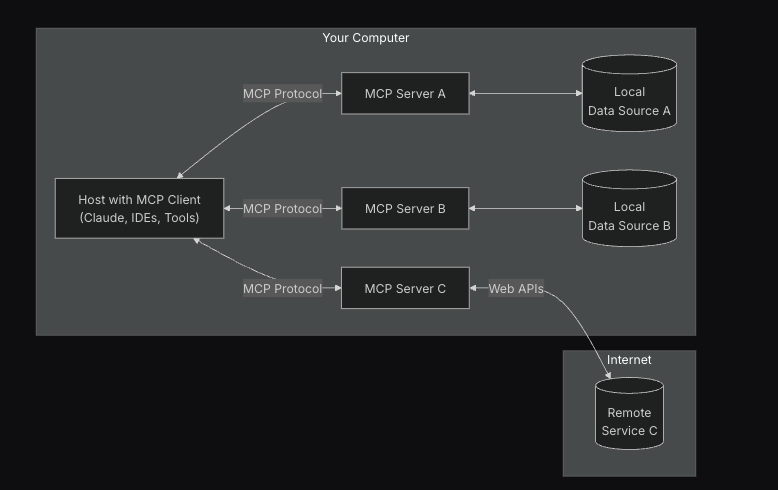

## MCP是什么

MCP 全称是`Model Context Protocol`，中文翻译就是模型上下文协议

没错，他就是一个协议，不是一个新东西。


## 为什么需要MCP

这几年`AI`各种大模型发展非常迅速，不管像`deepseek`还是`CHATGPT`等各种大模型，每隔几个月都要发布一些新的模型。

使用最多的还是对话类型大模型


使用方式也很简单。

**人工**从输入上下文，然后大模型给我处理答复

这里核心问题是**人工**

我们现在很难做到大模型自动读取到我们的资源信息然后自动取处理。

举个简单例子

我们想通过数据库的表结构去生成java代码。

那么我的操作就是首先**人工**去数据库复制表结构，然后**人工**输入给大模型，告诉大模型我要生成这样的java代码

大模型输出java代码后我再**人工** copy到我的`idea`中


可以看到整个过程人为操作方式很多，我们想要做到的就是大模型自动读取我们的数据库，然后自动写入到idea中去

MCP就是为了解决这个问题的。


## MCP架构及工作原理



架构图就用官方的图片说明了。总共包含如下5个部分

- MCP Hosts: Hosts 是指 LLM 启动连接的应用程序，像 Cursor, Claude Desktop、Cline 这样的应用程序。
- MCP Clients: 客户端是用来在 Hosts 应用程序内维护与 Server 之间 1:1 连接。
- MCP Servers: 轻量级程序，每个程序都通过标准化的模型上下文协议公开特定的功能
- Local Data Sources: 本地数据源：MCP服务器可以安全访问的计算机文件、数据库和服务
- Remote Services: 远程服务：通过互联网提供的外部系统（例如，通过API），MCP服务器可以连接到


听这些名词我们是不是还是不好理解，接着我们用一个案例大白话给大家解释各个组件的作用

现在大模型是不是都没办法实时获取天气信息(支持联网的另说)，我们就基于`MCP`来实现一个实时获取天气的功能

## 实时获取天气

### MCP Hosts

在本案例中我们的`MCP Hosts`是谁呢？我们可以直接使用`Claude for Desktop`，当然我们也可以用其他支持`MCP`的`AI`客户端


所以`MCP Hosts`我们都不用准备，一般我们都有下载


### MCP Servers

`MCP server`我们可以自己实现，也可以用开源的。可以理解为一个简单的`web`服务器

然后我们`web`服务器需要实现`MCP server`定义的一些接口。主要包含如下几个功能

- Resources: 客户端可以读取的类似文件的数据（如API响应或文件内容
- Tools: 可以由LLM调用的函数（经用户批准）
- Prompts: 帮助用户完成特定任务的预先编写的模板

`MCP server`支持多语言构造，就像我们写`web`服务器一样，你可以选择`Python`、`Java`等语言

具体的构造方式这里就不详细说明了，这里可以给一个官网的示例

> https://modelcontextprotocol.io/quickstart/server


### MCP Clients

服务器编写完了，我们就需要将`Claude for Desktop`和我们的`MCP server`连接上，让我们的`Claude for Desktop`可以调用`MCP server`的接口进行获取资源进行处理

这里连接的方式很简单就是修改配置文件

```shell
code ~/Library/Application\ Support/Claude/claude_desktop_config.json
```

然后添加如下内容

```json
{
    "mcpServers": {
        "weather": {
            "command": "uv",
            "args": [
                "--directory",
                "/ABSOLUTE/PATH/TO/PARENT/FOLDER/weather",
                "run",
                "weather.py"
            ]
        }
    }
}
```

这个配置文件的意思就是
1. 有一个名为“天气”的MCP服务器
2. 要启动它，请运行`uv --directory /ABSOLUTE/PATH/TO/PARENT/FOLDER/weather run weather.py`


### Data

这里如果获取天气信息从本地获取就是`Local Data Sources`

如果天气通过`api`调用从互联网获取天气信息就是`Remote Services`


### 测试使用

通过上面的方式我们就实现了一个`AI`实时获取天气的功能。

我们可以像之前一样询问天气信息，AI就可以获取实时天气回答我们

## 工作原理

当你问一个问题，AI具体的工作流程是怎么样的呢？

1. 客户将您的问题发送给`Claude`
2. `Claude`分析可用的工具并决定使用哪一个
3. 客户端通过MCP服务器执行所选工具
4. 结果将发送回`Claude`
5. `Claude`用自然语言回答
6. 答案显示给你


## 目前开源的 MCP servers


可以直接在`https://github.com/modelcontextprotocol/servers`找到

## 总结

`MCP`并不是什么新颖的东西，就是一个标准协议。

定义一些标准的输出，然后`AI`可以直接获取这些能力。

让`AI`能基于`MCP`提供的能力进行自动操作，不需要人为的操作。

让`AI`更智能。通俗点就是给`AI`装上手脚，大模型只是大脑

使用`java`语言的小伙伴想要实现`MCP`可以使用`spring-ai`

`spring-ai`提供了`MCP Client`和`MCP Server`协议的封装。让我更庄重与应用的开发，不需要自己去实现底层的一些协议通信


## 参考

- https://modelcontextprotocol.io/introduction
- https://docs.cursor.com/context/model-context-protocol
- https://github.com/modelcontextprotocol/servers
- https://github.com/modelcontextprotocol
- https://docs.spring.io/spring-ai/reference/api/mcp/mcp-client-boot-starter-docs.html