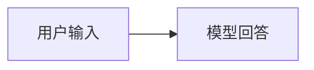
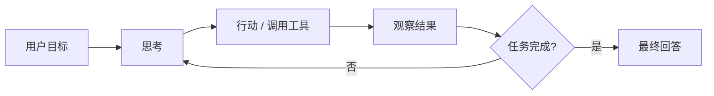
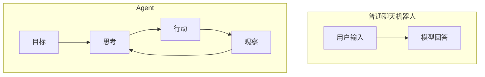
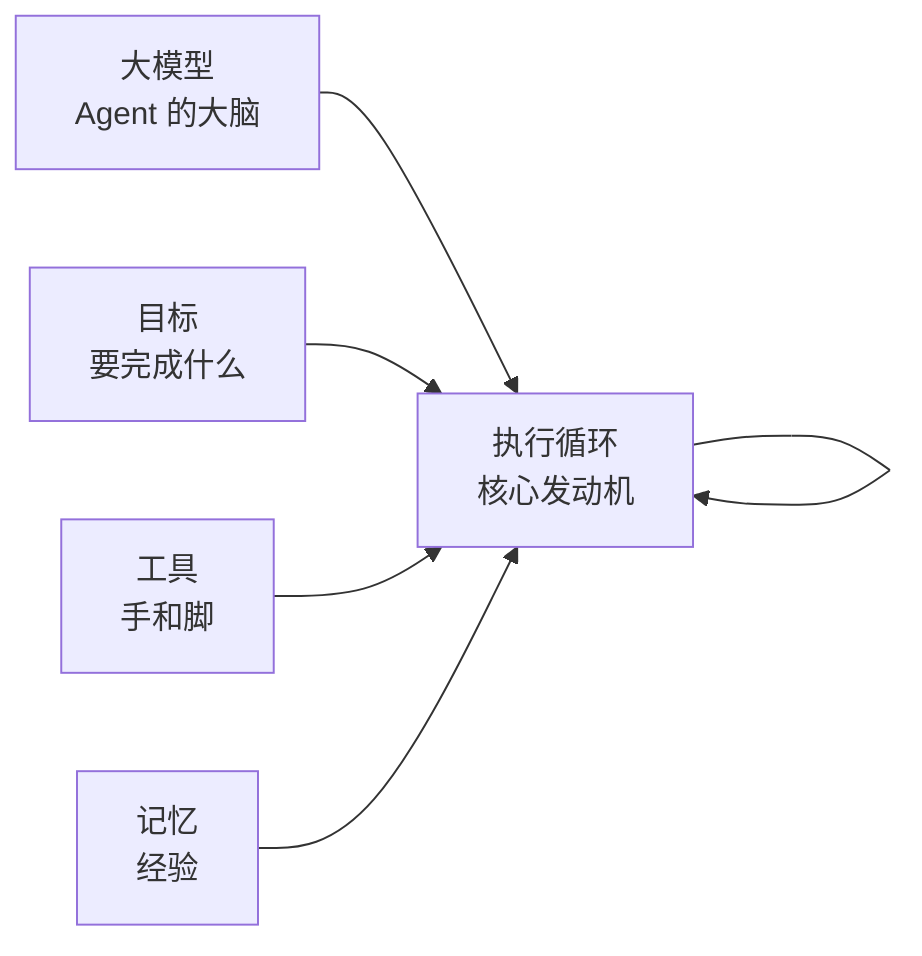
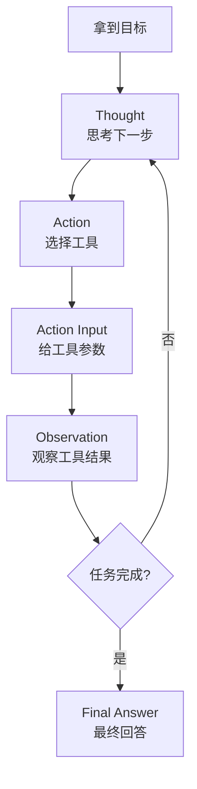
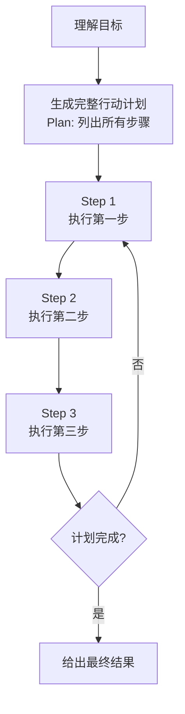
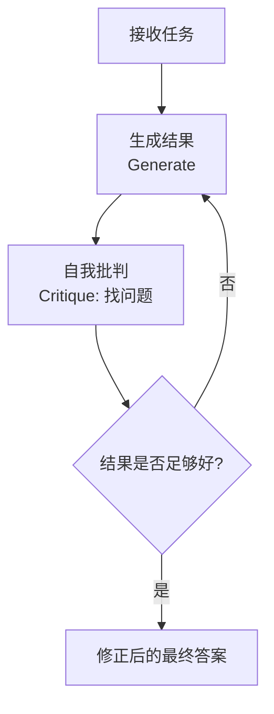

## agent 是什么


> Agent 是一个能够“感知环境、思考决策、调用工具、执行动作、根据结果继续行动”的程序


和普通聊天机器人不同，普通聊天机器人通常是：

> 用户输入 -> 模型回答



Agent则是

> 目标 -> 思考 -> 行动 -> 观察结果 -> 再思考 -> 再行动 -> 直到完成任务



两者对比：




举个例子。

你普通问 LLM：

帮我查一下北京明天天气，并写一封邮件提醒老板。

但 Agent 可以：

1. 调用天气工具查北京天气
2. 得到结果：晴，26 度
3. 调用邮件工具发送邮件
4. 告诉你已完成


所以，Agent 的核心不是“更会聊天”，而是：

能拆解任务、能调用工具、能根据反馈继续执行

##  Agent 的基本组成

一个完整 Agent 通常包括五个部分

Agent = 大模型 + 目标 + 工具 + 记忆 + 执行循环



### 1. 大模型：Agent 的大脑

LLM 负责：

- 理解用户目标
- 拆解任务
- 决定下一步调用什么工具
- 总结结果

常见模型：

- OpenAI GPT

- Anthropic Claude

- Qwen

- DeepSeek

- GLM

- Kimi

- 本地模型，如 Llama、Qwen 等


### 2. 目标：Agent 要完成什么


比如

> 帮我调研 3 个 AI Agent 开源框架，并写成 markdown 报告


目标必须清晰，否则 Agent 会不知道什么时候停止

### 3. 工具：Agent 的手和脚

工具可以是：

- 搜索网页

- 读取文件

- 写入文件

- 执行 Python 代码

- 查数据库

- 调 API

- 发邮件

- 操作浏览器

- 控制电脑

- 调用其他模型


没有工具的 Agent 只能“想”

有工具的 Agent 才能“做”

### 4. 记忆：Agent 的经验


记忆分两种

#### 短期记忆

当前任务过程中的上下文。
例如：


用户让我查天气

我已经查到了北京天气

下一步应该写邮件

#### 长期记忆

跨任务保存的知识

例如

用户喜欢简洁回答

用户的项目使用 Python

用户公司名称是 XXX


长期记忆可以用：

文件

数据库

向量数据库

JSON

SQLite

### 5. 执行循环：Agent 的核心发动机

#### ReAct

最经典的循环是：


Thought: 思考下一步
Action: 选择工具
Action Input: 给工具参数
Observation: 观察工具结果
...
Final Answer: 最终回答



这个模式叫 Reasoning + Acting

最常见的 Agent 范式有三种：

- **ReAct (Reasoning and Acting)**：一种将“思考”和“行动”紧密结合的范式，让智能体边想边做，动态调整。
- **Plan-and-Solve**：一种“三思而后行”的范式，智能体首先生成一个完整的行动计划，然后严格执行。
- **Reflection**：一种赋予智能体“反思”能力的范式，通过自我批判和修正来优化结果。

## Plan-and-Solve：先规划，再执行

ReAct 是“边想边做”，Plan-and-Solve 则是“先想清楚再动手”。

智能体先根据目标生成一份完整的行动计划，把大任务拆成可执行的小步骤，再一步步严格执行，步骤之间互不打断、顺序固定。



举个例子：`帮我调研 3 个 AI Agent 开源框架，并写成 markdown 报告`

Plan-and-Solve 会先输出计划：

```
1. 搜索哪些框架值得调研
2. 逐个调研框架的特性、优缺点
3. 整理成 markdown 报告
```

然后严格按照计划执行，直到全部完成。

**适用场景**：任务步骤明确、顺序固定、中途不需要根据反馈改方向的场景（如批量处理、流水线任务）。

**与 ReAct 的区别**：ReAct 每走一步都要观察结果再决定下一步；Plan-and-Solve 提前定好所有步骤，中途不调整。

## Reflection：做完再反思，修正再交付

Reflection 是在 Agent 输出最终答案之前，增加一个“自我审查”环节。

智能体生成结果后，先对自己的答案进行审视：有没有遗漏？思路对不对？结果是否满足目标？发现问题就重新生成，反复迭代直到满意。



举个例子：`写一篇 500 字的产品介绍`

Reflection 的流程是：

1. 先写出一版草稿
2. 自我审查：有没有突出卖点？语句是否通顺？字数是否达标？
3. 根据问题重写一版
4. 重复审查与改写，直到满意才交付

**适用场景**：答案质量要求高的任务（如写文章、写代码、做翻译、写方案），本质上是用“多轮生成”换“更高质量”。

**与 ReAct 的区别**：ReAct 反思的是“行动结果”，决定下一步动作；Reflection 反思的是“最终输出”，用来打磨答案本身。