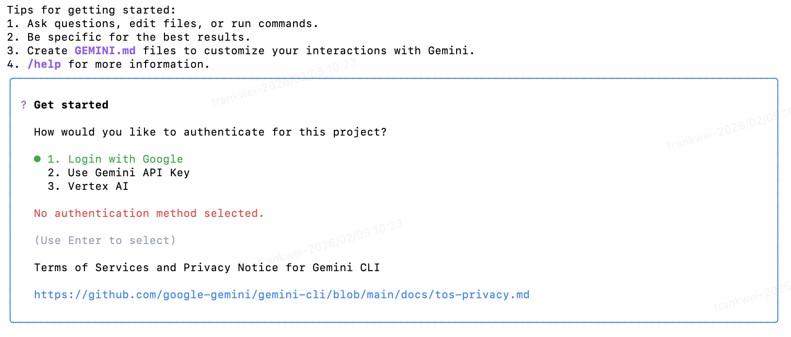

## 安装

```shell
brew install gemini-cli

```


## 验证是否安装成功

```shell
gemini --version
```

## 启动 

```shell
gemini
```




## 登入验证

启动成功后我们需要登入`Google`账户才能正常使用

直接浏览器授权登入

> 如果账号绑定地区为中国，则可能出现
> Gemini Code Assist, your current account is not eligible. 

修改账号绑定区域即可

修改绑定区域链接

https://policies.google.com/country-association-form

等待`Google`发邮件通知修改绑定区域成功重新登入即可


## 参考 

- https://codelabs.developers.google.com/gemini-cli-hands-on?hl=zh-cn#0
- https://github.com/google-gemini/gemini-cli/issues/5847