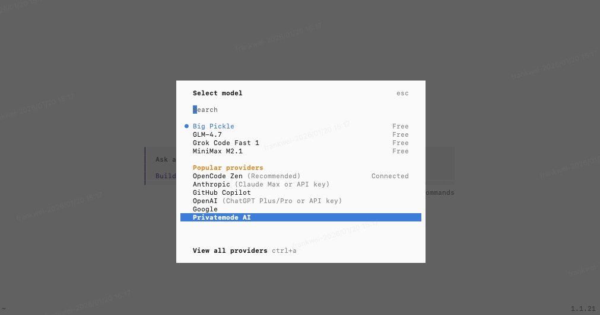

## 安装

```curl
curl -fsSL https://opencode.ai/install | bash
```

安装成功


## 教程

完整教程可以参考[opencode中文教程](https://learnopencode.com/3-workflow/01-plan-build.html)


## 使用

### 启动opencode

1. 重启终端:因为配置了环境变量，使用`opencode`命令需要使用刚配置的环境变量，所有需要新开一个终端


2. 选择我们需要分析的文件目录启动`opencode`

```shell
 cd Desktop/sofa/java/spring-boot-nebula
 opencode
```


### 模型选择

我们属于`/`就会提示很多命令行，直接输入`/models`查看支持哪些模型



有一些内置免费的，也有一些付费的

### 详细使用

#### 查看文件

可以让AI帮我查看当前文件目录包含哪些文件
```shell
帮我查看当前目录有哪些文件
```

#### 使用`@`操作指定文件

我们可以使用`@`来让AI分析指定的文件或者目录

### 使用`!`执行命令

我们可以使用`!`让`AI`获取到执行的`shell`命令结果，从而进行操作

```shell
!ls -la
```


