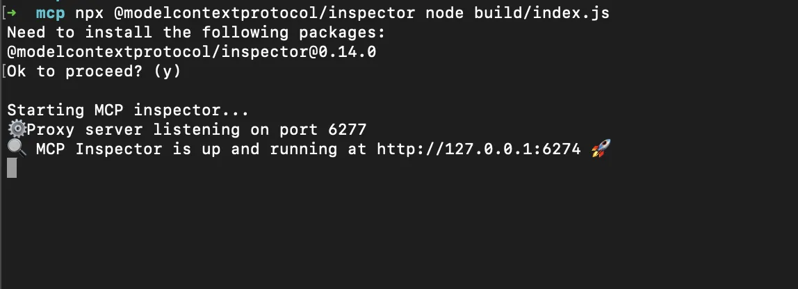
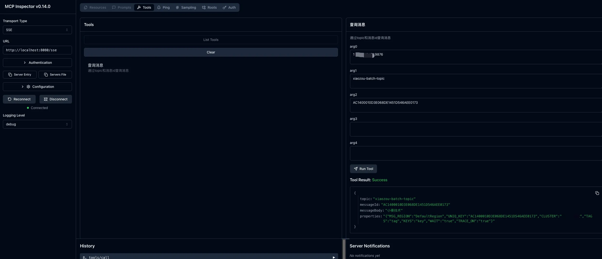
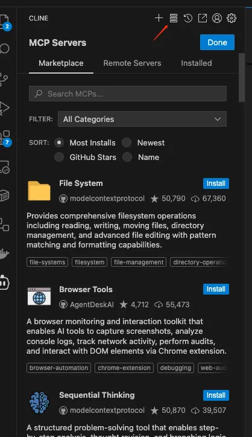
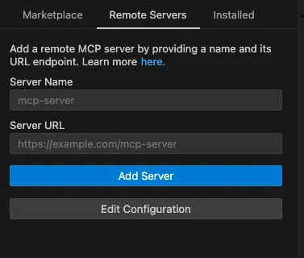
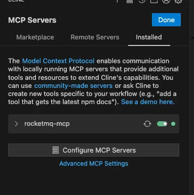
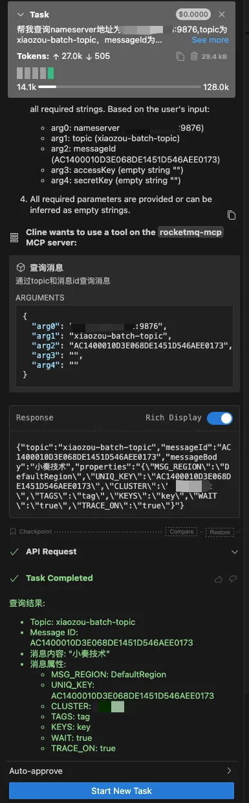

## 背景：为什么是 MCP + Spring AI?


近期，`MCP`协议在全球范围内引起了广泛关注。
它旨在为大型语言模型（LLM）与客户端应用程序之间的交互提供一个标准化、可扩展的协议。

简单来说，`MCP` 就像是 AI 时代的 "HTTP"，让 AI 应用的开发和集成变得更加规范和高效。

在日常的运维和开发工作中，与 RocketMQ 这样的消息中间件交互，通常需要记忆繁琐的命令行、编写专门的脚本或使用特定的管理控制台。如果我们可以直接用自然语言下达指令，例如“帮我查一下主题 a 中消息ID为 xxx 的消息”，无疑将极大提升工作效率和体验。

Spring AI 项目的出现，尤其是其对 Tool Calling（工具调用）的强大支持，让这个想法变得触手可及。

本文将记录如何从零开始，基于 `Spring AI` 和 `MCP` 协议，实现一个 `rocketmq-mcp` 服务器，将复杂的 RocketMQ 操作封装成简单的自然语言指令。

[rocketmq-mcp](https://github.com/weihubeats/rocketmq-mcp) 源码已开源，欢迎围观：https://github.com/weihubeats/rocketmq-mcp

> 源码写的比较简单，仅提供了一个简单的demo，后续需要持续优化

## 编码实战

### 引入依赖

```xml
    <properties>
        <maven.compiler.source>21</maven.compiler.source>
        <maven.compiler.target>21</maven.compiler.target>
        <project.build.sourceEncoding>UTF-8</project.build.sourceEncoding>
        <spring-boot.version>3.4.1</spring-boot.version>
        <rocketmq.version>5.1.0</rocketmq.version>
    </properties>

    <dependencies>

        <dependency>
            <groupId>org.springframework.ai</groupId>
            <artifactId>spring-ai-mcp-server-webmvc-spring-boot-starter</artifactId>
            <version>1.0.0-M6</version>
        </dependency>

        <dependency>
            <groupId>org.springframework.boot</groupId>
            <artifactId>spring-boot-starter-test</artifactId>
            <scope>test</scope>
        </dependency>
        <dependency>
            <groupId>org.apache.rocketmq</groupId>
            <artifactId>rocketmq-client</artifactId>
            <version>${rocketmq.version}</version>
        </dependency>
        <dependency>
            <groupId>org.apache.rocketmq</groupId>
            <artifactId>rocketmq-tools</artifactId>
            <version>${rocketmq.version}</version>
        </dependency>


        <dependency>
            <groupId>org.projectlombok</groupId>
            <artifactId>lombok</artifactId>
            <version>1.18.30</version>
        </dependency>

    </dependencies>

    <dependencyManagement>

        <dependencies>
            <dependency>
                <groupId>org.springframework.boot</groupId>
                <artifactId>spring-boot-dependencies</artifactId>
                <version>${spring-boot.version}</version>
                <type>pom</type>
                <scope>import</scope>
            </dependency>
        </dependencies>

    </dependencyManagement>
```
### 配置并注册 AI 工具

Spring AI 的核心魅力之一在于其 Tool 功能。
我们可以将任何服务中的方法通过注解暴露给 AI 模型。为此，我们需要创建一个配置类，将包含这些工具方法的服务注册到`ToolCallbackProvider` 中。


```java
@Configuration
public class MCPAutoConfiguration {

    @Bean
    public ToolCallbackProvider myTools(MessageService messageService) {
        return MethodToolCallbackProvider
            .builder()
            .toolObjects(messageService)
            .build();
    }
}
```

### 编写核心工具方法

现在，我们来编写实际与 RocketMQ 交互的 MessageService。在这个服务中，我们将定义一个查询消息的方法，并使用 @Tool 注解将其标记为一个可供 AI 调用的工具。


```java
@Service
@RequiredArgsConstructor
public class MessageServiceImpl implements MessageService {

    Map<String, DefaultMQAdminExt> defaultMQAdminExts = new HashMap<>();

    private final static int QUERY_MESSAGE_MAX_NUM = 64;

    @Tool(description = "通过topic和消息id查询消息", name = "查询消息")
    @Override
    public MessageView queryMessageById(String nameserver, String topic, String messageId, String accessKey,
        String secretKey) {

        if (Objects.isNull(defaultMQAdminExts.get(nameserver))) {
            DefaultMQAdminExt defaultMQAdminExt = Objects.nonNull(accessKey) && Objects.nonNull(secretKey) ?
                new DefaultMQAdminExt(new AclClientRPCHook(new SessionCredentials(accessKey, secretKey))) : new DefaultMQAdminExt();

            defaultMQAdminExt.setNamesrvAddr(nameserver);
            defaultMQAdminExt.setInstanceName(Long.toString(System.currentTimeMillis()));
            try {
                defaultMQAdminExt.start();
            } catch (MQClientException e) {
                throw new RuntimeException(e);
            }
            defaultMQAdminExts.put(nameserver, defaultMQAdminExt);
        }

        DefaultMQAdminExt defaultMQAdminExt = defaultMQAdminExts.get(nameserver);

        QueryResult result;
        try {
            result = defaultMQAdminExt.queryMessageByUniqKey(topic, messageId, QUERY_MESSAGE_MAX_NUM, MessageClientIDSetter.getNearlyTimeFromID(messageId).getTime() - 1000 * 60 * 60 * 13L,
                Long.MAX_VALUE);
        } catch (MQClientException | InterruptedException e) {
            throw new RuntimeException(e);
        }
        if (!result.getMessageList().isEmpty()) {
            MessageExt ext = result.getMessageList().getFirst();
            return new MessageView(ext.getTopic(), messageId, new String(ext.getBody(), StandardCharsets.UTF_8), JSON.toJSONString(ext.getProperties()));
        } else {
            return null;
        }
    }

}
```


##  连接并测试 MCP Server

`mcp`提供了`mcp-inspector`进行测试`mcp` `server`

所以我们首先安装`mcp-inspector`

```shell
npx @modelcontextprotocol/inspector node build/index.js
```





安装完成后我们在浏览器输入[http://127.0.0.1:6274/](http://127.0.0.1:6274/)

然后添加我们的mcp server，进行测试




可以看到通过`inspector`进行消息查询没有异常

## 实战：用自然语言查询 RocketM

现在，激动人心的时刻到了。

我们将使用一个支持 MCP 协议的 AI 客户端 cline，通过自然语言来调用我们的服务。


`cline`中配置mcp服务也很简单，首先我们点击下面这个图标




然后在`Remote Servers`中添加我们的`rocketmq-mcp` `server`



添加完成后可以看到我们的`rocketmq-mcp`是亮起一个小绿灯




随后我们就可以使用自然语言进行`RocketMQ`的消息查询了

帮我查询nameserver地址为`127.0.0.1:9876`,topic为`xiaozou-batch-topic`，messageId为`AC1400010D3E068DE1451D546AEE0173`的消息，accessKey和secretKey为空




## 总结

通过本教程，我们基于`Spring AI· 和 `MCP` 协议，将 RocketMQ 的底层操作封装成了对用户友好的自然语言接口。

这不仅极大地降低了消息队列的操作门槛，也为实现更智能、更自动化的 "AIOps" 提供了新的思路

目前，项目只实现了消息查询功能，但这仅仅是一个开始。未来，我们可以轻松地进行扩展，新增更多的功能，比如

- 发送消息
- 管理 Topic：实现 createTopic、deleteTopic 等


欢迎一起共建[rocketmq-mcp](https://github.com/weihubeats/rocketmq-mcp)

## 参考

- https://github.com/weihubeats/rocketmq-mcp
- https://docs.spring.io/spring-ai/reference/getting-started.html
