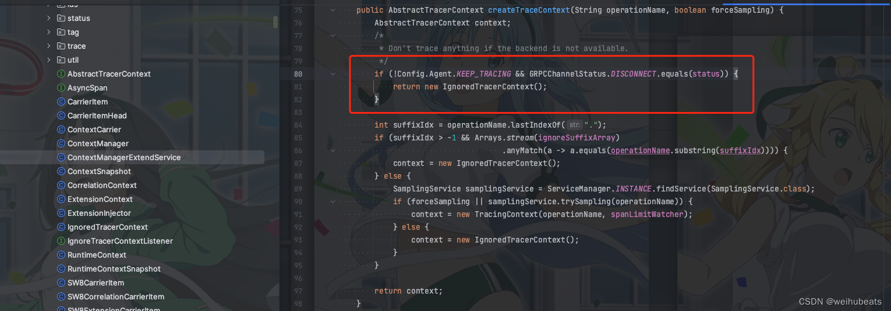
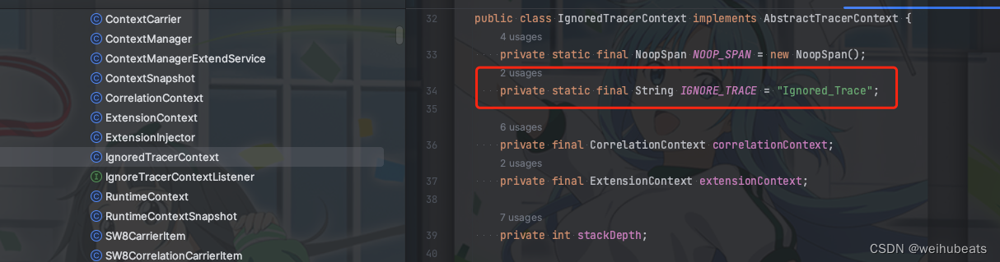

## 问题
在使用`Skywalking`进行`trace`追踪的时候发现配置好像都没问题，但是打印log的时候会出现
TID丢失。
但是和`[TID:N/A]`不同的是，变成了`[TID:Ignored_Trace]`

## 原因

这种情况一般是我们配置的`DSW_AGENT_COLLECTOR_BACKEND_SERVICES`也就是`Platform backend(平台后端)`地址有问题。

所以可以检查自己地址有没有写错、`Platform backend(平台后端)`是不是起来了

我们在源码中创建`TraceContext`可以看到有如下判断

如果GRPC连接为`DISCONNECT`，则创建`IgnoredTracerContext`

