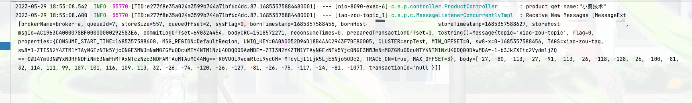
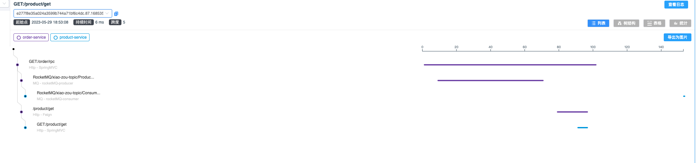
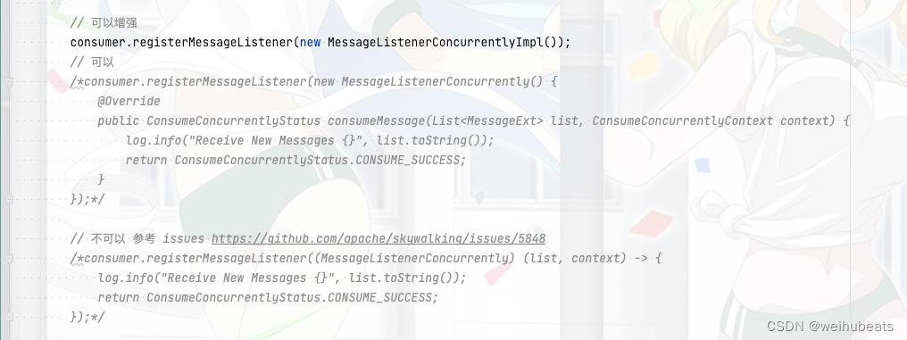

## 背景
继上次我们对`skywalking`整体架构作了一些了解，然后就是学习了`spring boot`项目如何基于`agent`接入`skywalking`

这次我们要实现的是`spring boot`项目的全链路追踪
我们都知道在分布式系统中，会存在多个系统之间的相互调用
比如系统之间的`http`调用，系统之间的`MQ`消费，系统与`MySql`的调用
一个请求包含这么多组件，整个链路非常长，为了方便我们监控排查问题我们就需要一个全链路id(Tid、TraceId)

## skywalking版本
- 9.4.0

## 源码

本demo所有使用的源码都以上传github
- [github](https://github.com/weihubeats/weihubeats_demos/tree/master/spring-boot-demos/spring-boot-skywalking):https://github.com/weihubeats/weihubeats_demos/tree/master/spring-boot-demos/spring-boot-skywalking


## spring boot接入全链路id

这里我们以`order-skywalking`这个demo为例


### 添加依赖

```xml
      <dependency>
            <groupId>org.apache.skywalking</groupId>
            <artifactId>apm-toolkit-logback-1.x</artifactId>
            <version>8.15.0</version>
        </dependency>

        <dependency>
            <groupId>org.apache.skywalking</groupId>
            <artifactId>apm-toolkit-trace</artifactId>
            <version>8.15.0</version>
        </dependency>
```

> 虽然我们的skywalking ui、oap使用的是`9.4.0`版本<br/>
> 但是最新的skywalking-agetn版本只有`8.15.0`

### 新建order-logback.xml 文件

我们新建log文件

```xml
<?xml version="1.0" encoding="UTF-8"?>

<configuration>

    <include resource="org/springframework/boot/logging/logback/defaults.xml"/>

    <property name="CONSOLE_LOG_PATTERN" value="%clr(%d{yyyy-MM-dd HH:mm:ss.SSS}){faint} %clr(${LOG_LEVEL_PATTERN:-%5p}) %clr(%X{tl:-}){yellow} %clr(${PID:- }){magenta} %clr([%tid]){faint}  %clr(---){faint} %clr([%15.15t]){faint} %clr(%-40.40logger{39}){cyan} %clr(:){faint} %m%n${LOG_EXCEPTION_CONVERSION_WORD:-%wEx}"/>

    <appender name="CONSOLE" class="ch.qos.logback.core.ConsoleAppender">
        <encoder class="ch.qos.logback.core.encoder.LayoutWrappingEncoder">
            <layout class="org.apache.skywalking.apm.toolkit.log.logback.v1.x.TraceIdPatternLogbackLayout">
                <pattern>${CONSOLE_LOG_PATTERN}</pattern>
            </layout>
            <charset>UTF-8</charset> <!-- 此处设置字符集 -->
        </encoder>
    </appender>

    <!-- skywalking grpc 日志收集 8.4.0版本开始支持 -->
    <appender name="GRPC-LOG" class="org.apache.skywalking.apm.toolkit.log.logback.v1.x.log.GRPCLogClientAppender">
        <encoder class="ch.qos.logback.core.encoder.LayoutWrappingEncoder">
            <layout class="org.apache.skywalking.apm.toolkit.log.logback.v1.x.mdc.TraceIdMDCPatternLogbackLayout">
                <Pattern>${CONSOLE_LOG_PATTERN}</Pattern>
            </layout>
            <charset>UTF-8</charset> <!-- 此处设置字符集 -->
        </encoder>
    </appender>

    <!--根日志基本是INFO，输出到控制台-->
    <root level="INFO">
        <appender-ref ref="CONSOLE" />
        <appender-ref ref="GRPC-LOG" />
    </root>

    <logger name="com.skywalking.order" level="INFO"/>

        <springProfile name="test">
            <logger name="com.skywalking.order" level="DEBUG" additivity="true">
            </logger>
        </springProfile>

    <springProfile name="prd">
        <logger name="com.skywalking.order" level="INFO" additivity="true">
        </logger>
    </springProfile>
</configuration>
```

### application.yml指定log文件

我们在`application.yml`中指定我们自定义的log文件

```yaml
logging:
  config: classpath:order-logback.xml
```


## 测试
- 启动参数
```
-javaagent:/Users/xiaozoujishu/Downloads/skywalking-agent/skywalking-agent.jar
-DSW_AGENT_NAME=order-service
-DSW_AGENT_COLLECTOR_BACKEND_SERVICES=127.0.0.1:11800
```
我们还是运行项目中的`test.http`中的
`GET localhost:8091/order/rpc?name="小奏技术"`


实际效果
- `order-skywalking`打印log


- `product-skywalking`打印log





可以看到一个请求，所有的tid是一致的都是`e277f8e35a024a3599b744a71bf6c4dc.87.16853575884480001`
我们去ui页面搜索看看





## 一个小坑

需要注意在使用`RocketMQ`全链路tid追踪的时候我们不能使用匿名内部类的方式去消费消息比如这种
```java
consumer.registerMessageListener((MessageListenerConcurrently) (list, context) -> {
    log.info("Receive New Messages {}", list.toString());
    return ConsumeConcurrentlyStatus.CONSUME_SUCCESS;
});
```




这种打印出来的log是没有`tid`的
具体原因是如下:
字节码增强无法增强基于Lambda表达式的实现，主要是因为两种实现方式在字节码层面上存在很大的差异。

1. 当使用匿名内部类的方式创建实例时，Java编译器会实际上生成一个新的类，该类继承自原始接口。在这个过程中，编译器会生成一个完整的类，包括类结构和方法实现。在这个情况下，字节码增强可以很容易地找到并修改这个新生成的类和方法。

2. 当使用Lambda表达式时，情况就完全不同。Java编译器并不会为Lambda表达式单独生成一个新的类。相反，它将Lambda表达式编译为一个名为“invokedynamic”的字节码指令。这使得JVM可以在运行时动态地将Lambda表达式转换为实现相应函数接口的实例。这里的关键是，实例的实际类和方法是在运行时动态生成的，而不是在编译时静态生成的。
由于这种运行时的动态生成机制，Lambda表达式的字节码结构使得它在编译时很难被字节码增强工具直接修改。要想增强这种实现方式，需要在运行时刻进行拦截，修改或者增强Lambda表达式的行为，这样的技术成本和实现难度比直接修改静态字节码要高得多。因此，当前的字节码增强工具通常不能直接增强基于Lambda表达式的实现
