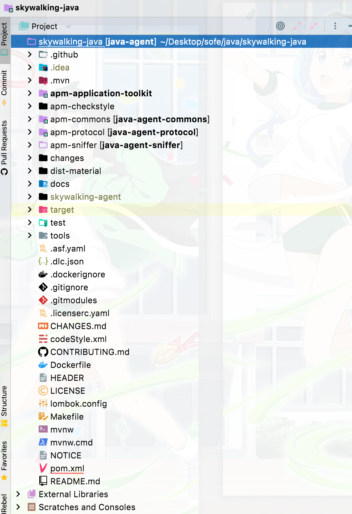
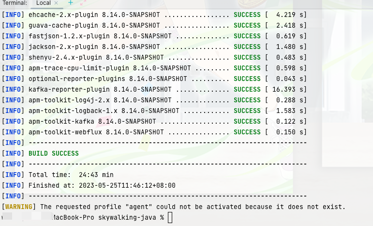
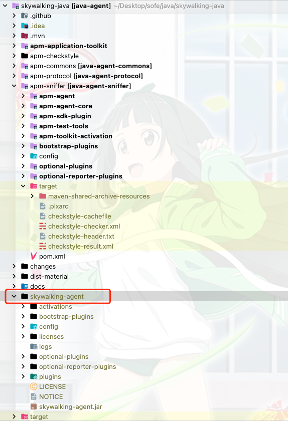
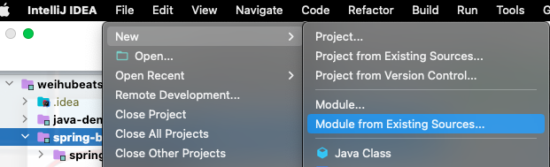
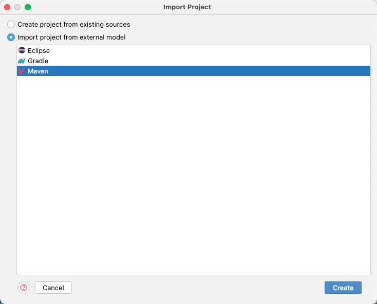
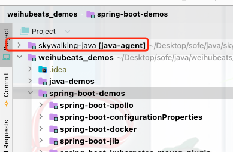

> 这里是weihubeats,觉得文章不错可以关注公众号**小奏技术**，文章首发。拒绝营销号，拒绝标题党

## 背景

传统项目我们再遇到问题都会使用终极技能`Debug`，但是一些非传统项目，我们可能不知道如何`Debug`，所以本文就记录下`java` `agent`如何`Debug`，我们以`skywalking`为例

## 如何debug

首先我们下载`skywalking-java`源码

- [源码地址](https://github.com/apache/skywalking-java):https://github.com/apache/skywalking-java

### 源码目录




### 打包agent

源码目录直接执行`mvn` `package`
```
mvn clean -Dmaven.test.skip=true package -Pagent
```




打包完成后`skywalking-java`项目多出一个`skywalking-agent`目录




### 导入项目

这里比如我们要debug的项目是我们之前使用的`product-skywalking`的demo项目要debug查问题

我们将我们之前下载的`skywalking-java`项目以模块化的方式导入到`product-skywalking`即可







导入完成后`demo`项目和  `skywalking-java`就在同一个项目了




### debug

我们运行还是像之前那样指定agent的目录，使用我们刚打出来的agent即可
```java
-javaagent:/Users/xiazoujishu/Desktop/sofe/java/skywalking-java/skywalking-agent/skywalking-agent.jar -DSW_AGENT_NAME=product-service -DSW_AGENT_COLLECTOR_BACKEND_SERVICES=127.0.0.1:11800
```

然后我们在导入进来的`skywalking-java`项目中打断点，就和正常项目一样`debug`了


## 总结

这里我们研究了`agent`如何`debug`，并以开源项目`skywalking-java`为例.为后续的`skywalking`开发做准备