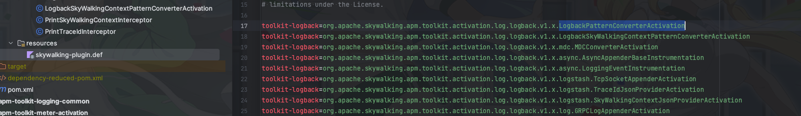

> 这里是**weihubeats**,觉得文章不错可以关注公众号**小奏技术**，文章首发。拒绝营销号，拒绝标题党


## skywalking 版本

- 9.4.0

## 背景

目前系统服务全链路透传使用的是`skywalking`，大家都知道接入`skywalking`会再log里面添加一个tid的打印


比如这样。那么如果我们想新增一个我们自定义的标签怎么处理呢？比如我想新增一个`uid`
变成
```java
2023-12-19 22:07:01.361  INFO  10 [TID:8e3374d0c5394da58fa58b12f1a8c6ae.163.17029696213611565] [Uid:234]
```

### tid的实现原理分析

#### apm-toolkit-logback-1.x 修改

这里我们以`logback`为例

一般我们在`log.xml`里面都会新增一个占位符，比如
```xml
    <property name="CONSOLE_LOG_PATTERN" value="%clr(%d{yyyy-MM-dd HH:mm:ss.SSS}){faint} %clr(${LOG_LEVEL_PATTERN:-%5p}) %clr(%X{tl:-}){yellow} %clr(${PID:- }){magenta} %clr([%tid]){faint}  %clr(---){faint} %clr([%15.15t]){faint} %clr(%-40.40logger{39}){cyan} %clr(:){faint} %m%n${LOG_EXCEPTION_CONVERSION_WORD:-%wEx}"/>

    <appender name="CONSOLE" class="ch.qos.logback.core.ConsoleAppender">
        <encoder class="ch.qos.logback.core.encoder.LayoutWrappingEncoder">
            <layout class="org.apache.skywalking.apm.toolkit.log.logback.v1.x.TraceIdPatternLogbackLayout">
                <pattern>${CONSOLE_LOG_PATTERN}</pattern>
            </layout>
            <charset>UTF-8</charset> <!-- 此处设置字符集 -->
        </encoder>
    </appender>
```

这里我们就加了`tid`。如果要实现我们自定义的`uid`的话，我们肯定也是要加一个占位符比如`uid`。

我们首先看看`skywalking`是如何实现的


首先在`LogbackPatternConverter`类实现`ClassicConverter`给一个默认值
```java
public class LogbackPatternConverter extends ClassicConverter {
    /**
     * As default, return "TID: N/A" to the output message, if SkyWalking agent in active mode, return the real traceId
     * in the recent Context, if existed.
     *
     * @param iLoggingEvent the event
     * @return the traceId: N/A, empty String, or the real traceId.
     */
    @Override
    public String convert(ILoggingEvent iLoggingEvent) {
        return "TID: N/A";
    }
}
```

之后将`LogbackPatternConverter`添加到`PatternLayout`的`defaultConverterMap`中

```java
public class TraceIdPatternLogbackLayout extends PatternLayout {
    static {
        defaultConverterMap.put("tid", LogbackPatternConverter.class.getName());
    }
}
```

可以看到到此为止都只是给默认值。

这一快的代码都是在`apm-toolkit-logback-1.x` 这个sdk实现的。
#### 增强定义(agent)
接下来真正的实现当然是放在`agent`里面去做的首先去继承`ClassInstanceMethodsEnhancePluginDefine`

```java
/**
 * Active the toolkit class "org.apache.skywalking.apm.toolkit.log.logback.v1.x.LogbackPatternConverter". Should not
 * dependency or import any class in "skywalking-toolkit-logback-1.x" module. Activation's classloader is diff from
 * "org.apache.skywalking.apm.toolkit.log.logback.v1.x.LogbackPatternConverter", using direct will trigger classloader
 * issue.
 * <p>
 */
public class LogbackPatternConverterActivation extends ClassInstanceMethodsEnhancePluginDefine {

    public static final String INTERCEPT_CLASS = "org.apache.skywalking.apm.toolkit.activation.log.logback.v1.x.PrintTraceIdInterceptor";
    public static final String ENHANCE_CLASS = "org.apache.skywalking.apm.toolkit.log.logback.v1.x.LogbackPatternConverter";
    public static final String ENHANCE_METHOD = "convert";

    /**
     * @return the target class, which needs active.
     */
    @Override
    protected ClassMatch enhanceClass() {
        return byName(ENHANCE_CLASS);
    }

    /**
     * @return null, no need to intercept constructor of enhance class.
     */
    @Override
    public ConstructorInterceptPoint[] getConstructorsInterceptPoints() {
        return null;
    }

    /**
     * @return the collection of {@link StaticMethodsInterceptPoint}, represent the intercepted methods and their
     * interceptors.
     */
    @Override
    public InstanceMethodsInterceptPoint[] getInstanceMethodsInterceptPoints() {
        return new InstanceMethodsInterceptPoint[] {
                new InstanceMethodsInterceptPoint() {
                    @Override
                    public ElementMatcher<MethodDescription> getMethodsMatcher() {
                        return named(ENHANCE_METHOD).and(takesArgumentWithType(0, "ch.qos.logback.classic.spi.ILoggingEvent"));
                    }

                    @Override
                    public String getMethodsInterceptor() {
                        return INTERCEPT_CLASS;
                    }

                    @Override
                    public boolean isOverrideArgs() {
                        return false;
                    }
                }
        };
    }
}
```

这里主要定义`agent`要增强哪个类、哪个方法。比如这里就通过`ENHANCE_CLASS`定义增强类，`ENHANCE_METHOD`定义增强的方法


之后再`skywalking-plugin.def`配置类中添加这个类




`INTERCEPT_CLASS`拦截class就是配置我们下面要写的也就是真正的实现类

#### 拦截器(agent)
之后再写一个真正实现增强的拦截器

```java
public class PrintTraceIdInterceptor implements InstanceMethodsAroundInterceptor {

    @Override
    public void beforeMethod(EnhancedInstance objInst, Method method, Object[] allArguments, Class<?>[] argumentsTypes,
                             MethodInterceptResult result) throws Throwable {

    }

    @Override
    public Object afterMethod(EnhancedInstance objInst, Method method, Object[] allArguments, Class<?>[] argumentsTypes,
                              Object ret) throws Throwable {
        if (!ContextManager.isActive()) {
            if (allArguments[0] instanceof EnhancedInstance) {
                SkyWalkingContext skyWalkingContext = (SkyWalkingContext) ((EnhancedInstance) allArguments[0]).getSkyWalkingDynamicField();
                if (skyWalkingContext != null) {
                    return "TID:" + skyWalkingContext.getTraceId();
                }
            }
        }
        return "TID:" + ContextManager.getGlobalTraceId();
    }

    @Override
    public void handleMethodException(EnhancedInstance objInst, Method method, Object[] allArguments,
                                      Class<?>[] argumentsTypes, Throwable t) {

    }
}
```

可以看到这个类也是比较简单，实现`InstanceMethodsAroundInterceptor`即可。

然后有方法执行前，执行后，执行异常的各个增强点，和`AOP`优点类似。
看名字就知道这个方法是干嘛的，名字取得非常好


## 如何增加uid打印

通过上面的分析我们就知道如果我们要实现增加一个`uid`的打印我们需要如何开发

1. 在`apm-toolkit-logback-1.x`中继承`ClassicConverter`添加默认值处理类比如`LogbackUidPatternConverter`
```java
public class LogbackUidPatternConverter extends ClassicConverter {
    /**
     * As default, return "TID: N/A" to the output message, if SkyWalking agent in active mode, return the real traceId
     * in the recent Context, if existed.
     *
     * @param iLoggingEvent the event
     * @return the traceId: N/A, empty String, or the real traceId.
     */
    @Override
    public String convert(ILoggingEvent iLoggingEvent) {
        return "Uid:null";
    }
}
```
2. 将`LogbackUidPatternConverter`添加到`TraceIdPatternLogbackLayout`中
```java
public class TraceIdPatternLogbackLayout extends PatternLayout {
    static {
        defaultConverterMap.put("tid", LogbackPatternConverter.class.getName());
        defaultConverterMap.put("uid", LogbackUidPatternConverter.class.getName());
    }
}
```
3. `apm-toolkit-logback-1.x`默认sdk打包，其他项目升级到这个打包出来的新版本

4. agent中`apm-toolkit-logback-1.x-activation`新增拦截器`PrintUidInterceptor`
```java
public class PrintUidInterceptor implements InstanceMethodsAroundInterceptor {

    @Override
    public void beforeMethod(EnhancedInstance objInst, Method method, Object[] allArguments, Class<?>[] argumentsTypes,
                             MethodInterceptResult result) throws Throwable {

    }

    @Override
    public Object afterMethod(EnhancedInstance objInst, Method method, Object[] allArguments, Class<?>[] argumentsTypes,
                              Object ret) throws Throwable {
        if (!ContextManager.isActive()) {
            if (allArguments[0] instanceof EnhancedInstance) {
                SkyWalkingContext skyWalkingContext = (SkyWalkingContext) ((EnhancedInstance) allArguments[0]).getSkyWalkingDynamicField();
                if (skyWalkingContext != null) {
                    return "Uid:null";
                }
            }
        }
        if (Objects.nonNull(ContextManager.getCorrelationContext())) {
            return "Uid:" + ContextManager.getCorrelationContext().get("x-xiazou-uid").orElse(null);
        }
        return "Uid:null";
    }

    @Override
    public void handleMethodException(EnhancedInstance objInst, Method method, Object[] allArguments,
                                      Class<?>[] argumentsTypes, Throwable t) {

    }
}

```

4. 新增`LogbackUidConverterActivation`继承`ClassInstanceMethodsEnhancePluginDefine`定义增强点
```java
public class LogbackUidConverterActivation extends ClassInstanceMethodsEnhancePluginDefine {

    public static final String INTERCEPT_CLASS = "org.apache.skywalking.apm.toolkit.activation.log.logback.v1.x.PrintUidInterceptor";
    public static final String ENHANCE_CLASS = "org.apache.skywalking.apm.toolkit.log.logback.v1.x.LogbackUidPatternConverter";
    public static final String ENHANCE_METHOD = "convert";

    /**
     * @return the target class, which needs active.
     */
    @Override
    protected ClassMatch enhanceClass() {
        return byName(ENHANCE_CLASS);
    }

    /**
     * @return null, no need to intercept constructor of enhance class.
     */
    @Override
    public ConstructorInterceptPoint[] getConstructorsInterceptPoints() {
        return null;
    }

    /**
     * @return the collection of {@link StaticMethodsInterceptPoint}, represent the intercepted methods and their
     * interceptors.
     */
    @Override
    public InstanceMethodsInterceptPoint[] getInstanceMethodsInterceptPoints() {
        return new InstanceMethodsInterceptPoint[] {
                new InstanceMethodsInterceptPoint() {
                    @Override
                    public ElementMatcher<MethodDescription> getMethodsMatcher() {
                        return named(ENHANCE_METHOD).and(takesArgumentWithType(0, "ch.qos.logback.classic.spi.ILoggingEvent"));
                    }

                    @Override
                    public String getMethodsInterceptor() {
                        return INTERCEPT_CLASS;
                    }

                    @Override
                    public boolean isOverrideArgs() {
                        return false;
                    }
                }
        };
    }


}
```

5. 将`LogbackUidConverterActivation`添加到`skywalking-plugin.def`配置中

6. 打包`agent`升级agent即可


## 总结

总的来说修改起来还是比较简单的，主要是skywalking这一套都高度封装了。我们只需要实现或者继承对应的接口(类)即可