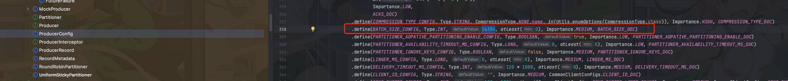
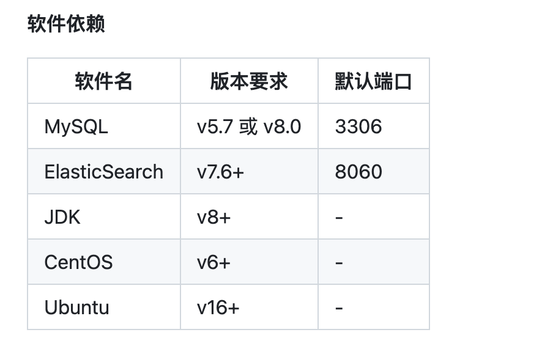
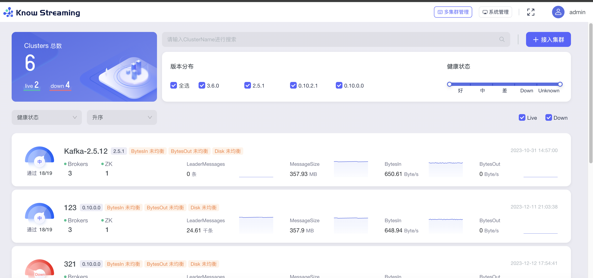
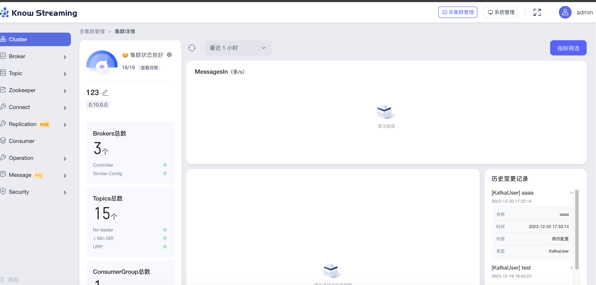

> 这里是**weihubeats**,觉得文章不错可以关注公众号**小奏技术**，文章首发。拒绝营销号，拒绝标题党


## 背景

如果要自建`Kafka`，那么一款功能齐全好用的`dashbaord`是必不可少的。

## 主流的kafka dashbaord

这里简单调研了下主流的`dashbaord`

- [Know Streaming](https://github.com/didi/KnowStreaming) 滴滴开源 `start`:6.6k
- [kafka-ui](https://github.com/provectus/kafka-ui) `start`:7.5k
- [CMAK](https://github.com/yahoo/CMAK) 最早叫`kafka manager`，雅虎开源 `start`:11.6k
- [kafka-map](https://github.com/dushixiang/kafka-map)  一个美观简洁且强大的kafka web管理工具 `start`:0.6k


这里其实也没有做太多的功能对比，主要是还是选用国人开源的`Know Streaming`，毕竟他们称是东半球最简单易用的。


文档、功能非常完善、沟通起来也方便，我们可以看看文档



软件依赖



## 官方文档地址
- [官方文档](https://knowstreaming.com/): https://knowstreaming.com/

## 部署

部署目前支持多种方式


这里我们使用`docker compose`方式

### docker安装

```sh
curl -fsSL https://test.docker.com -o test-docker.sh
sudo sh test-docker.sh
```

### 下载源码
```
git clone https://github.com/didi/KnowStreaming.git
```

### 部署
```sh
cd /data/KnowStreaming/km-dist/docker
docker compose up -d
```

```
✔ Container knowstreaming-manager  Started                                                                                                                                                                                                           10.8s 
 ✔ Container elasticsearch-single   Started                                                                                                                                                                                                            1.4s 
 ✔ Container knowstreaming-ui       Started                                                                                                                                                                                                            0.8s 
 ✔ Container knowstreaming-mysql    Started  
```

可以看到总共启动了四个组件
- manager 后台项目
- elasticsearch es主要存储一些监控埋点数据
- ui 前端数据
- mysql 后台数据库


### 停止
```sh
docker compose stop
```

### 重启
```
docker compose restart
```

## 访问
```
http://127.0.0.1
```


官方也给了一个测试访问的地址。
```
https://demo.knowstreaming.com/login?redirect=/
```

默认账号密码
- admin
- admin







ui还是比较好看的。功能也很气齐全

## 日志清理

`manager`的log不会自动清理。可以进入到容器写一个脚本自动清理

1. 进入容器
```sh
docker container exec -it cbf852xdf02b /bin/bash
```
2. 修改镜像源
```sh
cat << EOF > /etc/apt/sources.list


# 默认注释了源码镜像以提高 apt update 速度，如有需要可自行取消注释
deb http://mirrors.tuna.tsinghua.edu.cn/debian/ buster main contrib non-free
# deb-src http://mirrors.tuna.tsinghua.edu.cn/debian/ buster main contrib non-free

deb http://mirrors.tuna.tsinghua.edu.cn/debian/ buster-updates main contrib non-free
# deb-src http://mirrors.tuna.tsinghua.edu.cn/debian/ buster-updates main contrib non-free

deb http://mirrors.tuna.tsinghua.edu.cn/debian/ buster-backports main contrib non-free
# deb-src http://mirrors.tuna.tsinghua.edu.cn/debian/ buster-backports main contrib non-free

deb http://mirrors.tuna.tsinghua.edu.cn/debian-security buster/updates main contrib non-free
# deb-src http://mirrors.tuna.tsinghua.edu.cn/debian-security buster/updates main contrib non-free

# deb http://security.debian.org/debian-security buster/updates main contrib non-free
# # deb-src http://security.debian.org/debian-security buster/updates main contrib non-free
```

EOF

3. update apt
```
apt update
```

4. 安装vim
```
apt install vim
```

5. 安装cron
```sh
apt install cron
```

6. 编辑脚本
```
cd /logs

vim clear.sh
```

- 脚本内容
```
#!/bin/bash

logPath=/logs/

cd $logPath

rm log_debug_*
rm log_error_*
rm log_info_*
rm log_warn_*ls
```

7. 添加定时任务

```sh

crontab -e
```

添加内容
```
*/30 * * * * sh /logs/clear.sh
```

重启cron
```
service cron restart
```

## dcoker镜像log清理

实际脚本里面对docker的log没有进行限制。

我们可以修改容器的log限制

最简单的方式就是进入容器`log`目录

一般是在这个目录
```
/var/lib/docker/containers/container_id/
```

然后直接 `echo "" > cbf859cdf02bee9baabcf05b5d1439aca5a2db9d03562b2011986d8bc02f7dc0-json.log `