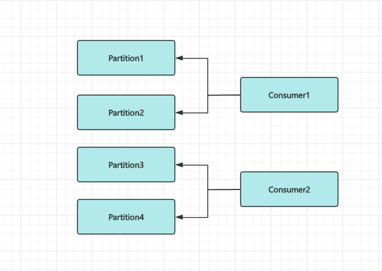
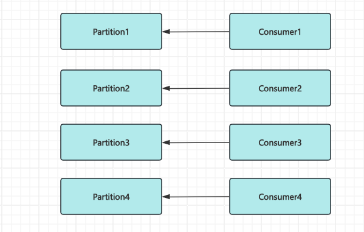
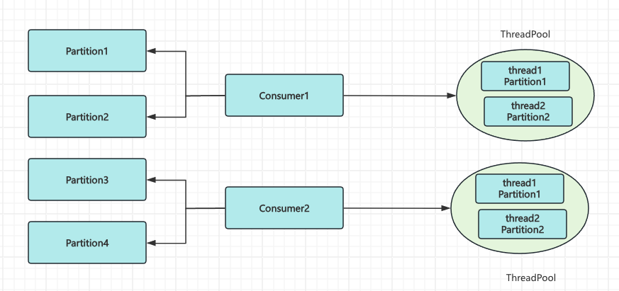
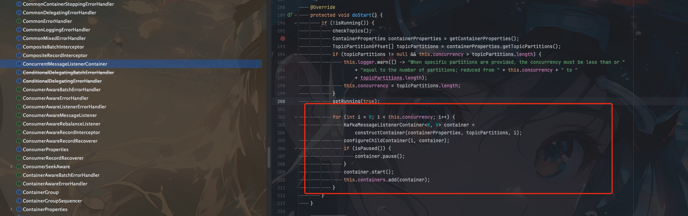

## 背景

在`RocketMQ`中使用顺序消息相对来说比较简单，都是封装好的`SDK`

但是消息的顺序发送和消费在`Kafka`中就似乎就没那么简单了


## 生产者消息顺序发送

我们直接看代码

```java
public class OrderedProducer {

    private static final String TOPIC_NAME = "ordered-topic";

    private final Producer<String, String> producer;

    public OrderedProducer(String bootstrapServers) {

        Properties props = new Properties();
        props.put(ProducerConfig.BOOTSTRAP_SERVERS_CONFIG, bootstrapServers);
        props.put(ProducerConfig.KEY_SERIALIZER_CLASS_CONFIG, StringSerializer.class.getName());
        props.put(ProducerConfig.VALUE_SERIALIZER_CLASS_CONFIG, StringSerializer.class.getName());
        // 生产环境配置
        props.put(ProducerConfig.ACKS_CONFIG, "all");
        // 设置重试次数
        props.put(ProducerConfig.RETRIES_CONFIG, 3);
        // 设置重试间隔时间
        props.put(ProducerConfig.RETRY_BACKOFF_MS_CONFIG, 100);
        //  设置最大请求大小
        props.put(ProducerConfig.BATCH_SIZE_CONFIG, 16384);
        // 批处理延迟时间
        props.put(ProducerConfig.LINGER_MS_CONFIG, 5); 
        // 32MB缓冲区
        props.put(ProducerConfig.BUFFER_MEMORY_CONFIG, 33554432); 
        this.producer = new KafkaProducer<>(props);
    }

    /**
     * 同步发送消息
     *
     * @param topic
     * @param orderKey
     * @param message
     * @return
     */
    public RecordMetadata sendOrderedMessage(String topic, String orderKey, String message) {
        // 使用业务键作为消息的key，确保相同key的消息路由到同一分区 
        ProducerRecord<String, String> record = new ProducerRecord<>(topic, orderKey, message);
        try {
            // 必须是同步模式
            return producer.send(record).get();
        } catch (InterruptedException | ExecutionException e) {
            System.err.println("消息发送失败: " + e.getMessage());
            throw new RuntimeException(e);
        }

    }

    public void close() {
        if (producer != null) {
            producer.flush();
            producer.close();
        }
    }


    public static void main(String[] args) {
        OrderedProducer producer = new OrderedProducer("kafka1:9092,kafka2:9092,kafka3:9092");
        try {
            // 发送订单相关消息 - 同一订单ID的消息保持顺序
            String orderId = "order-12345";
            producer.sendOrderedMessage(TOPIC_NAME, orderId, "订单创建");
            producer.sendOrderedMessage(TOPIC_NAME, orderId, "支付完成");
            producer.sendOrderedMessage(TOPIC_NAME, orderId, "开始配送");
            producer.sendOrderedMessage(TOPIC_NAME, orderId, "订单完成");
        } finally {
            producer.close();
        }
    }

}

```

### 重点说明

1. 我们只初始化了一个生产者

2. 相同`Partition`消息进行同步发送,即只有上一条消息发送成功了才能发送下一条消息

所以发送消息我们没有进行异步发送直接`producer.send(record).get()`


> 实际不同`Partition`消息可以并行发送

> 如果api层面还是想用异步，也可以设置参数`max.in.flight.requests.per.connection`为1.这个参数控制客户端在单个连接上能够发送但尚未收到服务器响应的请求数量。简单来说，它决定了每个连接的最大未确认请求数
> 


## 消费者顺序消费


消费者顺序消费有多种实现方式。我们先说最简单的实现方式

看代码

```java
    public static void main(String[] args) {
        // Configure consumer properties
        Properties props = new Properties();
        props.put(ConsumerConfig.BOOTSTRAP_SERVERS_CONFIG, "localhost:9092");
        props.put(ConsumerConfig.GROUP_ID_CONFIG, "ordered-topic");
        props.put(ConsumerConfig.KEY_DESERIALIZER_CLASS_CONFIG, StringDeserializer.class.getName());
        props.put(ConsumerConfig.VALUE_DESERIALIZER_CLASS_CONFIG, StringDeserializer.class.getName());
        props.put(ConsumerConfig.ENABLE_AUTO_COMMIT_CONFIG, "false"); // Manual offset commit
        props.put(ConsumerConfig.MAX_POLL_RECORDS_CONFIG, "100");     // Limit records per poll

        // Create Kafka consumer
        KafkaConsumer<String, String> consumer = new KafkaConsumer<>(props);

        // Subscribe to topic
        String topic = "orderly-topic";
        consumer.subscribe(Collections.singletonList(topic));

        try {
            while (true) {
                // Poll for messages
                ConsumerRecords<String, String> records = consumer.poll(Duration.ofMillis(100));
                for (ConsumerRecord<String, String> record : records) {
                    System.out.printf("Consumed from partition %d, offset %d: key = %s, value = %s%n",
                            record.partition(), record.offset(), record.key(), record.value());
                    // Manually commit offset
                    consumer.commitSync();
                }
            }
        } finally {
            consumer.close();
        }
    }
```

由于消息发送已经保证了分区有序。所以我们只需要进行分区有序消费即可


所以有如下几个重点

1. 设置自动提交消费位点为`false`
2. 每条消息消费成功才提交消费位点


但是这里实际线上使用可能有一些问题要考虑

比如消息消费失败超过多少次是否考虑丢弃，否则将阻塞后面所有的消息消费


这里我们一个进程只启动了一个`consumer`

如果`consumer`数量 小于 `Partition` 数量

就会出现单线程消费多个`Partition`,多个`Partition`之间应该可以并行，但是实际这里的实现是串行




如果想要优化性能我们就只有两种选择

1. 多少个`Partition`启动多个`consumer`



2. 1个`consumer`使用多线程消费多个 `Partition`




方案一的优点就是实现简单

方案二需要自己进行多`Partition`的分发，实现起来相对来说更复杂

像`spring-kafka`封装中`consumer`有一个参数`concurrency`可以设置消费的并发数量，实际也是启动多个`consumer`




这里给一个代码进行参考,推荐使用第一种


```java
public class OrderedConsumer {

    private static final String BOOTSTRAP_SERVERS = "localhost:9092";
    private static final String TOPIC_NAME = "ordered-messages";
    private static final String CONSUMER_GROUP_ID = "ordered-consumer-group";

    private final Consumer<String, String> consumer;
    private final String topic;
    private final Map<TopicPartition, PartitionProcessor> partitionProcessorMap = new ConcurrentHashMap<>();
    private final ExecutorService executorService;
    private volatile boolean running = true;

    public OrderedConsumer(String bootstrapServers, String groupId, String topic, int maxThreads) {
        Properties props = new Properties();
        props.put(ConsumerConfig.BOOTSTRAP_SERVERS_CONFIG, bootstrapServers);
        props.put(ConsumerConfig.GROUP_ID_CONFIG, groupId);
        props.put(ConsumerConfig.KEY_DESERIALIZER_CLASS_CONFIG, StringDeserializer.class.getName());
        props.put(ConsumerConfig.VALUE_DESERIALIZER_CLASS_CONFIG, StringDeserializer.class.getName());

        props.put(ConsumerConfig.ENABLE_AUTO_COMMIT_CONFIG, "false"); // 手动提交偏移量
        props.put(ConsumerConfig.AUTO_OFFSET_RESET_CONFIG, "latest");
        props.put(ConsumerConfig.MAX_POLL_RECORDS_CONFIG, 100); // 每次拉取的最大记录数
        props.put(ConsumerConfig.MAX_POLL_INTERVAL_MS_CONFIG, 300000); // 5分钟
        props.put(ConsumerConfig.SESSION_TIMEOUT_MS_CONFIG, 30000); // 30秒
        props.put(ConsumerConfig.HEARTBEAT_INTERVAL_MS_CONFIG, 10000); // 10秒

        this.consumer = new KafkaConsumer<>(props);
        this.topic = topic;
        this.executorService = Executors.newFixedThreadPool(maxThreads);
    }

    public void start() {
        try {
            consumer.subscribe(Collections.singletonList(topic));
            while (running) {
                ConsumerRecords<String, String> records = consumer.poll(Duration.ofMillis(100));
                // 按分区处理消息
                Map<TopicPartition, List<ConsumerRecord<String, String>>> partitionedRecords = new HashMap<>();
                for (ConsumerRecord<String, String> record : records) {
                    TopicPartition partition = new TopicPartition(record.topic(), record.partition());
                    partitionedRecords.computeIfAbsent(partition, k -> new ArrayList<>()).add(record);
                }
                // 为每个分区分配专门的处理器
                for (Map.Entry<TopicPartition, List<ConsumerRecord<String, String>>> entry : partitionedRecords.entrySet()) {
                    TopicPartition partition = entry.getKey();
                    List<ConsumerRecord<String, String>> partitionRecords = entry.getValue();

                    // 获取或创建分区处理器
                    PartitionProcessor processor = partitionProcessorMap.computeIfAbsent(partition, k -> new PartitionProcessor(partition));
                    // 提交消息到处理器的队列
                    processor.addRecords(partitionRecords);
                }
            }
        } finally {
            close();
        }
    }

    private class PartitionProcessor {

        private final TopicPartition partition;

        private final Queue<ConsumerRecord<String, String>> messageQueue = new LinkedList<>();

        private boolean isProcessing = false;


        public PartitionProcessor(TopicPartition partition) {
            this.partition = partition;
        }

        public synchronized void addRecords(List<ConsumerRecord<String, String>> records) {
            messageQueue.addAll(records);
            if (!isProcessing) {
                isProcessing = true;
                executorService.submit(this::processQueue);
            }
        }

        private void processQueue() {
            while (true) {
                ConsumerRecord<String, String> record;
                synchronized (this) {
                    record = messageQueue.poll();
                    if (record == null) {
                        isProcessing = false;
                        break;
                    }
                }

                try {
                    // 处理单条消息
                    processMessage(record);
                    // 处理完成后提交偏移量
                    synchronized (consumer) {
                        consumer.commitSync(Collections.singletonMap(
                                partition, new OffsetAndMetadata(record.offset() + 1)
                        ));
                    }
                } catch (Exception e) {
                    System.err.println("处理消息时发生错误: " + e.getMessage());
                    e.printStackTrace();
                    // 在生产环境中，可考虑重试或推送到死信队列
                    // 这里简单地继续处理下一条消息
                }
            }
        }

        private void processMessage(ConsumerRecord<String, String> record) {
            System.out.println("处理消息: partition=" + record.partition() +
                    ", offset=" + record.offset() +
                    ", key=" + record.key() +
                    ", value=" + record.value());

            // 模拟处理时间
            try {
                TimeUnit.MILLISECONDS.sleep(100);
            } catch (InterruptedException e) {
                Thread.currentThread().interrupt();
            }
        }


    }

    public void shutdown() {
        running = false;
    }

    public void close() {
        running = false;
        if (consumer != null) {
            consumer.close();
        }
        if (executorService != null) {
            executorService.shutdown();
            try {
                if (!executorService.awaitTermination(10, TimeUnit.SECONDS)) {
                    executorService.shutdownNow();
                }
            } catch (InterruptedException e) {
                executorService.shutdownNow();
                Thread.currentThread().interrupt();
            }
        }
    }


    public static void main(String[] args) {
        OrderedConsumer consumer = new OrderedConsumer(BOOTSTRAP_SERVERS, CONSUMER_GROUP_ID, TOPIC_NAME, 10);
        Runtime.getRuntime().addShutdownHook(new Thread(consumer::shutdown));
        consumer.start();
    }


}
```

## 总结

`kafka`要保证消息的顺序发送和消费核心主要有如下几个点

1. 保证同`Partition`种消息的同步发送
2. `consumer`的消费相对来说比较简单，要实现不同`Partition`的并发消费，有多种选择


实际上面的方式能保证严格的顺序消费吗？

比如遇到如下意外场景

1. `Partition`进行扩容，默认的分区策略是`Hash`会影响消息分配的`Partition`

2. 如果`Broker` 宕机重启，消费者组会重新分配分区


## 参考

- [kafka-client-examples](https://github.com/hezhangjian/kafka-client-examples)
- [knowstreaming](https://doc.knowstreaming.com/study-kafka/3-config#33-producer-%E9%85%8D%E7%BD%AE)