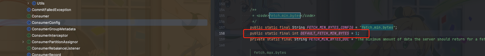
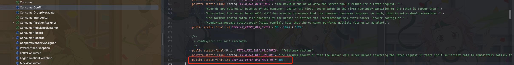

> 这里是**weihubeats**,觉得文章不错可以关注公众号**小奏技术**，文章首发。拒绝营销号，拒绝标题党


## 背景

最近在使用`kafka`的时候遇到了一些性能问题。

所以就打算研究下`kafka`相关的性能优化方案。

`client`主要分两个
- producer
- consumer

## producer

`producer`主要是有两个核心参数

- batch.size
- linger.ms

### batch.size

先说说这个参数吧
`batch.size`是`producer`的参数。

当多条消息发送到相同分区时，`producer`就会将消息打包到一起，然后一次性批量发送到`kafka`。减少网络请求

默认到小是`16384`即`16kb`


默认值其实是偏小的，所以我们最好设置为更大。

batch.size 设置的越大，吞吐就越大，但是延迟也会越大

### linger.ms

我们设想一下，如果要发送的消息一直达不到我们的`batch.size`怎么办呢？

难道消息一直不发送吗？

这里就推出第二个参数`linger.ms`。表示batch的超时时间。

如果`linger.ms`时间内`batch.size`还没达到的话，消息也会直接发送。

该值越大，吞吐越大、但延迟也会越大

## consumer

`consumer`这边的核心参数就是`fetch.min.bytes`,默认值是`1kb`




`Kafka Broker`端积只要积攒了`1kb `的数据，就可以返回给 `Consumer`

然后就是一个`fetch.max.wait.ms`和`producer`的`linger.ms`类似。指定`broker`最大等待时间,默认500ms




## kafka最佳实践

实际早在国外`Hortonworks`就总结了一些`kafka`的最佳实践，虽然文章时间久远，但是依旧很有参考价值

- [【译】Kafka最佳实践 / Kafka Best Practices](https://www.cnblogs.com/huxi2b/p/6720292.html):https://www.cnblogs.com/huxi2b/p/6720292.html
- [原文](https://www.infoq.com/articles/apache-kafka-best-practices-to-optimize-your-deployment/):https://www.infoq.com/articles/apache-kafka-best-practices-to-optimize-your-deployment/
- [ppt](https://www.slideshare.net/HadoopSummit/apache-kafka-best-practices):https://www.slideshare.net/HadoopSummit/apache-kafka-best-practices

## 总结

其实可以看到`producer`的`batch.size`和`linger.ms`就是借鉴了`tcp/ip`的网络发送算法。

`tcp/ip`的`Nagle`算法大致的规则如下
1. 如果包长度达到MSS，则允许发送
2. 如果包含FIN，则允许发送
3. 如果设置了TCP_NODELAY，则允许发送
4. 未设置TCP_CORK选项时，若所有发出去的小数据包（包长度小于MSS）均被确认，则允许发送
5. 上述条件都未满足，但发生了超时（一般为200ms），则立即发送。

```
if there is new data to send then
    if the window size ≥ MSS and available data is ≥ MSS then
        send complete MSS segment now
    else
        if there is unconfirmed data still in the pipe then
            enqueue data in the buffer until an acknowledge is received
        else
            send data immediately
        end if
    end if
end if
```

总得来说主要是四个参数

`producer`:
- batch.size
- linger.ms

`consumer`:

- fetch.min.bytes
- fetch.max.wait.ms

实际还有很多参数也需要配置，在`kafka`最佳实践里面都有一些说明，这里就不过多介绍了
