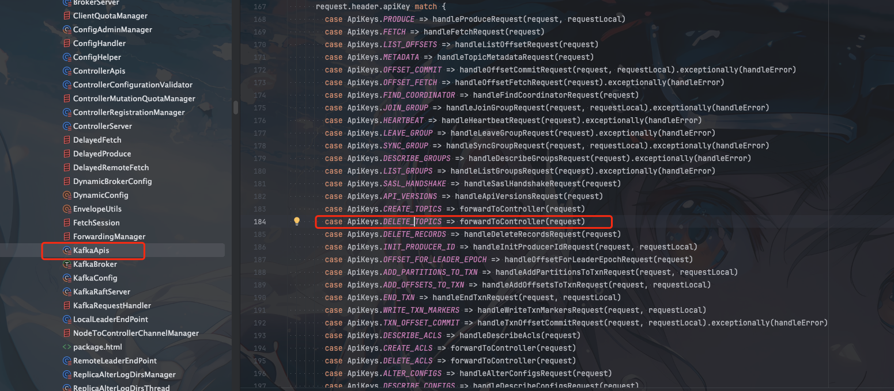
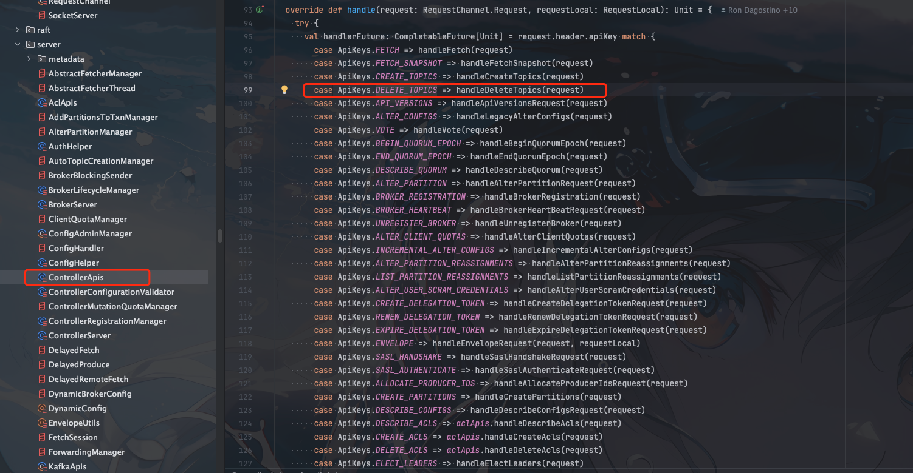

## client

kafka的所有`client`请求都在`kafka.server.KafkaApis`这个类进行分发

`kafka.server.KafkaApis` 这个类用的不是java语言实现的，主要用的是`scala`


请求类型基于`scala`强大的模式匹配语法进行分发的





## serv

server的处理代码也是类似，请求分发主要是在`ControllerApis`




```scala
  private def handleDeleteTopics(request: RequestChannel.Request): CompletableFuture[Unit] = {
    val deleteTopicsRequest = request.body[DeleteTopicsRequest]
    val controllerMutationQuota = quotas.controllerMutation.newQuotaFor(request, strictSinceVersion = 5)
    val context = new ControllerRequestContext(request.context.header.data, request.context.principal,
      requestTimeoutMsToDeadlineNs(time, deleteTopicsRequest.data.timeoutMs),
      controllerMutationQuotaRecorderFor(controllerMutationQuota))
    val future = deleteTopics(context,
      deleteTopicsRequest.data,
      request.context.apiVersion,
      authHelper.authorize(request.context, DELETE, CLUSTER, CLUSTER_NAME, logIfDenied = false),
      names => authHelper.filterByAuthorized(request.context, DESCRIBE, TOPIC, names)(n => n),
      names => authHelper.filterByAuthorized(request.context, DELETE, TOPIC, names)(n => n))
    future.handle[Unit] { (results, exception) =>
      val response = if (exception != null) {
        deleteTopicsRequest.getErrorResponse(exception)
      } else {
        val responseData = new DeleteTopicsResponseData()
          .setResponses(new DeletableTopicResultCollection(results.iterator))
        new DeleteTopicsResponse(responseData)
      }
      requestHelper.sendResponseMaybeThrottleWithControllerQuota(controllerMutationQuota, request, response)
    }
  }

```


实际的删除`topic`逻辑都封装在`deleteTopics`中，这里只是做了一些方法调用的参数组装，所以我们需要继续看看`deleteTopics`方法

```scala
  def deleteTopics(
    context: ControllerRequestContext,
    request: DeleteTopicsRequestData,
    apiVersion: Int,
    hasClusterAuth: Boolean,
    getDescribableTopics: Iterable[String] => Set[String],
    getDeletableTopics: Iterable[String] => Set[String]
  ): CompletableFuture[util.List[DeletableTopicResult]] = {
    // Check if topic deletion is enabled at all.
    if (!config.deleteTopicEnable) {
      if (apiVersion < 3) {
        return CompletableFuture.failedFuture(new InvalidRequestException("This version does not support topic deletion."))
      } else {
        return CompletableFuture.failedFuture(new TopicDeletionDisabledException())
      }
    }
    // The first step is to load up the names and IDs that have been provided by the
    // request.  This is a bit messy because we support multiple ways of referring to
    // topics (both by name and by id) and because we need to check for duplicates or
    // other invalid inputs.
    val responses = new util.ArrayList[DeletableTopicResult]
    def appendResponse(name: String, id: Uuid, error: ApiError): Unit = {
      responses.add(new DeletableTopicResult().
        setName(name).
        setTopicId(id).
        setErrorCode(error.error.code).
        setErrorMessage(error.message))
    }
    val providedNames = new util.HashSet[String]
    val duplicateProvidedNames = new util.HashSet[String]
    val providedIds = new util.HashSet[Uuid]
    val duplicateProvidedIds = new util.HashSet[Uuid]
    def addProvidedName(name: String): Unit = {
      if (duplicateProvidedNames.contains(name) || !providedNames.add(name)) {
        duplicateProvidedNames.add(name)
        providedNames.remove(name)
      }
    }
    request.topicNames.forEach(addProvidedName)
    request.topics.forEach {
      topic => if (topic.name == null) {
        if (topic.topicId.equals(ZERO_UUID)) {
          appendResponse(null, ZERO_UUID, new ApiError(INVALID_REQUEST,
            "Neither topic name nor id were specified."))
        } else if (duplicateProvidedIds.contains(topic.topicId) || !providedIds.add(topic.topicId)) {
          duplicateProvidedIds.add(topic.topicId)
          providedIds.remove(topic.topicId)
        }
      } else {
        if (topic.topicId.equals(ZERO_UUID)) {
          addProvidedName(topic.name)
        } else {
          appendResponse(topic.name, topic.topicId, new ApiError(INVALID_REQUEST,
            "You may not specify both topic name and topic id."))
        }
      }
    }
    // Create error responses for duplicates.
    duplicateProvidedNames.forEach(name => appendResponse(name, ZERO_UUID,
      new ApiError(INVALID_REQUEST, "Duplicate topic name.")))
    duplicateProvidedIds.forEach(id => appendResponse(null, id,
      new ApiError(INVALID_REQUEST, "Duplicate topic id.")))
    // At this point we have all the valid names and IDs that have been provided.
    // However, the Authorizer needs topic names as inputs, not topic IDs.  So
    // we need to resolve all IDs to names.
    val toAuthenticate = new util.HashSet[String]
    toAuthenticate.addAll(providedNames)
    val idToName = new util.HashMap[Uuid, String]
    controller.findTopicNames(context, providedIds).thenCompose { topicNames =>
      topicNames.forEach { (id, nameOrError) =>
        if (nameOrError.isError) {
          appendResponse(null, id, nameOrError.error())
        } else {
          toAuthenticate.add(nameOrError.result())
          idToName.put(id, nameOrError.result())
        }
      }
      // Get the list of deletable topics (those we can delete) and the list of describable
      // topics.
      val topicsToAuthenticate = toAuthenticate.asScala
      val (describable, deletable) = if (hasClusterAuth) {
        (topicsToAuthenticate.toSet, topicsToAuthenticate.toSet)
      } else {
        (getDescribableTopics(topicsToAuthenticate), getDeletableTopics(topicsToAuthenticate))
      }
      // For each topic that was provided by ID, check if authentication failed.
      // If so, remove it from the idToName map and create an error response for it.
      val iterator = idToName.entrySet().iterator()
      while (iterator.hasNext) {
        val entry = iterator.next()
        val id = entry.getKey
        val name = entry.getValue
        if (!deletable.contains(name)) {
          if (describable.contains(name)) {
            appendResponse(name, id, new ApiError(TOPIC_AUTHORIZATION_FAILED))
          } else {
            appendResponse(null, id, new ApiError(TOPIC_AUTHORIZATION_FAILED))
          }
          iterator.remove()
        }
      }
      // For each topic that was provided by name, check if authentication failed.
      // If so, create an error response for it. Otherwise, add it to the idToName map.
      controller.findTopicIds(context, providedNames).thenCompose { topicIds =>
        topicIds.forEach { (name, idOrError) =>
          if (!describable.contains(name)) {
            appendResponse(name, ZERO_UUID, new ApiError(TOPIC_AUTHORIZATION_FAILED))
          } else if (idOrError.isError) {
            appendResponse(name, ZERO_UUID, idOrError.error)
          } else if (deletable.contains(name)) {
            val id = idOrError.result()
            if (duplicateProvidedIds.contains(id) || idToName.put(id, name) != null) {
              // This is kind of a weird case: what if we supply topic ID X and also a name
              // that maps to ID X?  In that case, _if authorization succeeds_, we end up
              // here.  If authorization doesn't succeed, we refrain from commenting on the
              // situation since it would reveal topic ID mappings.
              duplicateProvidedIds.add(id)
              idToName.remove(id)
              appendResponse(name, id, new ApiError(INVALID_REQUEST,
                "The provided topic name maps to an ID that was already supplied."))
            }
          } else {
            appendResponse(name, ZERO_UUID, new ApiError(TOPIC_AUTHORIZATION_FAILED))
          }
        }
        // Finally, the idToName map contains all the topics that we are authorized to delete.
        // Perform the deletion and create responses for each one.
        controller.deleteTopics(context, idToName.keySet).thenApply { idToError =>
          idToError.forEach { (id, error) =>
            appendResponse(idToName.get(id), id, error)
          }
          // Shuffle the responses so that users can not use patterns in their positions to
          // distinguish between absent topics and topics we are not permitted to see.
          Collections.shuffle(responses)
          responses
        }
      }
    }
  }
```


核心删除逻辑

```scala
controller.deleteTopics
```