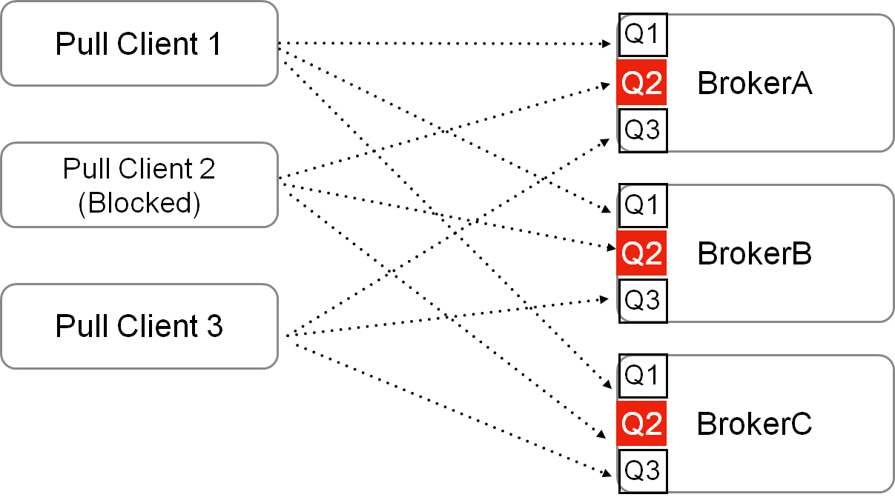
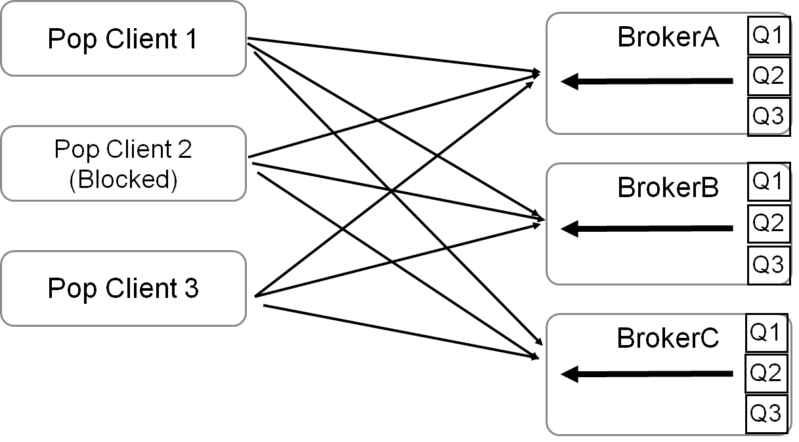

> 这里是**weihubeats**,觉得文章不错可以关注公众号**小奏技术**，文章首发。拒绝营销号，拒绝标题党


## 背景

当前的消费负载均衡策略是以队列的维度来进行，所有行为全部是由**客户端**主动来完成，主要分为三步：

1. 每个consumer定时去获取消费的topic的队列总数，以及consumer总数

2. 将队列按编号、consumer按ip排序，用统一的分配算法计算该consumer分配哪些消费队列

3. 每个consumer去根据算法分配出来的队列，拉取消息消费


存在的问题：

1. 客户端代码逻辑较重，要支持一种新语言的客户端就必须实现完整的重平衡逻辑，此外还需要实现拉消息、位点管理、消费失败后将消息发回 Broker 重试等逻辑。这给多语言客户端的支持造成很大的阻碍。
2. 当客户端升级或者下线时，都要进行重平衡操作，可能造成消息堆积。
3. 如果有一个队列有异常（应用自身异常，或某个broker在升级）导致消费较慢或者停止，该队列会出现堆积现象，因为队列不会被分配给其他机器，因此如果长时间不处理，队列的堆积会越来越严重
4. 消费者无法无限扩展，当消费者数量扩大到大于队列数量时，有的消费者将无法分配到队列。

## 目标
新方案需要保证两点：

1. 高可用：单一队列的消费能力不受某个消费客户端异常的影响

2. 高性能：POP订阅对消息消费的延迟和吞吐的影响在10%以内

## 架构设计

当前`pull`模式架构下的消费模型如下




pop的消费模型



举个简单🌰

- topic名字: xiaozou
- queue数量: 6(brokerA-Q1、brokerA-Q2、brokerB-Q1、brokerB-Q2、brokerC-Q1、brokerC-Q2)
- gid: gid_xiaozou
- 消费者数量: 3(consumer-a、consumer-b、consumer-c)

- push消费模式

consumer-a:brokerA-Q1、brokerB-Q1、brokerC-Q1

consumer-b: brokerA-Q2、okerB-Q2、bkerC-Q2

- pop消费模式:

consumer-a:brokerA-Q1、brokerB-Q1、brokerC-Q1、brokerA-Q2、okerB-Q2、bkerC-Q2

consumer-b:brokerA-Q1、brokerB-Q1、brokerC-Q1、brokerA-Q2、okerB-Q2、bkerC-Q2


## pop特性

- 单个客户端消费所有`queue`,避免单个`client`假死造成消息堆积

- `Rebalance`在`broker`实现，方便多语言`client`实现维护

## 如何切换

目前提供了两种方式切换

### 管理后台切换

```
mqadmin setConsumeMode -c cluster -t topic -g group -m POP -q 8
```

### 代码切换

```java
public class PopPushConsumer {

    public static final String CONSUMER_GROUP = "gid_pop_xiao-zou-topic";
    public static final String TOPIC = "xiao-zou-topic";

    // Or use AdminTools directly: mqadmin setConsumeMode -c cluster -t topic -g group -m POP -n 8
    private static void switchPop() throws Exception {

        DefaultMQAdminExt mqAdminExt = new DefaultMQAdminExt();
        mqAdminExt.setNamesrvAddr("http://localhost:9876");
        mqAdminExt.start();
        ClusterInfo clusterInfo = mqAdminExt.examineBrokerClusterInfo();
        Set<String> brokerAddrs = clusterInfo.getBrokerAddrTable().values().stream().map(BrokerData::selectBrokerAddr).collect(Collectors.toSet());
        for (String brokerAddr : brokerAddrs) {
            mqAdminExt.setMessageRequestMode(brokerAddr, TOPIC, CONSUMER_GROUP, MessageRequestMode.POP, 8, 3_000);
        }
    }

    public static void main(String[] args) throws Exception {
        switchPop();
        DefaultMQPushConsumer consumer = new DefaultMQPushConsumer(CONSUMER_GROUP);
        consumer.subscribe(TOPIC, "*");
        consumer.setConsumeFromWhere(ConsumeFromWhere.CONSUME_FROM_LAST_OFFSET);
        consumer.registerMessageListener((MessageListenerConcurrently) (msgs, context) -> {
            System.out.printf("%s Receive New Messages: %s %n", Thread.currentThread().getName(), msgs);
            return ConsumeConcurrentlyStatus.CONSUME_SUCCESS;
        });
        consumer.setClientRebalance(false);
        consumer.start();
        System.out.printf("Consumer Started.%n");
    }
}
```

## 总结

`pop`消费方式的出现主要是为了解决两个核心问题：
1. `Rebalance`在`broker`实现，方便多语言`client`实现维护.更符合云原生
2. 单个客户端消费所有`queue`,避免单个`client`假死造成消息堆积
3. 避免出现因为queue不足导致的扩展`consumer`提升消费能力异常
4. 避免消息队列数量与`consumer`数量比例不均衡时导致的某些`consumer`承担过多的消息

后续有机会再分析下`pop`消费时间的源码以及更多细节

## 参考
- [[RIP 19] Server side rebalance, lightweight consumer client support
](https://github.com/apache/rocketmq/wiki/%5BRIP-19%5D-Server-side-rebalance,--lightweight-consumer-client-support)

- [RocketMQ 5.0：POP 消费模式 原理详解 & 源码解析
](https://hscarb.github.io/rocketmq/20221212-rocketmq-consumer-7-pop-consume.html)
