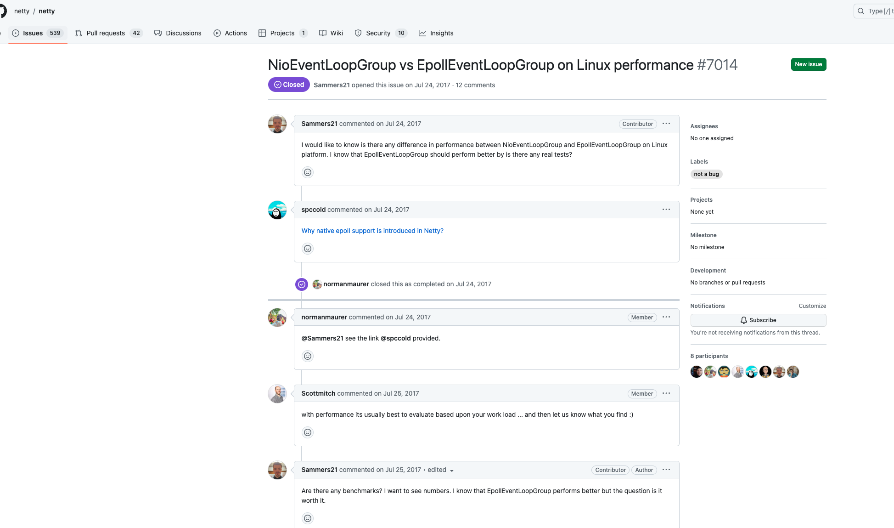
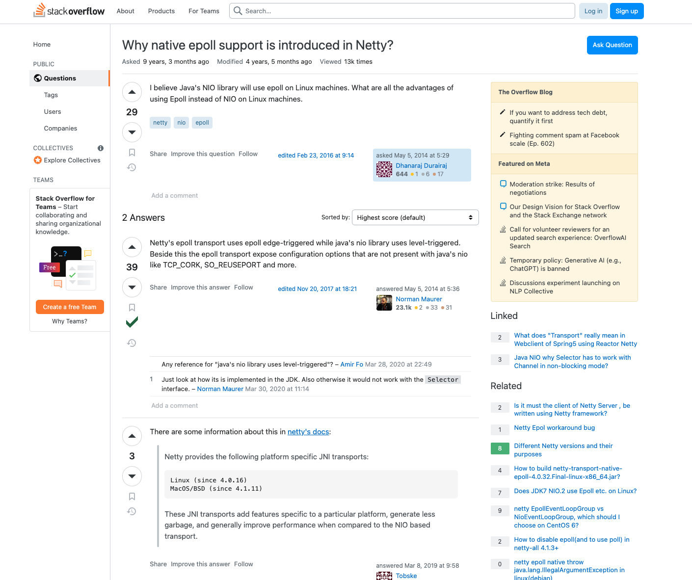

> 这里是**weihubeats**,觉得文章不错可以关注公众号**小奏技术**，文章首发。拒绝营销号，拒绝标题党


## 背景

最近在排查`RocketMQ`一个网络问题的时候，排查到了`Netty`相关的处理，然后看到了`RocketMQ`在构建`workGroup`的时候，发现了有如下代码

```java
private EventLoopGroup buildEventLoopGroupSelector() {
        if (useEpoll()) {
            return new EpollEventLoopGroup(nettyServerConfig.getServerSelectorThreads(), new ThreadFactory() {
                private final AtomicInteger threadIndex = new AtomicInteger(0);
                private final int threadTotal = nettyServerConfig.getServerSelectorThreads();

                @Override
                public Thread newThread(Runnable r) {
                    return new Thread(r, String.format("NettyServerEPOLLSelector_%d_%d", threadTotal, this.threadIndex.incrementAndGet()));
                }
            });
        } else {
            return new NioEventLoopGroup(nettyServerConfig.getServerSelectorThreads(), new ThreadFactory() {
                private final AtomicInteger threadIndex = new AtomicInteger(0);
                private final int threadTotal = nettyServerConfig.getServerSelectorThreads();

                @Override
                public Thread newThread(Runnable r) {
                    return new Thread(r, String.format("NettyServerNIOSelector_%d_%d", threadTotal, this.threadIndex.incrementAndGet()));
                }
            });
        }
    }
```

可以看到有一个很核心的判断
```java
if (useEpoll()) {
  //...
}


private boolean useEpoll() {
        return NetworkUtil.isLinuxPlatform()
            && nettyServerConfig.isUseEpollNativeSelector()
            && Epoll.isAvailable();
    }
```

这里判断是否使用linux中的`epoll`网络IO模型，可以看到最终构建的`Group`有区别，分别是:
- EpollEventLoopGroup
- NioEventLoopGroup


## `EpollEventLoopGroup`和`NioEventLoopGroup`的区别

- `NioEventLoopGroup`：基于 `Java NIO（New I/O）`库实现，使用 Java 原生的 Selector 类来处理事件驱动。它在大多数操作系统上都能正常工作，并且具有良好的跨平台性能。NioEventLoopGroup 是 Netty 的默认事件循环组

- `EpollEventLoopGroup`：基于 `Linux` 的 `epoll` 机制实现，利用了 Linux 内核提供的事件通知机制来实现高性能的事件驱动。它在适用于 Linux 的环境下提供更好的性能和扩展性。`EpollEventLoopGroup` 需要依赖于 Netty 的 `netty-transport-native-epoll` 模块，并且只能在支持 `epoll` 的操作系统上使用，如 `Linux`

可以看到这里的说明是`EpollEventLoopGroup`在`linux`平台的性能是要高于`NioEventLoopGroup`

网上也是大多这个说法，那么有没有什么数据证明呢？

## 相关issues及说明

其实如果我们去`netty` `github`仓库会发现，不止我们有这方面的疑问，一些老外也有。




- [issues](https://github.com/netty/netty/issues/7014):https://github.com/netty/netty/issues/7014

在这个issues讨论中给了一个`stackoverflow`的链接

- [stackoverflow](https://stackoverflow.com/questions/23465401/why-native-epoll-support-is-introduced-in-netty)https://stackoverflow.com/questions/23465401/why-native-epoll-support-is-introduced-in-netty

我们过去看看





大致说`EpollEventLoopGroup`有如下优势
1. `netty`的`epoll`传输使用`epoll`边缘触发，而Java的NIO库使用水平触发。除此之外，epoll传输还提供了Java的NIO库所没有的配置选项，例如`TCP_CORK、SO_REUSEPORT`等。
2. `Netty`提供了以下特定于平台的`JNI`传输：
```
Linux (since 4.0.16)
MacOS/BSD (since 4.1.11)
```
与基于NIO的传输相比，这些JNI传输添加了特定于特定平台的特性，生成更少的垃圾，并且通常提高了性能。

## 简单聊聊水平触发和边缘触发

- 水平触发（`Level-Triggered`）：在水平触发模式下，当一个文件描述符上有可读或可写事件发生时，如果应用程序没有对该事件进行处理，那么下次调用 epoll_wait() 函数时，仍然会返回该事件。也就是说，只要文件描述符上的状态还是可读或可写，就会不断地触发事件通知。这意味着如果应用程序没有及时处理事件，可能会导致事件的堆积和重复处理。
- 边缘触发（`Edge-Triggered`）：在边缘触发模式下，当一个文件描述符上有可读或可写事件发生时，只会触发一次事件通知，并且只有在文件描述符的状态发生变化时才会再次触发。也就是说，边缘触发模式只关注状态的变化，对于未处理的事件不会重复通知。应用程序需要确保在处理完事件后，及时读取或写入数据，以避免错过事件。

总结来说，水平触发模式下，只要文件描述符上的状态保持可读或可写，就会不断触发事件通知；而边缘触发模式下，只有在文件描述符的状态发生变化时才会触发事件通知。边缘触发模式更加精确和高效，因为它只通知状态变化的事件，减少了不必要的事件通知和处理开销。但是，边缘触发模式对于应用程序的处理要求更高，需要确保在处理完事件后及时读取或写入数据，否则可能会错过事件

## 总结

总的来说网上大多说明`EpollEventLoopGroup`在linux性能是更高于`NioEventLoopGroup`,但暂时没有找到相关的基准测试数据。总的来说在linux上面使用`EpollEventLoopGroup`似乎是更优的选择，所以我们在部署`RocketMQ`的时候我们可以将参数`useEpollNativeSelector`配置为`true`


