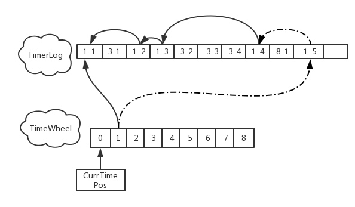
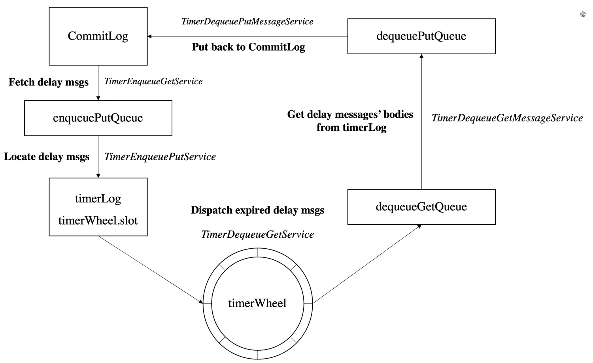

> 这里是**小奏**,觉得文章不错可以关注公众号**小奏技术**，文章首发。拒绝营销号，拒绝标题党


## RocketMQ版本
- 5.1.0

## 背景

之前我们分析了`RocketMQ` `5.x`固定等级延时消息源码分析

今天来分析`RocketMQ` `5.x`新增的任意时间的延时消息


## 使用

### 固定延时消息

早期在4.x的时候`RocketMQ`只支持18个固定延迟时间的延时消息

使用方式如下

```java
        DefaultMQProducer producer = new DefaultMQProducer(producerGroup);
        producer.setNamesrvAddr(namesrvAddr);
        try {
            producer.start();
        } catch (MQClientException e) {
            throw new RuntimeException(e);
        }

        Message msg = new Message(TOPIC /* Topic */,
                TAG /* Tag */,
                ("Hello RocketMQ " + i).getBytes(RemotingHelper.DEFAULT_CHARSET) /* Message body */
        );
        // 设置延迟level为5，对应延迟1分钟
        msg.setDelayTimeLevel(5);
        producer.send(msg);
```


### 任意时间延时消息

#### 支持延时消息时间限制

在5.x后支持了任意时间的延时消息，但是默认只支持3天

```java
private int timerMaxDelaySec = 3600 * 24 * 3;
```

如果需要支持更长时间的延时消息，我们需要在`broker`的`config`中进行配置

```properties
timerMaxDelaySec = 3600 * 24 * 7
```
#### 使用方式


```java
        DefaultMQProducer producer = new DefaultMQProducer(producerGroup);
        producer.setNamesrvAddr(namesrvAddr);
        try {
            producer.start();
        } catch (MQClientException e) {
            throw new RuntimeException(e);
        }

        Message msg = new Message(TOPIC /* Topic */,
                TAG /* Tag */,
                ("Hello RocketMQ " + i).getBytes(RemotingHelper.DEFAULT_CHARSET) /* Message body */
        );
        // 设置消息延迟投递时间为 10 秒后
        msg.setDelayTimeMs(10000);
        producer.send(msg);
```

当然我们也可以通过`setDeliverTimeMs`设置绝对时间进行投递，比如

```java
        DefaultMQProducer producer = new DefaultMQProducer(producerGroup);
        producer.setNamesrvAddr(namesrvAddr);
        try {
            producer.start();
        } catch (MQClientException e) {
            throw new RuntimeException(e);
        }

        Message msg = new Message(TOPIC /* Topic */,
                TAG /* Tag */,
                ("Hello RocketMQ " + i).getBytes(RemotingHelper.DEFAULT_CHARSET) /* Message body */
        );
        // 设置消息在指定的时间戳投递，例如 10 分钟后的某个时间点
        long deliverTime = System.currentTimeMillis() + 10 * 60 * 1000; 
        message.setDeliverTimeMs(deliverTime);
        producer.send(msg);

```

## 为什么4.x一直不支持任意时间的延时消息

主要是实现上有一定难度


目前`RocketMQ`的消息统一存储在`commitLog`，默认超过3天就会过期清理

如果是任意延时消息存储在`commitLog`如何保证消息不被清理，如果不存储在`commitLog`中如何存储

## 设计目标

1. 支持任意时延的延迟消息
2. 提供延迟消息可靠的存储方式
3. 保证延迟消息具有可靠的收发性能
4. 提供延迟消息的可观测性排查能力

## 设计思路

1. 采用本地文件系统作为可靠的延时消息存储介质。延时消息另存TimerLog文件中。通过时间轮对定时消息进行定位以及存取
2. 为延时消息设计新pipeline，定时扫描时间轮中的到时消息，转发至commitLog中
3. 针对长时间定时消息，通过消息滚动的方式避免过大的消息存储量
4. 定时消息查询，直接定位时间轮的slot进行查询；转为普通消息时，和当前的查询逻辑一致；


## 详细实现


### 存储

引入两个新的存储文件

- TimerLog： 主要用来存储演示消息的索引
- TimerWheel： 时间轮的主要实现





#### TimerWheel

`TimerWheel`是时间轮的实现。一些核心属性我们来看看

```java
    // 定义特殊标记：BLANK代表空，IGNORE代表在修改时忽略该字段
    public static final int BLANK = -1, IGNORE = -2;
    // 时间轮中的基础槽位数量 默认是 7 * 24 * 3600
    public final int slotsTotal;
    // 每个槽位代表的时间精度，单位为毫秒
    public final int precisionMs;

    // 整个时间轮文件在磁盘上的总长度（字节）
    private final int wheelLength;
```

这个是整个时间轮的结构，然后时间轮中的基本存储单位为`Slot`，`Slot`的数据结构如下
```
/**
 * Represents a slot of timing wheel. Format:
 * ┌────────────┬───────────┬───────────┬───────────┬───────────┐
 * │delayed time│ first pos │ last pos  │    num    │   magic   │
 * ├────────────┼───────────┼───────────┼───────────┼───────────┤
 * │   8bytes   │   8bytes  │  8bytes   │   4bytes  │   4bytes  │
 * └────────────┴───────────┴───────────┴───────────┴───────────┘
 */
```

- delayed_time：延迟时间
- first_pos：TimerLog 中该时刻定时消息链表的第一个消息的物理偏移量
- last_pos：TimerLog 中该时刻定时消息链表的最后（最新）一个消息的物理偏移量（链表头）
- num 消息条数


细节

虽然时间轮的基础槽位是7天

但是时间轮轮转的是2天的

#### TimerLog

`TimerLog`的存储方式也顺序写入`Append-only Log`

保留的不是真实的消息，只保留`CommitLog`的基本索引信息

详细的结构如下

名称|大小|备注
:--:|:--:|:--:|
size|4B|保存记录的大小
prev_pos|8B|前一条记录的位置
next_Pos|8B|后一条记录的位置，暂时为-1，作为保留字段
magic|4B|魔数
delayed_time|4B|该条记录的定时时间
offset_real|8B|该条消息在commitLog中的位置
size_real|4B|该条消息在commitLog中的大小
hash_topic|4B|该条消息topic的hash code
varbody|4B|存储可变的body，暂时没有为空


## 新的pipeline实现



时间轮的处理主要分几个service

```java
    public void initService() {
        enqueueGetService = new TimerEnqueueGetService();
        enqueuePutService = new TimerEnqueuePutService();
        dequeueWarmService = new TimerDequeueWarmService();
        dequeueGetService = new TimerDequeueGetService();
        timerFlushService = new TimerFlushService();

        int getThreadNum = Math.max(storeConfig.getTimerGetMessageThreadNum(), 1);
        dequeueGetMessageServices = new TimerDequeueGetMessageService[getThreadNum];
        for (int i = 0; i < dequeueGetMessageServices.length; i++) {
            dequeueGetMessageServices[i] = new TimerDequeueGetMessageService();
        }

        int putThreadNum = Math.max(storeConfig.getTimerPutMessageThreadNum(), 1);
        dequeuePutMessageServices = new TimerDequeuePutMessageService[putThreadNum];
        for (int i = 0; i < dequeuePutMessageServices.length; i++) {
            dequeuePutMessageServices[i] = new TimerDequeuePutMessageService();
        }
    }
```

下面我们来详细介绍这些`service`是干嘛用的

### TimerEnqueueGetService 扫描定时消息

`TimerEnqueueGetService`通过遍历消费队列索引的方式不断扫描定时消息 Topic(`rmq_sys_wheel_timer`) 中新的定时消息。

扫描到了之后将消息从`CommitLog` 中查出来，封装成`TimerRequest`，放入有界阻塞队列`enqueuePutQueue`(`DisruptorBlockingQueue`)。如果队列满，则会无限次重试等待，达到流控效果

```java
public static final String TIMER_TOPIC = TopicValidator.SYSTEM_TOPIC_PREFIX + "wheel_timer";

enqueuePutQueue = new DisruptorBlockingQueue<>(DEFAULT_CAPACITY);

    // 省略部分代码
    public boolean enqueue(int queueId) {

        ConsumeQueueInterface cq = this.messageStore.getConsumeQueue(TIMER_TOPIC, queueId);
        long offset = currQueueOffset;
        ReferredIterator<CqUnit> iterator = null;
        iterator = cq.iterateFrom(offset);
        if (null == iterator) {
            return false;
        }
        int i = 0;
        while (iterator.hasNext()) {
            i++;

            CqUnit cqUnit = iterator.next();
            long offsetPy = cqUnit.getPos();
            int sizePy = cqUnit.getSize();
            cqUnit.getTagsCode(); //tags code
            MessageExt msgExt = getMessageByCommitOffset(offsetPy, sizePy);
            lastEnqueueButExpiredTime = System.currentTimeMillis();
            lastEnqueueButExpiredStoreTime = msgExt.getStoreTimestamp();
            long delayedTime = Long.parseLong(msgExt.getProperty(TIMER_OUT_MS));
            // use CQ offset, not offset in Message
            msgExt.setQueueOffset(offset + i);
            TimerRequest timerRequest = new TimerRequest(offsetPy, sizePy, delayedTime, System.currentTimeMillis(), MAGIC_DEFAULT, msgExt);
            // System.out.printf("build enqueue request, %s%n", timerRequest);
            while (!enqueuePutQueue.offer(timerRequest, 3, TimeUnit.SECONDS)) {
                if (!isRunningEnqueue()) {
                    return false;
                }
            }
            currQueueOffset = offset + i;
        }
        currQueueOffset = offset + i;
        return i > 0;
    }

```


### TimerEnqueuePutService 将定时消息放入时间轮和 TimerLog

1. `TimerEnqueuePutService`不断扫描队列`enqueuePutQueue`，然后取出`TimerEnqueueGetService`放入的`TimerRequest`
2. 取出的`TimerRequest`请求中如果延时消息到期到期了则直接放入`dequeuePutQueue`准备投递到 `CommitLog`
3. 如果延时消息没到期则存储到到`TimerLog`和`TimerWheel`


执行逻辑核心代码

``` java
        protected void fetchAndPutTimerRequest() throws Exception {
            long tmpCommitQueueOffset = currQueueOffset;
            // 消费enqueuePutQueue获取TimerRequest
            List<TimerRequest> trs = this.fetchTimerRequests();
            if (CollectionUtils.isEmpty(trs)) {
                commitQueueOffset = tmpCommitQueueOffset;
                //尝试推进写入时间（currWriteTimeMs），用于清理过期槽位或触发后续任务
                maybeMoveWriteTime();
                return;
            }
            // 循环尝试将这批消息放入时间轮，直到全部成功
            while (!isStopped()) {
                CountDownLatch latch = new CountDownLatch(trs.size());
                for (TimerRequest req : trs) {
                    req.setLatch(latch);
                    // 将单个定时消息请求放入时间轮（Timer Wheel）
                    // 如果延时消息小于当前写入时间，则直接放入dequeuePutQueue队列
                    this.putMessageToTimerWheel(req);
                }
                //等待所有消息完成入轮（最多等待一段时间，内部有重试机制）
                checkDequeueLatch(latch, -1);
                boolean allSuccess = trs.stream().allMatch(TimerRequest::isSucc);
                if (allSuccess) {
                    break;
                } else {
                    holdMomentForUnknownError();
                }
            }
            // 所有消息成功入轮后，更新已提交的队列位点（持久化消费进度）
            // 更新为最后一条消息的 offset，表示这批消息已成功处理
            commitQueueOffset = trs.get(trs.size() - 1).getMsg().getQueueOffset();
            // 尝试推进写入时间（currWriteTimeMs）
            maybeMoveWriteTime();
        }

        // 省略监控代码
        protected void putMessageToTimerWheel(TimerRequest req) {
            try {
                // 当前消息的延迟时间已过期（小于当前写入时间）
                if (shouldRunningDequeue && req.getDelayTime() < currWriteTimeMs) {
                    // 消息已过期，不应再入时间轮，而是直接转入出队队列（dequeuePutQueue）
                    req.setEnqueueTime(Long.MAX_VALUE);
                    dequeuePutQueue.put(req);
                } else {
                    // 正常入轮：将消息存储到TimerLog和TimerWheel中
                    boolean doEnqueueRes = doEnqueue(
                        req.getOffsetPy(), req.getSizePy(), req.getDelayTime(), req.getMsg());
                    req.idempotentRelease(doEnqueueRes || storeConfig.isTimerSkipUnknownError());
                }
                perfCounterTicks.endTick(ENQUEUE_PUT);
            } catch (Throwable t) {
                LOGGER.error("Unknown error", t);
                if (storeConfig.isTimerSkipUnknownError()) {
                    req.idempotentRelease(true);
                } else {
                    holdMomentForUnknownError();
                }
            }
        }
```


###  TimerDequeueWarmService 

目前看代码这个线程好像没啥用


### TimerDequeueGetService 扫描时间轮中到期的消息

`TimerDequeueGetService`主要是定时扫描`TimerLog`和`TimerWheel`,然后将任务放入`dequeueGetQueue`,推进时间轮

这个线程的作用是：推进时间轮，将时间轮槽位对应的定时消息请求从时间轮和 TimerLog 中取出，加入到 dequeueGetQueue 中。

每 0.1s 执行一次，根据当前扫描时间轮的时间戳，从时间轮和 TimerLog 中查询出 TimerRequest，并分成定时请求和定时消息取消请求两类。

先批量将取消请求入队，等待处理完毕，再将定时消息请求入队，等待处理完毕。

该槽位的定时消息都处理完成后，推进时间轮扫描时间到下一槽位


```java


```


###  TimerFlushService

这个线程主要是将时间轮中的数据定时从`pageCache`中刷新到磁盘中

```java
        @Override
        public void run() {
            while (!this.isStopped()) {
                try {
                    prepareTimerCheckPoint();
                    timerLog.getMappedFileQueue().flush(0);
                    timerWheel.flush();
                    timerCheckpoint.flush();
                    waitForRunning(storeConfig.getTimerFlushIntervalMs());
                } catch (Throwable e) {
                    TimerMessageStore.LOGGER.error("Error occurred in " + getServiceName(), e);
                }
            }
            TimerMessageStore.LOGGER.info(this.getServiceName() + " service end");
        }
    }
```


###  TimerDequeueGetMessageService 查询原始消息

`TimerDequeueGetMessageService`主要是消费`dequeueGetQueue`中的`TimerRequest`

获取到`TimerRequest`根据索引去`CommitLog`查询出原始消息，放入`dequeuePutQueue`中


从 dequeueGetQueue 中取出 TimerRequest
对取出的 TimerRequst，从 CommitLog 中查询原始消息
处理定时消息取消请求，查询出原始消息中要取消消息的 UNIQ_KEY，放入 deleteUniqKeys Set
处理普通定时消息请求
如果 DeleteUniqKeys 中包含这个消息，则什么都不做（取消投递）
否则将查出的原始消息放入 TimerRequest，然后将 TimerRequest 放入 dequeuePutQueue，准备投递到 CommitLog


- TimerDequeuePutMessageService 投递定时消息

这个线程的作用是：将消息从`dequeuePutQueue` 中取出，若已经到期，投递到 CommitLog 中

无限循环从 dequeuePutQueue 中取出 TimerRequest
将原始消息的 Topic 和 queueId 从消息属性中取出，用它们构造成一个新的消息
将消息投递到 CommitLog
如果投递失败，则需要等待{精确度 / 2}时间然后重新投递，必须保证消息投递成功


## 参考

- https://github.com/apache/rocketmq/issues/4557
- https://docs.google.com/document/d/1D6XWwY39p531c2aVi5HQll9iwzTUNT1haUFHqMoRkT0/edit?tab=t.0#heading=h.d7x9otgla1zw