> 这里是**小奏**,觉得文章不错可以关注公众号**小奏技术**，文章首发。拒绝营销号，拒绝标题党


## RocketMQ版本
- 5.1.0

## 背景

首先说明本次源码分析仅分析**时间轮**之前的延时消息设计
> 现在的`RocketMQ`已经支持基于**时间轮**的任意级别延时消息

## 延时消息基础知识

默认`RocketMQ`延时消息共有18个等级


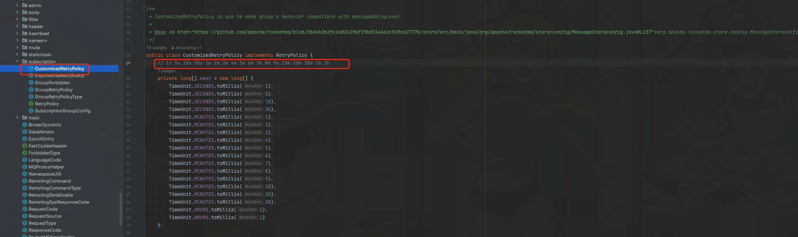


> 1s 5s 10s 30s 1m 2m 3m 4m 5m 6m 7m 8m 9m 10m 20m 30m 1h 2h

### 延时消息的简单使用

发送延时消息
```java
        DefaultMQProducer producer = new DefaultMQProducer(producerGroup);
        producer.setNamesrvAddr(namesrvAddr);
        try {
            producer.start();
        } catch (MQClientException e) {
            throw new RuntimeException(e);
        }

        Message msg = new Message(TOPIC /* Topic */,
                TAG /* Tag */,
                ("Hello RocketMQ " + i).getBytes(RemotingHelper.DEFAULT_CHARSET) /* Message body */
        );

        msg.setDelayTimeLevel(2);
        producer.send(msg);

```

和普通消息不同的我们新增了延时消息等级的设置
```java
        msg.setDelayTimeLevel(2);

```


## 源码分析

消息发送本身和普通消息发送没有太大差别，但是新增了一个`DELAY`属性
```java
public static final String PROPERTY_DELAY_TIME_LEVEL = "DELAY";
```

消息发送的请求code是
```java
public static final int SEND_BATCH_MESSAGE = 320;
```


### 源码入口

这里的我们先从消息的发送开始


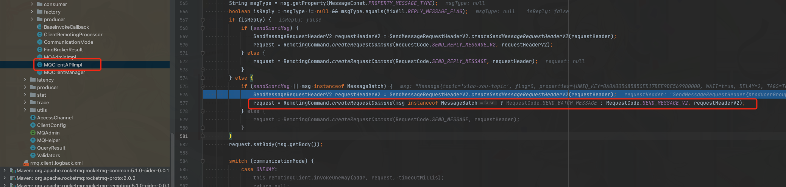


消息发送最终的请求状态码是
```java
public static final int SEND_MESSAGE_V2 = 310;
```

可以看到实际消息发送和普通消息没有什么区别，所以我们还是要去`broker`那边看看有没有什么特殊处理

### broker处理请求

消息处理方法
`org.apache.rocketmq.broker.processor.SendMessageProcessor#processRequest`

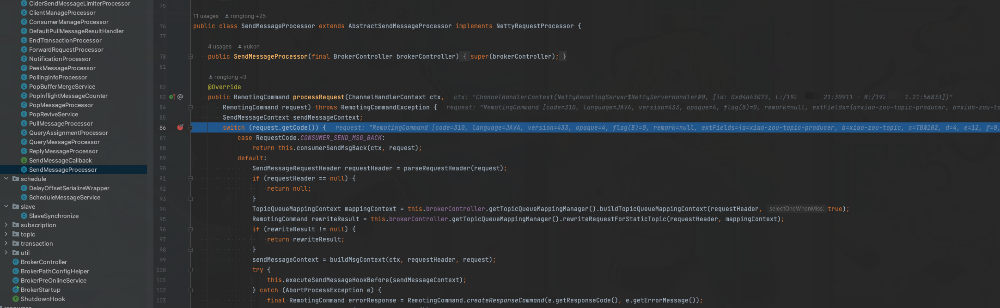


实际的消息发送逻辑在方法

```java
this.sendMessage(ctx, request, sendMessageContext, requestHeader, mappingContext,
                        (ctx12, response12) -> executeSendMessageHookAfter(response12, ctx12));
```


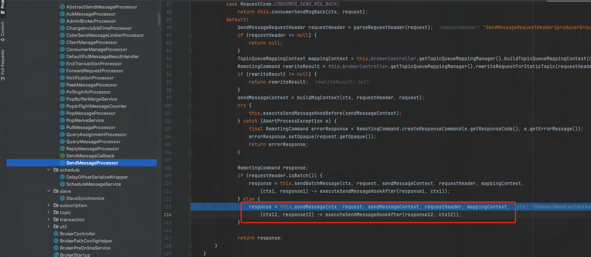

这里我们进去这个方法看看


由于是分析延时消息，所以我们不关注消息发送的一些其他细节。主要关注延时消息和普通消息的处理区别
我们看方法
```java
org.apache.rocketmq.store.DefaultMessageStore#asyncPutMessage
```

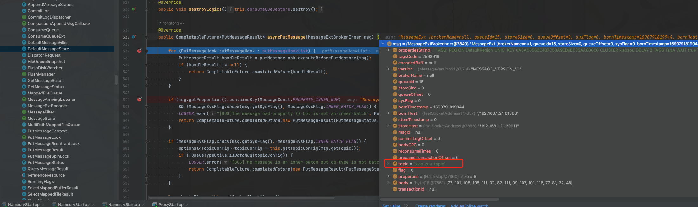


这里可以看到现在的`topic`还是我们正常指定的`xiao-zou-topic`

但是这里会执行多个消息的后置处理器`putMessageHookList`

我们看看`putMessageHookList`有哪些
```java
    public void registerMessageStoreHook() {
        List<PutMessageHook> putMessageHookList = messageStore.getPutMessageHookList();

        putMessageHookList.add(new PutMessageHook() {
            @Override
            public String hookName() {
                return "checkBeforePutMessage";
            }

            @Override
            public PutMessageResult executeBeforePutMessage(MessageExt msg) {
                return HookUtils.checkBeforePutMessage(BrokerController.this, msg);
            }
        });

        putMessageHookList.add(new PutMessageHook() {
            @Override
            public String hookName() {
                return "innerBatchChecker";
            }

            @Override
            public PutMessageResult executeBeforePutMessage(MessageExt msg) {
                if (msg instanceof MessageExtBrokerInner) {
                    return HookUtils.checkInnerBatch(BrokerController.this, msg);
                }
                return null;
            }
        });

        putMessageHookList.add(new PutMessageHook() {
            @Override
            public String hookName() {
                return "handleScheduleMessage";
            }

            @Override
            public PutMessageResult executeBeforePutMessage(MessageExt msg) {
                if (msg instanceof MessageExtBrokerInner) {
                    return HookUtils.handleScheduleMessage(BrokerController.this, (MessageExtBrokerInner) msg);
                }
                return null;
            }
        });

        SendMessageBackHook sendMessageBackHook = new SendMessageBackHook() {
            @Override
            public boolean executeSendMessageBack(List<MessageExt> msgList, String brokerName, String brokerAddr) {
                return HookUtils.sendMessageBack(BrokerController.this, msgList, brokerName, brokerAddr);
            }
        };

        if (messageStore != null) {
            messageStore.setSendMessageBackHook(sendMessageBackHook);
        }
    }
```

这里可以看到主要是三个
1. `checkBeforePutMessage`
2. `innerBatchChecker`
3. `handleScheduleMessage`

通过方法名我们可以很确定的看到主要是`handleScheduleMessage`这个方法出处理延时消息，所以我们重点看看`handleScheduleMessage`


### handleScheduleMessage
- `org.apache.rocketmq.broker.util.HookUtils#handleScheduleMessage
`

```java
 public static PutMessageResult handleScheduleMessage(BrokerController brokerController,
        final MessageExtBrokerInner msg) {
        final int tranType = MessageSysFlag.getTransactionValue(msg.getSysFlag());
        // 事务消息 暂时不管
        if (tranType == MessageSysFlag.TRANSACTION_NOT_TYPE
            || tranType == MessageSysFlag.TRANSACTION_COMMIT_TYPE) {
            if (!isRolledTimerMessage(msg)) {
                if (checkIfTimerMessage(msg)) {
                    if (!brokerController.getMessageStoreConfig().isTimerWheelEnable()) {
                        //wheel timer is not enabled, reject the message
                        return new PutMessageResult(PutMessageStatus.WHEEL_TIMER_NOT_ENABLE, null);
                    }
                    PutMessageResult transformRes = transformTimerMessage(brokerController, msg);
                    if (null != transformRes) {
                        return transformRes;
                    }
                }
            }
            // Delay Delivery 延时消息
            if (msg.getDelayTimeLevel() > 0) {
                transformDelayLevelMessage(brokerController, msg);
            }
        }
        return null;
    }
```

这里的核心逻辑还是
```java
if (msg.getDelayTimeLevel() > 0) {
                transformDelayLevelMessage(brokerController, msg);
            }
```

我们看看`transformDelayLevelMessage`方法
```java
public static void transformDelayLevelMessage(BrokerController brokerController, MessageExtBrokerInner msg) {
        // 判断是否超过最大延时级别18 如果超过则设置为最大延时等级
        if (msg.getDelayTimeLevel() > brokerController.getScheduleMessageService().getMaxDelayLevel()) {
            msg.setDelayTimeLevel(brokerController.getScheduleMessageService().getMaxDelayLevel());
        }

        // Backup real topic, queueId 备份真实的topic queueId
        MessageAccessor.putProperty(msg, MessageConst.PROPERTY_REAL_TOPIC, msg.getTopic());
        MessageAccessor.putProperty(msg, MessageConst.PROPERTY_REAL_QUEUE_ID, String.valueOf(msg.getQueueId()));
        msg.setPropertiesString(MessageDecoder.messageProperties2String(msg.getProperties()));
        // 设置延时消息为SCHEDULE_TOPIC_XXXX 这个固定的topic
        msg.setTopic(TopicValidator.RMQ_SYS_SCHEDULE_TOPIC);    
        // 设置延时消息的queueID delayLevel - 1 
        msg.setQueueId(ScheduleMessageService.delayLevel2QueueId(msg.getDelayTimeLevel()));
    }
```

备份前的`message`信息


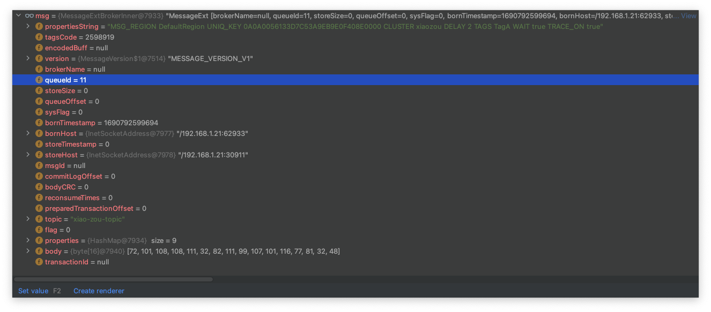

备份后


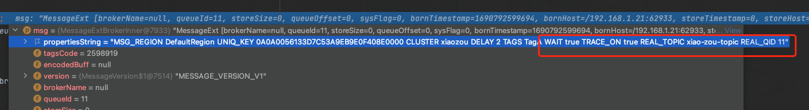


总结就是

1. 将原始topic替换为延迟消息固定的topic:`SCHEDULE_TOPIC_XXXX`

2. 将原始queueid替换为`delayLevel - 1 `

3. 备份原始`topic/queueid`, 保存到原始消息的`properties`属性中

### 延时消息消费

我们通过查看`SCHEDULE_TOPIC_XXXX`的调用发现有一个方法
- `org.apache.rocketmq.broker.schedule.ScheduleMessageService.DeliverDelayedMessageTimerTask#executeOnTimeup`

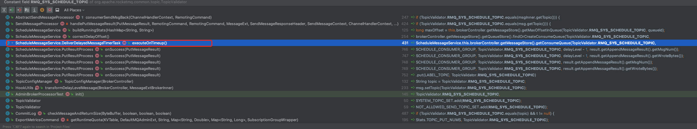

我们查看调用链

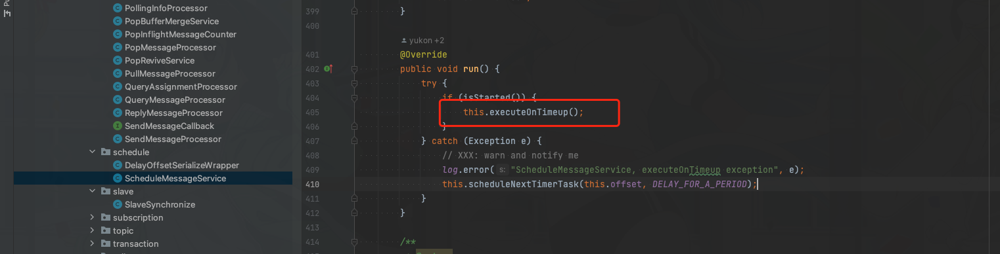

发现很明显应该是使用了一个定时器去执行的，我们可以看看


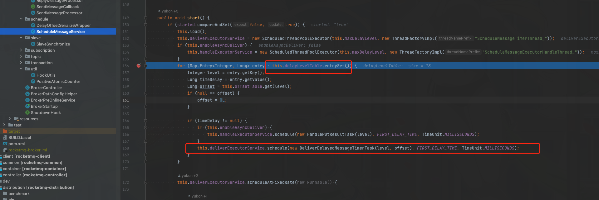

这里可以看到把18个延时等级的任务都加进去了


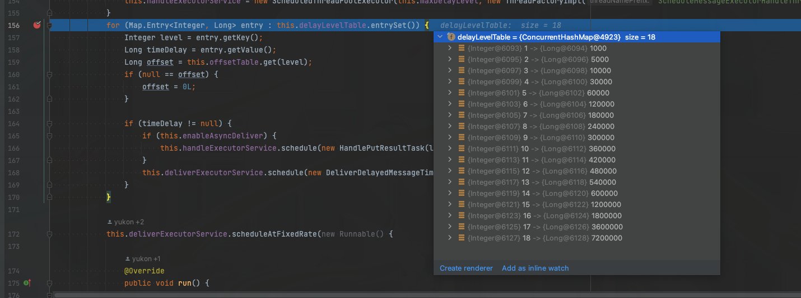

`deliverExecutorService`的核心线程数也是18个
```java
            this.deliverExecutorService = new ScheduledThreadPoolExecutor(this.maxDelayLevel, new ThreadFactoryImpl("ScheduleMessageTimerThread_"));
```


我们这里看看丢进去的`DeliverDelayedMessageTimerTask`的任务里面里面的逻辑

- `org.apache.rocketmq.broker.schedule.ScheduleMessageService.DeliverDelayedMessageTimerTask#executeOnTimeup`

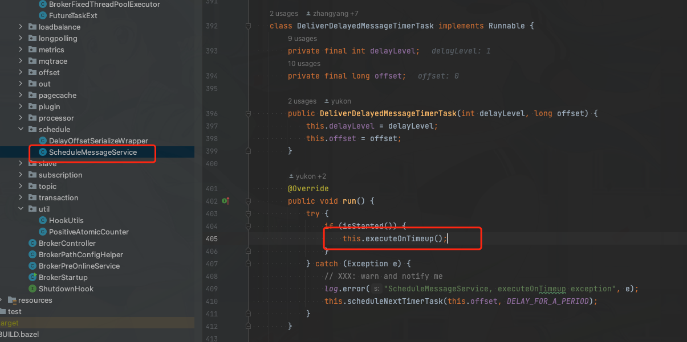

核心逻辑都被封装在`executeOnTimeup`

我们进去看看`executeOnTimeup`

代码逻辑有点长我们，慢慢看

```java
public void executeOnTimeup() {
            // 根据延迟topic和延迟queueid 去获取Consumequeue
            ConsumeQueueInterface cq =
                ScheduleMessageService.this.brokerController.getMessageStore().getConsumeQueue(TopicValidator.RMQ_SYS_SCHEDULE_TOPIC,
                    delayLevel2QueueId(delayLevel));
            // 如果 Consumequeue 为空则新增一个 DeliverDelayedMessageTimerTask 丢到 deliverExecutorService再定时执行，延时时间默认为100毫秒
            // Consumequeue存在但是没有消费文件 一样延时100毫秒后继续重复执行
            if (cq == null) {
                this.scheduleNextTimerTask(this.offset, DELAY_FOR_A_WHILE);
                return;
            }

            ReferredIterator<CqUnit> bufferCQ = cq.iterateFrom(this.offset);
            if (bufferCQ == null) {
                long resetOffset;
                if ((resetOffset = cq.getMinOffsetInQueue()) > this.offset) {
                    log.error("schedule CQ offset invalid. offset={}, cqMinOffset={}, queueId={}",
                        this.offset, resetOffset, cq.getQueueId());
                } else if ((resetOffset = cq.getMaxOffsetInQueue()) < this.offset) {
                    log.error("schedule CQ offset invalid. offset={}, cqMaxOffset={}, queueId={}",
                        this.offset, resetOffset, cq.getQueueId());
                } else {
                    resetOffset = this.offset;
                }

                this.scheduleNextTimerTask(resetOffset, DELAY_FOR_A_WHILE);
                return;
            }

            long nextOffset = this.offset;
            try {
                while (bufferCQ.hasNext() && isStarted()) {
                    CqUnit cqUnit = bufferCQ.next();
                    long offsetPy = cqUnit.getPos();
                    int sizePy = cqUnit.getSize();
                    // 这里的 tagCode实际是投递时间
                    long tagsCode = cqUnit.getTagsCode();

                    if (!cqUnit.isTagsCodeValid()) {
                        //can't find ext content.So re compute tags code.
                        log.error("[BUG] can't find consume queue extend file content!addr={}, offsetPy={}, sizePy={}",
                            tagsCode, offsetPy, sizePy);
                        long msgStoreTime = ScheduleMessageService.this.brokerController.getMessageStore().getCommitLog().pickupStoreTimestamp(offsetPy, sizePy);
                        tagsCode = computeDeliverTimestamp(delayLevel, msgStoreTime);
                    }

                    long now = System.currentTimeMillis();
                    // 延时消息时间校验 如果超过deliverTimestamp now+delayLevel 时间则矫正为 now+delayLevel
                    long deliverTimestamp = this.correctDeliverTimestamp(now, tagsCode);

                    long currOffset = cqUnit.getQueueOffset();
                    assert cqUnit.getBatchNum() == 1;
                    nextOffset = currOffset + cqUnit.getBatchNum();

                    long countdown = deliverTimestamp - now;
                    // 如果延时时间超过当前时间，证明还未到消息处理时间
                    if (countdown > 0) {
                        this.scheduleNextTimerTask(currOffset, DELAY_FOR_A_WHILE);      
                        ScheduleMessageService.this.updateOffset(this.delayLevel, currOffset);
                        return;
                    }
                    // 加载出延时消息
                    MessageExt msgExt = ScheduleMessageService.this.brokerController.getMessageStore().lookMessageByOffset(offsetPy, sizePy);
                    if (msgExt == null) {
                        continue;
                    }
                    // 构建新的消息体，将原来的消息信息设置到这里，并将topic和queueid设置为原始的topic和queueid(前面备份过）
                    MessageExtBrokerInner msgInner = ScheduleMessageService.this.messageTimeup(msgExt);
                    if (TopicValidator.RMQ_SYS_TRANS_HALF_TOPIC.equals(msgInner.getTopic())) {
                        log.error("[BUG] the real topic of schedule msg is {}, discard the msg. msg={}",
                            msgInner.getTopic(), msgInner);
                        continue;
                    }

                    boolean deliverSuc;
                    if (ScheduleMessageService.this.enableAsyncDeliver) {
                        deliverSuc = this.asyncDeliver(msgInner, msgExt.getMsgId(), currOffset, offsetPy, sizePy);
                    } else {
                        // 将消息写入到 commitlog中
                        deliverSuc = this.syncDeliver(msgInner, msgExt.getMsgId(), currOffset, offsetPy, sizePy);
                    }

                    if (!deliverSuc) {
                        this.scheduleNextTimerTask(nextOffset, DELAY_FOR_A_WHILE);
                        return;
                    }
                }
            } catch (Exception e) {
                log.error("ScheduleMessageService, messageTimeup execute error, offset = {}", nextOffset, e);
            } finally {
                bufferCQ.release();
            }

            this.scheduleNextTimerTask(nextOffset, DELAY_FOR_A_WHILE);
        }
```


上面的代码我们将核心逻辑做了注释,我们总结一下大致流程
1. 校验对应的延时等级消息是否存在ConsumeQueue，如果不存在则延时100ms继续轮训
2. 校验ConsumeQueue中的索引是否存在，如果不存在则延时100ms继续轮训
3. 校验索引里面的tagsCode 实际是投递时间是否到了需要投递的时间，如果是则取出延时消息
4. 将延时消息还原为原始消息，投递到`commitLog`中继续消费


这里我们通过debug看看消息转换前后的参数

转换前的延时消息

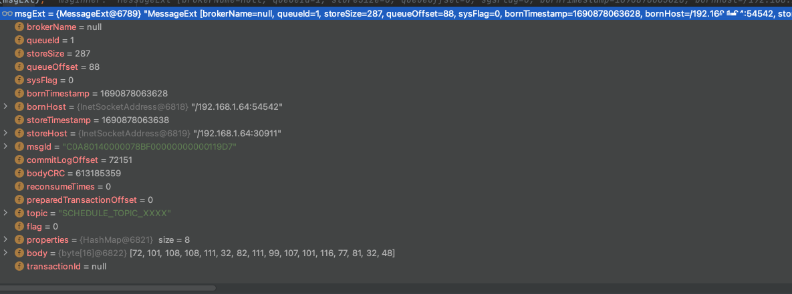

转换后的原始消息

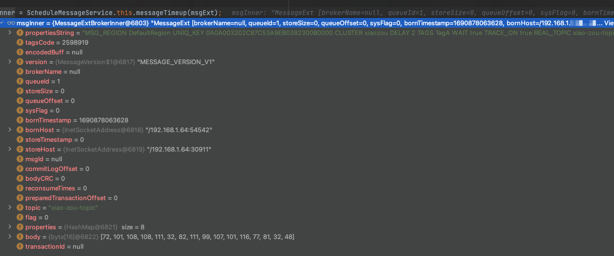

消息的重新投递是通过`syncDeliver`方法
```java
deliverSuc = this.syncDeliver(msgInner, msgExt.getMsgId(), currOffset, offsetPy, sizePy);
```

```java
private boolean syncDeliver(MessageExtBrokerInner msgInner, String msgId, long offset, long offsetPy,
            int sizePy) {
            PutResultProcess resultProcess = deliverMessage(msgInner, msgId, offset, offsetPy, sizePy, false);
            PutMessageResult result = resultProcess.get();
            boolean sendStatus = result != null && result.getPutMessageStatus() == PutMessageStatus.PUT_OK;
            if (sendStatus) {
                ScheduleMessageService.this.updateOffset(this.delayLevel, resultProcess.getNextOffset());
            }
            return sendStatus;
        }
```

如果成功则更新延时消息的消费进度，注意延时消息的消费进度是存储在
```java
    private final ConcurrentMap<Integer /* level */, Long/* offset */> offsetTable =
        new ConcurrentHashMap<>(32);

```

实际的配置文件是`delayOffset.json`


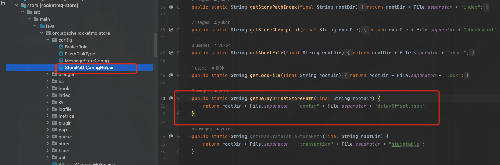


自此`RocketMQ`的延时消息我们就分析完了

## 总结

总的来说延时消息就是默认分为18个队列，然后启动18个线程一直去扫描这18个队列。如果没有消息就过100毫秒继续重复扫描，周而复始

如果扫描到消息则将延时消息`Topic`：`SCHEDULE_TOPIC_XXXX`中的消息取出来,然后重新转换为原始消息，包括原始消息的`Topic`和`queueId`，然后重新写入到`commitLog`中


