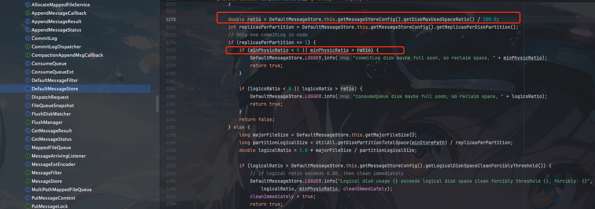
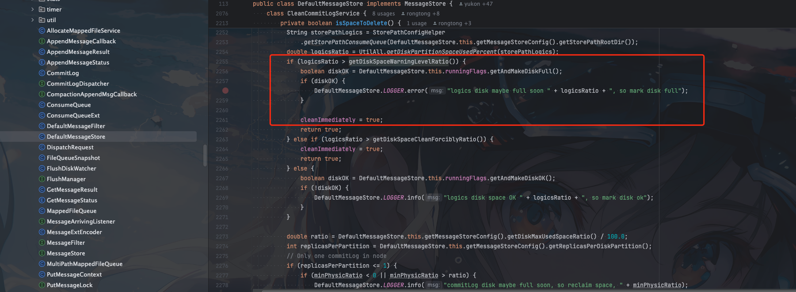
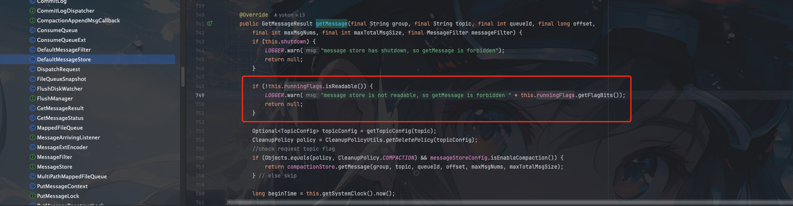
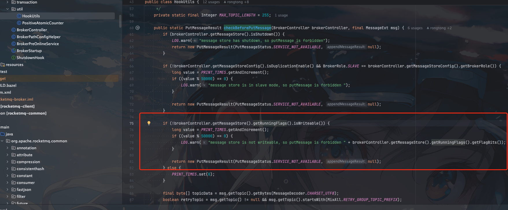

## 背景

`RocketMQ`的磁盘还是很重要的监控参数，如果`RocketMQ`集群磁盘出现了暴增，比如从50%增大到80% 甚至90%，会出现什么问题呢？？

我们什么时候该扩容磁盘，达到什么阈值会很危险呢？

## 核心配置

RocketMQ和磁盘使用率相关的配置主要有三个

- diskMaxUsedSpaceRatio
- diskSpaceCleanForciblyRatio
- diskSpaceWarningLevelRatio

我们今天重点是来讨论这三个配置，看看这个三个配置有什么不同


## diskMaxUsedSpaceRatio

`diskMaxUsedSpaceRatio`是磁盘使用率超过这个阈值就会进行消息清理

一般`RocketMQ`的文件清理是定时在比如默认凌晨4点才会进行消息清理，因为这个时候属于**国内的业务低峰**

但是如果磁盘使用超过`diskMaxUsedSpaceRatio` 这个阈值也会进行清理。默认60s检查一次



### 默认值

`diskMaxUsedSpaceRatio` 默认值 `75%`，最小值`10%`，最大值`95%`

```java

    private int diskMaxUsedSpaceRatio = 75;

    public int getDiskMaxUsedSpaceRatio() {
        if (this.diskMaxUsedSpaceRatio < 10)
            return 10;

        if (this.diskMaxUsedSpaceRatio > 95)
            return 95;

        return diskMaxUsedSpaceRatio;
    }
```


## diskSpaceCleanForciblyRatio

`diskSpaceCleanForciblyRatio`是如果磁盘超过这个阈值，且设置了其他磁盘存储目录，就会标记这个目录为不可写，继续写其他磁盘。

如果所有磁盘都超过`diskSpaceCleanForciblyRatio`的阈值，则还是会继续进行消息写入


如果磁盘超过85%,`commitLog`则会标记为磁盘以满，如果有其他磁盘不超过85%，则写其他磁盘，如果所有磁盘都超过了85%，则会继续写入消息

我们结合源码来看看

```java
        public double calcStorePathPhysicRatio() {
            Set<String> fullStorePath = new HashSet<>();
            String storePath = getStorePathPhysic();
            String[] paths = storePath.trim().split(MixAll.MULTI_PATH_SPLITTER);
            double minPhysicRatio = 100;
            for (String path : paths) {
                double physicRatio = UtilAll.isPathExists(path) ?
                    UtilAll.getDiskPartitionSpaceUsedPercent(path) : -1;
                minPhysicRatio = Math.min(minPhysicRatio, physicRatio);
                if (physicRatio > getDiskSpaceCleanForciblyRatio()) {
                    fullStorePath.add(path);
                }
            }
            DefaultMessageStore.this.commitLog.setFullStorePaths(fullStorePath);
            return minPhysicRatio;

        }
```

这里可以看到如果超过`diskSpaceCleanForciblyRatio`，则将`commitLog`标记为`FullStorePath`

```java
            DefaultMessageStore.this.commitLog.setFullStorePaths(fullStorePath);
```

然后再创建文件的时候会先跳过标记磁盘满了的路径

```java
    public MappedFile tryCreateMappedFile(long createOffset) {
        long fileIdx = createOffset / this.mappedFileSize;
        Set<String> storePath = getPaths();
        Set<String> readonlyPathSet = getReadonlyPaths();
        Set<String> fullStorePaths =
                fullStorePathsSupplier == null ? Collections.emptySet() : fullStorePathsSupplier.get();


        HashSet<String> availableStorePath = new HashSet<>(storePath);
        //do not create file in readonly store path.
        availableStorePath.removeAll(readonlyPathSet);

        //do not create file is space is nearly full.
        availableStorePath.removeAll(fullStorePaths);

        //if no store path left, fall back to writable store path.
        if (availableStorePath.isEmpty()) {
            availableStorePath = new HashSet<>(storePath);
            availableStorePath.removeAll(readonlyPathSet);
        }

        String[] paths = availableStorePath.toArray(new String[]{});
        Arrays.sort(paths);
        String nextFilePath = paths[(int) (fileIdx % paths.length)] + File.separator
                + UtilAll.offset2FileName(createOffset);
        String nextNextFilePath = paths[(int) ((fileIdx + 1) % paths.length)] + File.separator
                + UtilAll.offset2FileName(createOffset + this.mappedFileSize);
        return doCreateMappedFile(nextFilePath, nextNextFilePath);
    }
```

如果所有存储路径磁盘使用率都超过`diskSpaceCleanForciblyRatio`，则还是会继续对所有磁盘进行写入(排除只读磁盘)

### 默认值

`diskSpaceCleanForciblyRatio` 默认值为`85%`，最大值为`85%`,最小值为`30%`


```java
        private int diskSpaceCleanForciblyRatio = 85;

        double getDiskSpaceCleanForciblyRatio() {
            double finalDiskSpaceCleanForciblyRatio;
            if ("".equals(diskSpaceCleanForciblyRatio)) {
                finalDiskSpaceCleanForciblyRatio = DefaultMessageStore.this.getMessageStoreConfig().getDiskSpaceCleanForciblyRatio() / 100.0;
            } else {
                finalDiskSpaceCleanForciblyRatio = Double.parseDouble(diskSpaceCleanForciblyRatio);
            }

            if (finalDiskSpaceCleanForciblyRatio > 0.85) {
                finalDiskSpaceCleanForciblyRatio = 0.85;
            }
            if (finalDiskSpaceCleanForciblyRatio < 0.30) {
                finalDiskSpaceCleanForciblyRatio = 0.30;
            }

            return finalDiskSpaceCleanForciblyRatio;
        }
```


## diskSpaceWarningLevelRatio

如果磁盘使用率超过了`diskSpaceWarningLevelRatio`设置的阈值，会干两件事

1. 打印警告log
2. 标记磁盘已满



那么标记磁盘满了`broker`会做什么处理呢


```java
boolean diskFull = DefaultMessageStore.this.runningFlags.getAndMakeDiskFull();
```

首先会调用`RunningFlags`中的`getAndMakeDiskFull`方法标记磁盘已满


在`RunningFlags`中标记磁盘满了之后`broker`会做什么处理呢？


1. `client`请求`broker`获取消息的时候会拒绝

在`org.apache.rocketmq.store.DefaultMessageStore#getMessage(java.lang.String, java.lang.String, int, long, int, int, org.apache.rocketmq.store.MessageFilter)`中，如果磁盘已满则会返回null



2. `client`请求`broker`写入消息也会被拒绝

在`org.apache.rocketmq.broker.util.HookUtils#checkBeforePutMessage`方法中就会检测状态



### 默认值

`diskSpaceWarningLevelRatio`默认值 90%,最大值 90% 最小值 35%

```java
        private int diskSpaceWarningLevelRatio = 90;

        double getDiskSpaceWarningLevelRatio() {
            double finalDiskSpaceWarningLevelRatio;
            if ("".equals(diskSpaceWarningLevelRatio)) {
                finalDiskSpaceWarningLevelRatio = DefaultMessageStore.this.getMessageStoreConfig().getDiskSpaceWarningLevelRatio() / 100.0;
            } else {
                finalDiskSpaceWarningLevelRatio = Double.parseDouble(diskSpaceWarningLevelRatio);
            }

            if (finalDiskSpaceWarningLevelRatio > 0.90) {
                finalDiskSpaceWarningLevelRatio = 0.90;
            }
            if (finalDiskSpaceWarningLevelRatio < 0.35) {
                finalDiskSpaceWarningLevelRatio = 0.35;
            }

            return finalDiskSpaceWarningLevelRatio;
        }
```


## 总结

`RocketMQ`磁盘使用率核心配置有三个

`diskMaxUsedSpaceRatio`主要是配置磁盘超过多少会进行消息清理

`diskSpaceCleanForciblyRatio`主要如果配置了多个存储路径，单个存储路径超过该阈值则对其他路径进行写入

`diskSpaceWarningLevelRatio`则主要是磁盘超过该阈值，`broker`会直接对外停止服务包括消息的写入和获取

所以如果线上的`RocketMQ`磁盘超过75%左右或者80%左右就需要警惕报警。

查看

最后我这里整理一份总结的表格给大家参考

| **配置参数**               | `diskMaxUsedSpaceRatio` | `diskSpaceCleanForciblyRatio` | `diskSpaceWarningLevelRatio` |
|---------------------------|-------------------------|-------------------------------|------------------------------|
| **默认阈值**              | 75%                    | 85%                          | 90%                         |
| **有效范围**              | 10%-95%                | 30%-85%                      | 35%-90%                     |
| **主要作用**              | 触发消息清理           | 多磁盘切换                   | 服务熔断保护                |
| **超阈值后果**            | 立即清理过期消息       | 标记磁盘不可用               | Broker不提供服务         |
| **是否阻塞写入**          | 否                     | 否           | 是（超过90%）               |
| **是否影响读取**          | 否                     | 否                           | 是                          |


