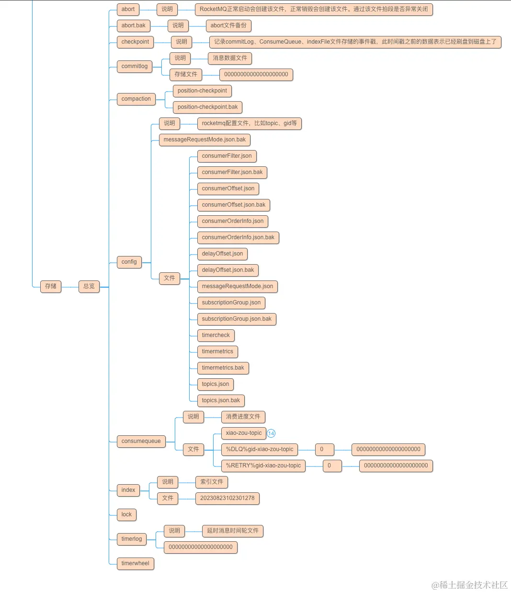
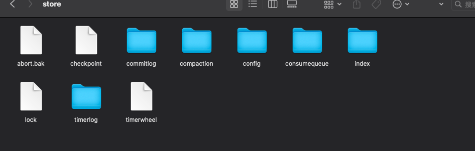
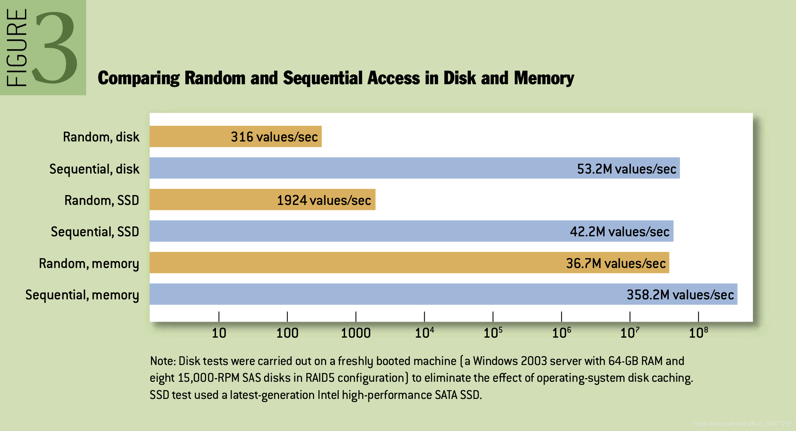
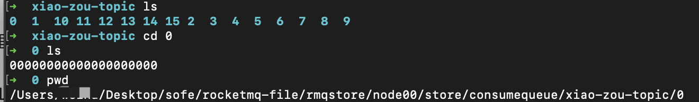
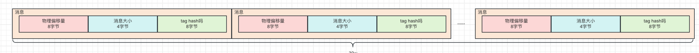
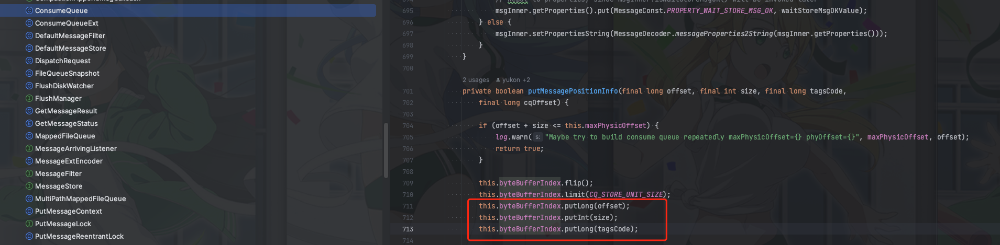
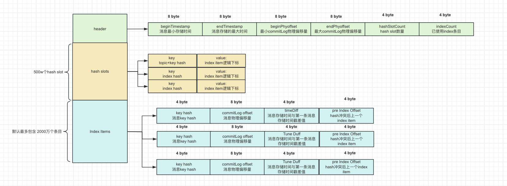

> 这里是**weihubeats**,觉得文章不错可以关注公众号**小奏技术**

## RocketMQ version

*   5.1.0

## 脑图总览



## 实际存储文件




## 消息实际存储文件 commitLog

消息实际是存储在`commitLog`里面.里面没有区分`topic`和`queue`

存储结构的定义如下表

消息的具体格式定义

| 第几位 |             字段            |  数据类型 |       长度(字节)       |                   说明                   |
| :-: | :-----------------------: | :---: | :----------------: | :------------------------------------: |
|  1  |         totalSize         |  int  |          4         |                  消息总长度                 |
|  2  |         magicCode         |  int  |          4         |                   魔术                   |
|  3  |          bodyCRC          |  int  |          4         |                消息体CRC校验码               |
|  4  |          queueId          |  int  |          4         |                 消息队列id                 |
|  5  |            flag           |  int  |          4         |      消息标记.RocketMQ不对其做任何处理.应用程序可使用     |
|  6  |        queueOffset        |  long |          8         |         消息在ConusmeQueue中的物理偏移量         |
|  7  |        physicOffset       |  long |          8         |          消息在CommitLog文件中的物理偏移量         |
|  8  |          sysFlag          |  int  |          4         |         消息系统标识，比如是否压缩，是否是事务消息等         |
|  9  |       bornTimeStamp       |  long |          8         |                 消息发送时间戳                |
|  10 |          BORNHOST         |   \~  |        8(20)       |        消息发送者ip、端口。v6 8字节，否则20字节        |
|  11 |       storeTimestamp      |  long |          8         |                 消息存储时间戳                |
|  12 |      STOREHOSTADDRESS     | 8(20) |         \~         |       broker ip+端口,v6 8字节，否则20字节       |
|  13 |       reconsumeTimes      |  int  |          4         |               消息重试次数，4字节               |
|  14 | preparedTransactionOffset |  long |          8         |                事务消息物理偏移量               |
|  15 |          bodyLen          |  int  |          4         |                  消息长度                  |
|  16 |            body           |   \~  |       bodyLen      |            消息body，长度为bodyLen           |
|  17 |        TopicLength        |   \~  |        1(2)        |         topic长度,V1版本是1字节，V2是2字节        |
|  18 |           topic           |   \~  |    TopicLength的值   |               topic name               |
|  19 |      propertiesLength     | short |          2         |                 消息属性长度                 |
|  20 |         properties        |   \~  | propertiesLength的值 | 消息属性(里面包含key、uniqKye、tags、delayLevel等) |

这里的字段我们是结合源码`org.apache.rocketmq.store.CommitLog#checkMessageAndReturnSize(java.nio.ByteBuffer, boolean, boolean, boolean)`总结出来的


也可以自己看源码

文件名默认值是20个字符，文件名就是起始的偏移量，不够的补零，比如第一个文件的起始偏移量是0然后从`00000000000000000000`开始，每个文件默认1G(1024 \* 1024 \* 1024=1073741824 字节)，下个文件名就是`00000000001073741824`

这样设计的好处

1.  顺序写入：高性能，磁盘的顺序写入性能比内存的随机写入还要高



> 磁盘写入性能比对具体可以参考 [The Pathologies of Big Data](https://queue.acm.org/detail.cfm?id=1563874)

2.  查找性能高:由于是顺序写入，文件名也是顺序的。
    所以如果有任何一个物理偏移量我们可以基于二分查找O(log n)很快定位到对应的`CommitLog`，定位到文件后使用**物理偏移量 -文件名**，就是在**文件中的物理偏移量**

## consumequeue

RocketMQ消息消费模型是

`consumer` 订阅 `topic`,`topic`里面有`queue`

所以实际`consumer`并不直接与`commitLog`打交道，主要是和`queue`打交道
`queue`的实际物理存储路径就是

`consumequeue/${topicName}/1/00000000000000000000`

比如这样的



`consumequeue`的实际存储结构就是如下的



*   源码中的体现



一条消息字节为 `8 + 4 + 8 = 20`,一个文件30w个。
所以一个`consumequeue`文件是 `300000 * 20 / 1024 / 1024 = 5.72M`

消费者在订阅消息的时候不需要遍历`commitLog`整个文件，只需要遍历`consumequeue`,`consumequeue`中存储消息的偏移量和大小。然后去`commitLog`二分找到消息即可。

如果要基于消息的tag过滤，也是通过tag的hash进行过滤

## 索引文件 IndexFile

`RocketMQ`如果通过消息id（offsetMsgId）去查找消息是非常容易的，因为消息id(offsetMsgId)本身就是由`broker IP` + `broker port` + `消息的物理偏移量`

但是如果要基于比如我们设置的`message key`去或者`UNIQ_KEY`查询。很明显上面的存储结构就不支持了。

> 不清楚 `UNIQ_KEY`和`offsetMsgId`的区别可以看之前的博文

> https://weihubeats.blog.csdn.net/article/details/130495965


所以我们需要再建立一个索引文件，用来支持按`message key`查询消息

`IndexFile`实际结构如下图所示



寻找方式就是

1.  根据 key 的 Hash 值计算出 hash槽绝对位置 absSlotPos

```java
int keyHash = indexKeyHashMethod(key);
int slotPos = keyHash % this.hashSlotNum;
int absSlotPos = IndexHeader.INDEX_HEADER_SIZE + slotPos * hashSlotSize;
```

2.  获取当前 hash槽的值，为该 hash槽对应的最新的索引的逻辑下标

```java
int slotValue = this.mappedByteBuffer.getInt(absSlotPos);
```

3.  找到index item

具体的代码源码可以参考`org.apache.rocketmq.store.index.IndexService#queryOffset`

4.  基于index item找到对应的`commitLog`

## 总结

RocketMQ的消息文件主要存储在`commitLog`，为了保证高性能的读写，`commitLog`采用顺序写入，文件名按偏移量命名，这样通过二分查找消息的效率非常高。

由于订阅模型是基于`topic`的所以为了提高性能又引入了`consumequeue`,`consumequeue`类似`commitLog`的索引，并不会直接存储消息，只存储了消息的物理偏移量，这样可以很方便的通过`consumequeue`定位到`commitLog`

为了支持按`key`查找，`RocketMQ`又引入了索引文件`IndexFile`，用来支持按key的查询。索引文件主要是利用hash，通过对`topic + key`进行hash，然后存储对应的消息物理偏移量.

RocketMQ核心的消息存储文件就是`commitLog`，其他文件都是为了提升效率引入的，都可以理解为是索引文件

## 参考

-  https://github.com/apache/rocketmq
-  https://rocketmq.apache.org/zh/
-  https://queue.acm.org/detail.cfm?id=1563874
