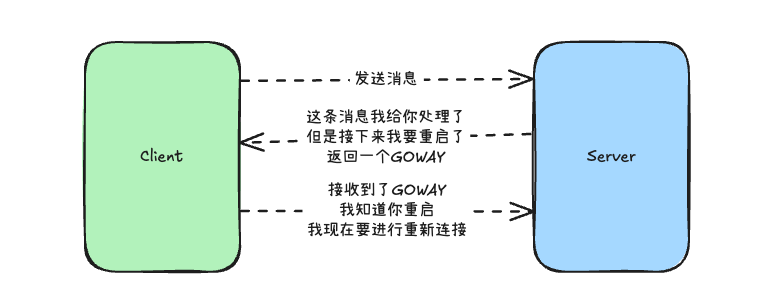
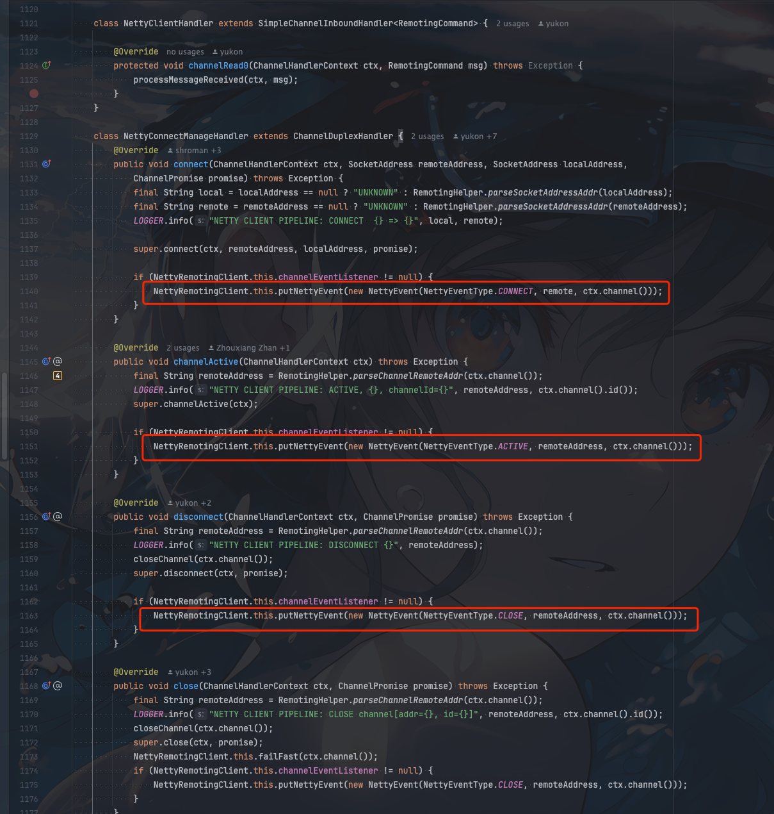

## 背景

我们先看看我们的`client`和`server`通信的这么一种场景


`client`和`server`需要保持长连接。然后无论客户端还是服务端出现异常重启。我们都希望长连接都应该具备**重试保活**。


`HTTP2`中是如何实现这种重连机制呢？

答案就是`GOAWAY`帧。

`HTTP2` 使用 GOAWAY 帧信号来控制连接关闭。当服务端需要重启的时候，就会给`client`发送一个 GOAWAY 帧，告诉业务方，我要重启了，你们需要重连了。


`client`收到`GOAWAY`帧后，会关闭当前连接，然后重新发起连接。

大致流程如下




## 大部分的网络通信封装

实际我们如果去看开源项目。很多开源项目`client`和`server`无论是私有协议还是`GRPC`协议对`GOAWAY`帧的实现都不是很好，或者没有这种处理


## RocketMQ中的GOAWAY帧应用

在早期的4.0或者早一点的5.x版本都没有实现类似`GOAWAY`帧


我们来看看最新的`RocketMQ`现在是如何实现`GOAWAY`优雅停机的


1. 首先在`ResponseCode`新增了一个状态码

```java
public static final int GO_AWAY = 1500;
```

2. 如果服务端要进行停机，会给`client`发送一个`GOAWAY`帧


```java
protected AtomicBoolean isShuttingDown = new AtomicBoolean(false);

public void processRequestCommand(final ChannelHandlerContext ctx, final RemotingCommand cmd) {
    // 省略部分代码
    if (isShuttingDown.get()) {
        if (cmd.getVersion() > MQVersion.Version.V5_3_1.ordinal()) {
            final RemotingCommand response = RemotingCommand.createResponseCommand(ResponseCode.GO_AWAY,
                "please go away");
            response.setOpaque(opaque);
            writeResponse(ctx.channel(), cmd, response);
            log.info("proxy is shutting down, write response GO_AWAY. channel={}, requestCode={}, opaque={}", ctx.channel(), cmd.getCode(), opaque);
            return;
        }
    }
    
}
```

3. 客户端如果接收到`GOAWAY`帧，会关闭当前连接，然后重新发起连接

- NettyRemotingClient

```java
    public CompletableFuture<ResponseFuture> invokeImpl(final Channel channel, final RemotingCommand request,
        final long timeoutMillis) {
    if (response.getCode() == ResponseCode.GO_AWAY) {
        ChannelWrapper channelWrapper = channelWrapperTables.computeIfPresent(channel, (channel0, channelWrapper0) -> {
            try {
                // 重新建立连接
                if (channelWrapper0.reconnect(channel0)) {
                    LOGGER.info("Receive go away from channelId={}, channel={}, recreate the channelId={}", channel0.id(), channel0, channelWrapper0.getChannel().id());
                    channelWrapperTables.put(channelWrapper0.getChannel(), channelWrapper0);
                }
            } catch (Throwable t) {
                LOGGER.error("Channel {} reconnect error", channelWrapper0, t);
            }
            return channelWrapper0;
        });
        
        
    }
    
}
```

重新建立连接的时候也会对重新建立连接的`broker`进行心跳发送。


这里主要是对所有的`channal`进行了封装

- NettyConnectManageHandler





每次出发`netty`相关的比如`channal` `CLOSE`或者`ACTIVE`等事件
```java
public enum NettyEventType {
    CONNECT,
    CLOSE,
    IDLE,
    EXCEPTION,
    ACTIVE
}
```

就会触发对应的`NettyEvent`事件给客户端处理


```java
    protected final NettyEventExecutor nettyEventExecutor = new NettyEventExecutor();

    public void putNettyEvent(final NettyEvent event) {
    this.nettyEventExecutor.putNettyEvent(event);
    }

    public void putNettyEvent(final NettyEvent event) {
        int currentSize = this.eventQueue.size();
        int maxSize = 10000;
        if (currentSize <= maxSize) {
            this.eventQueue.add(event);
        } else {
            log.warn("event queue size [{}] over the limit [{}], so drop this event {}", currentSize, maxSize, event.toString());
    }
}

```

其中`client`就可以监听各种`Netty`的事件进行对应的业务逻辑处理,比如监听`ACTIVE`事件重新发送心跳给`broker`

```java
                @Override
                public void onChannelActive(String remoteAddr, Channel channel) {

                    for (Map.Entry<String, HashMap<Long, String>> addressEntry : brokerAddrTable.entrySet()) {
                        for (Map.Entry<Long, String> entry : addressEntry.getValue().entrySet()) {
                            String addr = entry.getValue();
                            if (addr.equals(remoteAddr)) {
                                long id = entry.getKey();
                                String brokerName = addressEntry.getKey();
                                if (sendHeartbeatToBroker(id, brokerName, addr)) {
                                    rebalanceImmediately();
                                }
                                break;
                            }
                        }
                    }

                }
```
## 总结

`GOAWAY`帧是`HTTP2`中的一个重要的帧，用来告知`client`服务端要重启了，`client`需要重新连接。以此保证服务的可用性

大多数开源项目中的私有协议或者使用`GRPC`通信的开源中间件都没有很好的去处理`GOAWAY`帧

如果想要`client`和`server`连接的可用性更高，我们可以参考`RocketMQ`的实现，对`GOAWAY`帧进行处理，保证服务的可用性