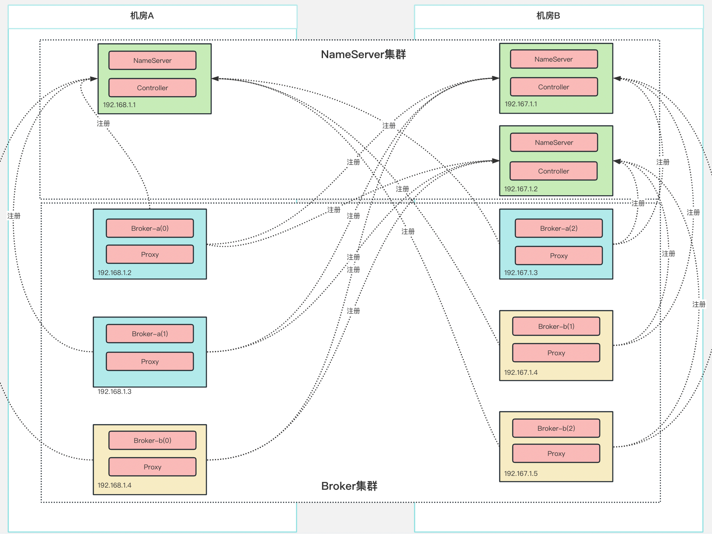
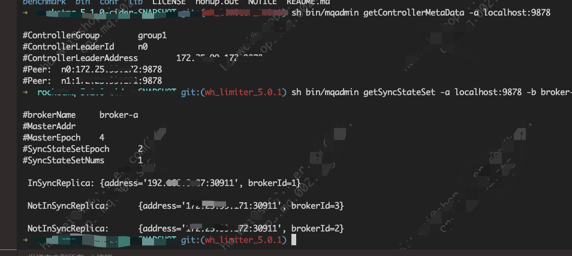

## 背景

- RocketMQ版本: 5.1.0


- 部署方式





## 报错

首选通过执行命令查看同步信息
```
sh bin/mqadmin getSyncStateSet -a 127.0.0.1:9878 -b broker-a
```




发现有几个broker处于`NotInSyncReplica`状态

查看`broker` log信息
```
tail -f ~/logs/rocketmqlogs/brokerLogDir_IS_UNDEFINED/broker.log
```

发现如下报错
```java
2023-03-15 16:59:06 WARN ReplicasManager_ExecutorService_1 - Failed to start replicasManager, retry times:35, current state:FIRST_TIME_SYNC_CONTROLLER_METADATA_DONE, try it again
2023-03-15 16:59:06 ERROR ReplicasManager_ExecutorService_1 - Failed to register broker to controller
org.apache.rocketmq.client.exception.MQBrokerException: CODE: 2012  DESC: The broker has not master, and this new registered broker can't not be elected as master
For more information, please visit the url, https://rocketmq.apache.org/docs/bestPractice/06FAQ
        at org.apache.rocketmq.broker.out.BrokerOuterAPI.registerBrokerToController(BrokerOuterAPI.java:1183)
        at org.apache.rocketmq.broker.controller.ReplicasManager.registerBrokerToController(ReplicasManager.java:302)
        at org.apache.rocketmq.broker.controller.ReplicasManager.startBasicService(ReplicasManager.java:151)
        at org.apache.rocketmq.broker.controller.ReplicasManager.lambda$start$0(ReplicasManager.java:133)
        at java.util.concurrent.Executors$RunnableAdapter.call(Executors.java:511)
        at java.util.concurrent.FutureTask.run(FutureTask.java:266)
        at java.util.concurrent.ThreadPoolExecutor.runWorker(ThreadPoolExecutor.java:1149)
        at java.util.concurrent.ThreadPoolExecutor$Worker.run(ThreadPoolExecutor.java:624)
        at java.lang.Thread.run(Thread.java:750)
2023-03-15 16:59:11 WARN ReplicasManager_ExecutorService_1 - Failed to start replicasManager, retry times:36, current state:FIRST_TIME_SYNC_CONTROLLER_METADATA_DONE, try it again
2023-03-15 16:59:11 ERROR ReplicasManager_ExecutorService_1 - Failed to register broker to controller
org.apache.rocketmq.client.exception.MQBrokerException: CODE: 2012  DESC: The broker has not master, and this new registered broker can't not be elected as master
For more information, please visit the url, https://rocketmq.apache.org/docs/bestPractice/06FAQ
        at org.apache.rocketmq.broker.out.BrokerOuterAPI.registerBrokerToController(BrokerOuterAPI.java:1183)
        at org.apache.rocketmq.broker.controller.ReplicasManager.registerBrokerToController(ReplicasManager.java:302)
        at org.apache.rocketmq.broker.controller.ReplicasManager.startBasicService(ReplicasManager.java:151)
        at org.apache.rocketmq.broker.controller.ReplicasManager.lambda$start$0(ReplicasManager.java:133)
        at java.util.concurrent.Executors$RunnableAdapter.call(Executors.java:511)
        at java.util.concurrent.FutureTask.run(FutureTask.java:266)
        at java.util.concurrent.ThreadPoolExecutor.runWorker(ThreadPoolExecutor.java:1149)
        at java.util.concurrent.ThreadPoolExecutor$Worker.run(ThreadPoolExecutor.java:624)
        at java.lang.Thread.run(Thread.java:750)
2023-03-15 16:59:14 INFO ReplicasManager_ScheduledService_2 - Update controller leader address to x.x.x.1:9878
```


核心错误:
```java
The broker has not master, and this new registered broker can't not be elected as master
```

## 产生原因

服务器部署了两个`broker`，由于有问题，想要本地debug，使用本地方式启动了一个`broker`并被选举为master。

然后发送消息到本地`master` broker
之后下线本地`broker`，服务器上的两个`broker`算新加入的`broker`，所以不能选举为`master`
提示`and this new registered broker can't not be elected as master`

## 解决方式

1. 最简单的方式
Nameserve配置新增
`enableElectUncleanMaster = true`,表示允许新加入的broker选举为master

> 注意开启这个配置可能会丢失消息，已经稳定允许的集群不要开启该配置

如果是新建的集群可以使用如下方式恢复集群，然后再删除该配置

2. 删除元数据操作
1. 下线主备Broker
2. 利用`cleanBrokerData`命令清除Controller中该组Broker元数据

>使用例子
>sh bin/mqadmin cleanBrokerData -a 127.0.0.1:9878 -b 127.0.0.1:30911 -n broker-a -c clusterName

3. 删除主备Broker下的文件～/store/epochFileCheckpoint和epochFileCheckpoint.bak
4. Broker重新上线（尽量保证旧的主备关系，先主后备上线）

## 备注

附带相关 github讨论地址
- https://github.com/apache/rocketmq/discussions/6354
