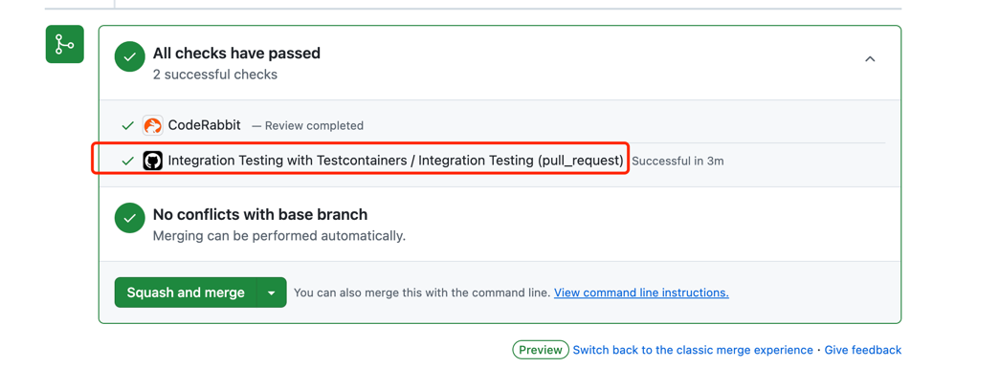
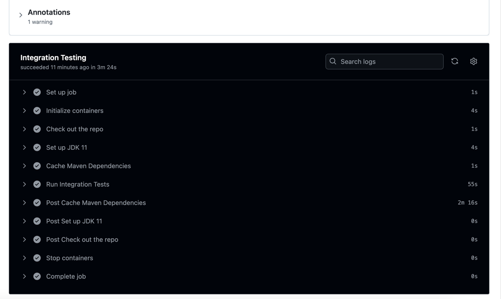

## 背景

之前研究过[spring boot如何不依赖外部redis、mysql等中间件也不mock实现集成测试](https://mp.weixin.qq.com/s/ljtfxjhQ-p8Z7HM8RlaVuQ)

这种做法主要是在本地手动进行集成测试，我们最终的目的肯定是希望能够实现自动化集成测试

所以今天我们就来看看如何通过`github workflow`+`docker`实现自动集成测试


## 添加集成测试相关maven依赖

### 添加maven依赖

首先我们需要添加集成测试相关的`maven`依赖

```xml
        <dependency>
            <groupId>org.testcontainers</groupId>
            <artifactId>junit-jupiter</artifactId>
            <version>1.17.6</version>
            <scope>test</scope>
        </dependency>

        <dependency>
            <groupId>org.testcontainers</groupId>
            <artifactId>testcontainers</artifactId>
            <version>1.20.4</version>
            <scope>test</scope>
        </dependency>
```
### 添加maven插件依赖

其次添加集成测试相关的`maven`插件依赖

```xml
    <build>
        <plugins>
            <plugin>
                <groupId>org.apache.maven.plugins</groupId>
                <artifactId>maven-failsafe-plugin</artifactId>
                <version>3.1.0</version>
                <executions>
                    <execution>
                        <goals>
                            <goal>integration-test</goal>
                            <goal>verify</goal>
                        </goals>
                    </execution>
                </executions>
                <configuration>
                    <includes>
                        <include>**/*Test.java</include> <!-- 包含所有以 Test 结尾的集成测试类 -->
                    </includes>
                </configuration>
            </plugin>

            <plugin>
                <groupId>org.springframework.boot</groupId>
                <artifactId>spring-boot-maven-plugin</artifactId>
                <configuration>
                    <classesDirectory>${project.build.outputDirectory}</classesDirectory>
                </configuration>
            </plugin>
            
        </plugins>
    </build>

```


## 编写github workflow

依赖添加完成后我们就需要编写`github workflow`了

```shell
name: Integration Testing with Testcontainers
on:
  push:
    branches:
      - main
  pull_request:
    branches:
      - main

jobs:
  integration-testing:
    name: Integration Testing
    runs-on: ubuntu-latest
    services:
      docker:
        image: docker:dind
        options: --privileged
    steps:
      # 检出代码
      - name: Check out the repo
        uses: actions/checkout@v2

      - name: Set up JDK 11
        uses: actions/setup-java@v2
        with:
          java-version: '11'
          distribution: 'adopt'

      # 缓存 Maven 依赖
      - name: Cache Maven Dependencies
        uses: actions/cache@v2
        with:
          path: ~/.m2/repository
          key: ${{ runner.os }}-maven-${{ hashFiles('**/pom.xml') }}
          restore-keys: |
            ${{ runner.os }}-maven-

      # 运行集成测试
      - name: Run Integration Tests
        run: mvn verify -B -Dmaven.test.skip=false -Dgpg.skip=true
```

这里相关的源码可以参考多级缓存框架[fluxcache-integration-test.yml](https://github.com/weihubeats/fluxcache/blob/main/.github/workflows/integration-test.yml)

> 注意这个文件必须放在`.github/workflows`目录下

## 编写测试代码

```java
@SpringBootTest(classes = FluxCacheApplication.class)
@Slf4j
@Testcontainers
public class TestControllerTest {

    @Container
    public static GenericContainer<?> redis = new GenericContainer<>(DockerImageName.parse("redis:6.2.6"))
        .withExposedPorts(6379);

    @DynamicPropertySource
    static void redisProperties(DynamicPropertyRegistry registry) {
        registry.add("redis.host", redis::getHost);
        registry.add("redis.port", () -> redis.getMappedPort(6379).toString());
        registry.add("redis.password", () -> "");
    }

    private final static Long SLEEP_TIME = 3L;

    @Autowired
    private FluxCacheProperties cacheProperties;

    @Autowired
    private TestController testController;

    @Autowired
    private DefaultFluxCacheManager cacheManager;

    @Test
    public void testFirstCacheByCaffeine() {
        List<StudentVO> vos = testController.firstCacheByCaffeine("aaa");
        StudentVO vo = vos.get(0);
        int age = vo.getAge();
        List<StudentVO> vos1 = testController.firstCacheByCaffeine("aaa");
        StudentVO vo1 = vos1.get(0);
        int age1 = vo1.getAge();
        assertEquals(age, age1);
        List<StudentVO> vos2 = testController.firstCacheByCaffeine("bb");
        StudentVO vo2 = vos2.get(0);
        assertNotEquals(age, vo2.getAge());
    }
}
```

测试相关的代码解释我们可以参考之前的[spring boot如何不依赖外部redis、mysql等中间件也不mock实现集成测试](https://mp.weixin.qq.com/s/ljtfxjhQ-p8Z7HM8RlaVuQ)


## 实际效果

我们在`main`分支上切一个新分支出来，修改代码，再发起`Pull requests`，就可以看到`github workflow`自动执行了集成测试




我们看看集成测试的结果




可以看到集成测试通过了

这样只要我们的测试用例写的足够全面，我们就可以保证我们的代码质量，进行重大重构，只要测试用例通过，我们就可以放心的发布

## 总结

通过`github workflow`+`docker`实现自动集成测试，可以保证我们的代码质量，让我们的代码更加健壮

我们也无需手动执行，不用担心有人没有执行测试，导致改动的代码有bug

通过`github` `workflow`我们实现自动化集成测试非常简单，任何改动有了ci的检查不会像以前没有底气。

至少能保证基本的功能是正常的，不会出现非常明显的bug