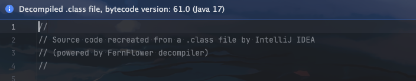
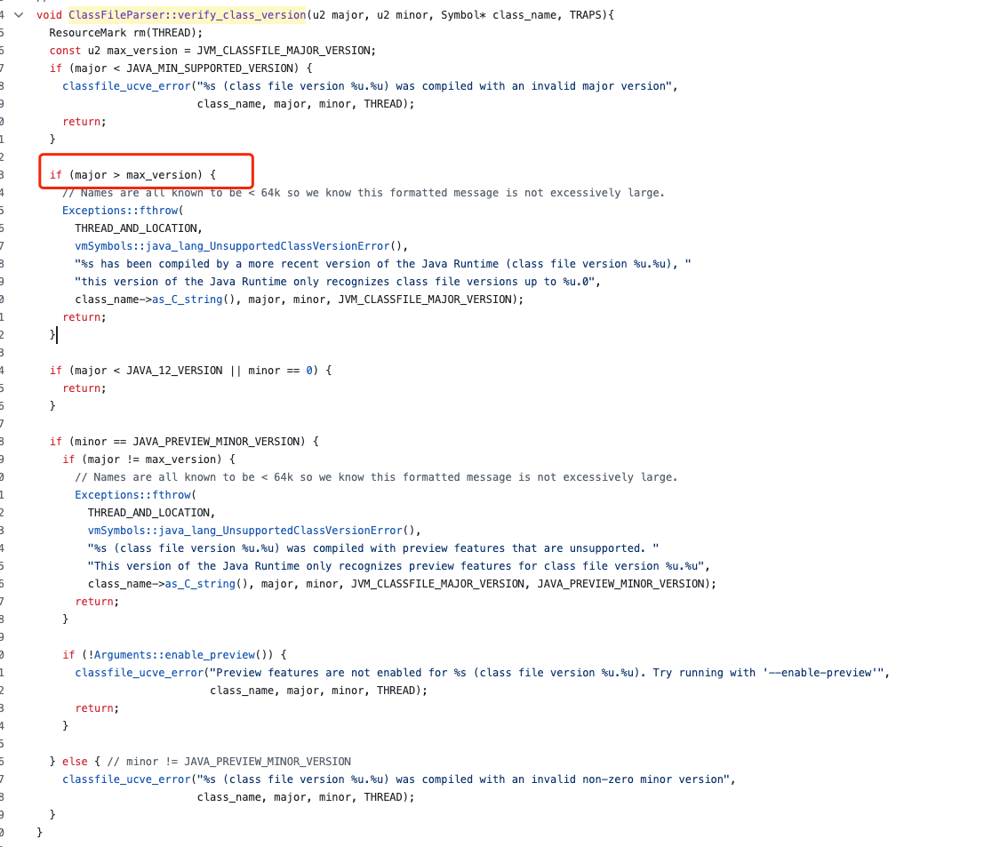

>大家好，这里是**小奏**,觉得文章不错可以关注公众号**小奏技术**


## 背景

最近，我们团队在开发一个新服务时，选择了`Spring Boot 3` + `Dubbo 3` + `JDK 17` 的技术栈。

项目运行比较顺利，但在`Dubbo RPC`调用时遇到了一个棘手的问题：其他团队的项目使用的是`JDK 11`，导致我们的`JAR`包在他们的环境中运行时出错

报错信息如下

```java
java: 无法访问 com.xiaozou.rpc.XiaoZouService
  错误的类文件: /Users/xiaozou/Desktop/sofe/java/localRepository/com/xiaozou/1.0.0-SNAPSHOT/xiaozou-1.0.0-SNAPSHOT.jar!/com/xiaozou/rpc/XiaoZouService.class
    类文件具有错误的版本 61.0, 应为 55.0
    请删除该文件或确保该文件位于正确的类路径子目录中
```

从错误提示中可以看出，JAR 包中的类文件版本为 61.0（对应 JDK 17），而目标环境期望的版本是 55.0（对应 JDK 11）。这引发了版本不兼容的问题


## 原因分析

Java 源代码（.java 文件）通过 javac 编译成字节码文件（.class 文件）时，会在文件头部写入版本信息。不同 JDK 版本生成的 .class 文件版本不同：

- Java 8：52.0
- Java 11：55.0
- Java 17：61.0


如果要验证我们可以直接使用`idea`自带的反编译工具直接查看`/target/classes`下的`.class`文件





可以看到不同的`JDK`版本生成的`.class`文件头部的版本信息是不一样的，`idea`反编译可以识别出来

我们也可以使用`javap`命令查看`.class`文件的版本信息

```shell
javap -v XiaoZou.class
```

那么我们就会得到如下字节码信息

```java
  Last modified 2025年2月26日; size 229 bytes
  SHA-256 checksum e8457714c4513babc6686fd96495e7ad7b65658b143023c8b8185bbacb757eea
  Compiled from "XiaoZou.java"
public interface com.xiaozou.XiaoZou
  minor version: 0
  major version: 55
  flags: (0x0601) ACC_PUBLIC, ACC_INTERFACE, ACC_ABSTRACT
  this_class: #1                          // com/xiaozou/XiaoZou
  super_class: #3                         // java/lang/Object
  interfaces: 0, fields: 0, methods: 1, attributes: 1
```

输出中会显示`major version: 55`，表示该类文件是`JDK 11` 编译的。

在`jdk`的源码中`verify_class_version`方法就会对`class`的版本进行校验




如果`class`的版本大于当前的版本就会抛出`UnsupportedClassVersionError`异常

所以高版本`JDK`编译的类文件在低版本`JDK`上运行时，低版本`JDK`会直接编译报错

## 解决方案


由于我们是`dubbo` `RPC`调用发布简单的`RPC`接口`jar`给到其他服务调用，除了基本的接口定义，不会使用高版本`JDK`的特性，所以解决方式相对来说也比较容易。

> 如果是一些公用`sdk`就需要针对性发布不同jdk版本的`sdk`，这里不做讨论

### 打包出一个低版本的jar

所以第一个解决方案是我们可以打一个低版本的jar给其他低版本的服务使用

我们项目的模块是如下结构

```java
- xiaozou-service
    - xiaozou-api
    - xiaozou-start
```

我们在`xiaozou-service`中配置了全局的打包插件

```xml
        <properties>
        <maven.compiler.source>17</maven.compiler.source>
        <maven.compiler.target>17</maven.compiler.target>
        </properties>

            <plugin>
                <groupId>org.apache.maven.plugins</groupId>
                <artifactId>maven-compiler-plugin</artifactId>
                <version>3.11.0</version>
                <configuration>
                    <source>${maven.compiler.source}</source>
                    <target>${maven.compiler.target}</target>
                    <compilerArgs>
                        <arg>-parameters</arg>
                    </compilerArgs>
                </configuration>
            </plugin>
```

指定了`source`和`target`的版本为`17`，所以我们打出来的jar就是`JDK 17`的版本

但是我们可以在`xiaozou-api`模块进行覆盖

在`xiaozou-api`的`pom.xml`添加如下配置

```xml
    <properties>
    <maven.compiler.source>11</maven.compiler.source>
    <maven.compiler.target>11</maven.compiler.target>
    </properties>
```

这样`xiaozou-api`打出来的`jar`版本是`JDK 11`

### 低版本服务升级JDK

虽然这是一种解决方案，但升级`JDK`可能涉及较大的工程量和风险，不太现实。

### 使用 Multi-Release JAR Files

`JDK 9`引入了`Multi-Release JAR Files`特性，允许在一个`JAR`文件中包含多个版本的类文件。

虽然这可以解决版本兼容问题，但配置较为复杂，不适合本场景。


## 总结

`JDK` 版本不兼容是`Dubbo`服务调用中常见的问题，特别是在跨团队协作时。

解决这一问题的最简单方法是打包一个低版本的`JAR`包，以确保兼容性。

如果不想折腾，保持团队之间`JDK`版本即可