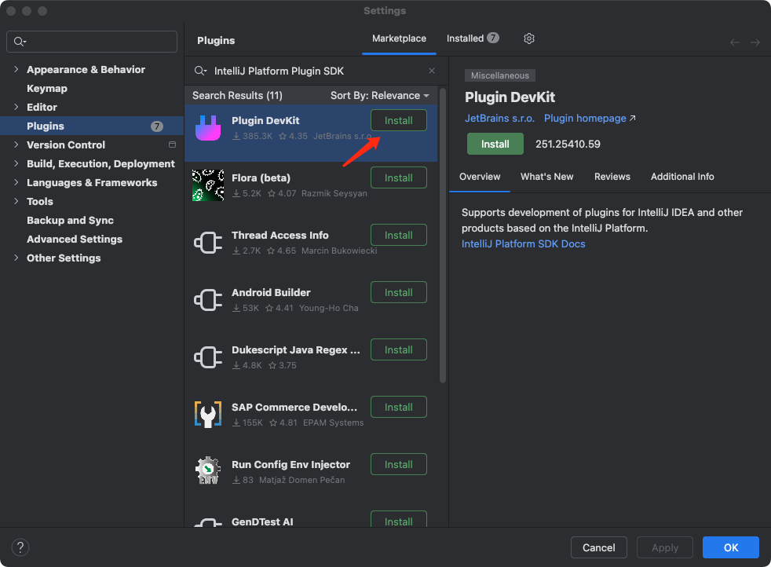
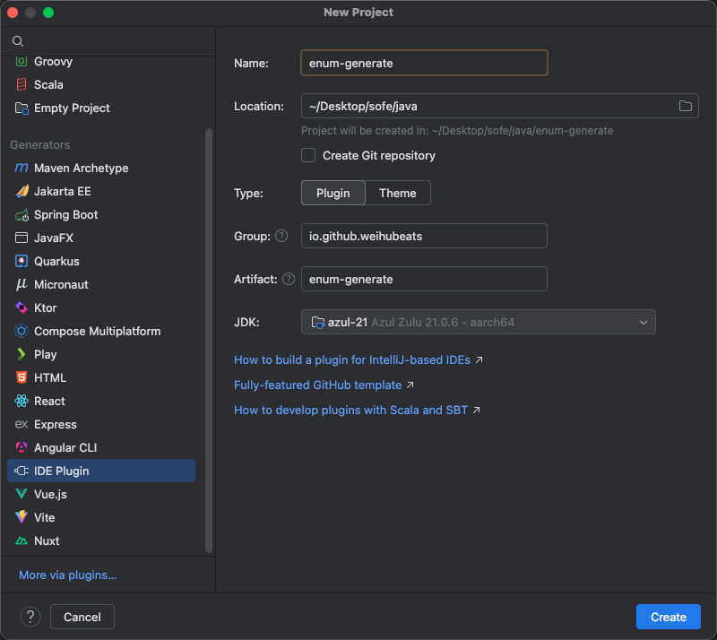
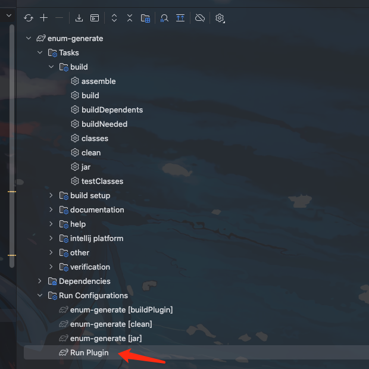
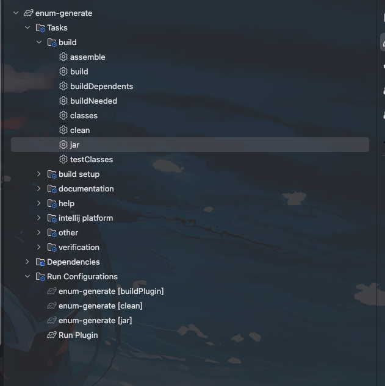
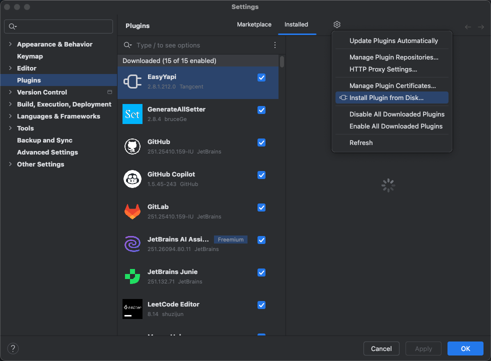

## 背景

最近写枚举代码感觉写的有点烦，每次都要重复复制代码

枚举的代码大致都是这种模式

```java
import lombok.AllArgsConstructor;
import lombok.Getter;

import java.util.Arrays;
import java.util.Map;
import java.util.Optional;
import java.util.stream.Collectors;

@Getter
@AllArgsConstructor
public enum XiaoZouStatusEnum {

    A(0, "待处理"),

    B(1, "处理中"),

    C(2, "已完成"),
    
    D(3, "失败");

    private final int code;

    private final String description;

    public static final Map<Integer, XiaoZouStatusEnum> ENUM_MAP = Arrays.stream(XiaoZouStatusEnum.values())
            .collect(Collectors.toMap(XiaoZouStatusEnum::getCode, e -> e));

    public static XiaoZouStatusEnum parse(int type) {
        return ENUM_MAP.get(type);
    }

    public static Optional<XiaoZouStatusEnum> parseOptional(int type) {
        return Optional.ofNullable(ENUM_MAP.get(type));
    }
}

```


所以想实现一个`idea`的插件，右键直接自动生成枚举代码，提升下开发效率

现在用AI去实现也很快，但是感觉还是没有`idea`右键点一下快

因为AI还要去打字描述半天需求，可能不一定符合预期


## 实现

### 环境准备和项目创建

目前`2025`版本的idea插件开发需要`JDK17+`,然后需要安装一个idea插件开发的插件




插件安装完后我们就用idea创建创建一个枚举自动生成插件的项目

项目名我们就叫`enum-generate`



创建完成后的项目结构大致如下

```
.
├── gradle
├── build.gradle.kts
├── gradle.properties
├── gradlew
├── gradlew.bat
├── settings.gradle.kts
└── src
    ├── main
    │   ├── java
    │   └── resources
    │       └── META-INF
    │           └── plugin.xml  // 插件的核心配置文件
    └── test
```

### 定义插件的Action

我们需要创建一个 Action，当用户在编辑器中右键点击一个字段时，这个 Action 会出现在菜单中。

1. 在 `src/main/java` 目录下创建一个包名为`io.github.weihubeats.enumgenerate`

2. 新建一个`GenerateEnumAction`类

```java
public class GenerateEnumAction extends AnAction {

    @Override
    public void actionPerformed(@NotNull AnActionEvent e) {
        // 插件的主要逻辑将在这里实现
    }
}

```

### 注册Action

创建了`Action` class后，我们需要在`plugin.xml` 文件中注册它，这样`IDEA`才能知道它的存在以及何时显示它


打开 `src/main/resources/META-INF/plugin.xml` 文件，在 `<actions>` 标签内添加如下代码：


```java
    <actions>
        <action id="io.github.weihubeats.enumgenerate.GenerateEnumAction"
                class="io.github.weihubeats.enumgenerate.GenerateEnumAction"
                text="Generate Enum from Field"
                description="Generates a Java enum class based on the selected field's Javadoc.">
            <add-to-group group-id="EditorPopupMenu" anchor="last"/>
        </action>
    </actions>
```

这些配置我们详细说明一下作用

- `<add-to-group>`: 将这个菜单组添加到了编辑器的右键弹出菜单 (EditorPopupMenu) 的最后。


- `<action>`: 注册了我们的`GenerateEnumAction`类

    - `id`: `Action` 的唯一标识

    - `class`: 指向我们创建的 `Action` 类的完全限定名

    - `text`: 显示在菜单项上的文本

    - `description`: 鼠标悬停时显示的描述信息


### 实现Action的核心逻辑

我们上面的代码只继承了`AnAction`，没有实现我们的核心逻辑


核心逻辑也很简单

```java
package io.github.weihubeats.enumgenerate;

import com.intellij.ide.highlighter.JavaFileType;
import com.intellij.openapi.actionSystem.ActionUpdateThread;
import com.intellij.openapi.actionSystem.AnAction;
import com.intellij.openapi.actionSystem.AnActionEvent;
import com.intellij.openapi.actionSystem.CommonDataKeys;
import com.intellij.openapi.command.WriteCommandAction;
import com.intellij.openapi.project.Project;
import com.intellij.psi.PsiClass;
import com.intellij.psi.PsiDirectory;
import com.intellij.psi.PsiElement;
import com.intellij.psi.PsiField;
import com.intellij.psi.PsiFile;
import com.intellij.psi.PsiFileFactory;
import java.util.Objects;
import java.util.regex.Matcher;
import java.util.regex.Pattern;
import org.jetbrains.annotations.NotNull;

public class GenerateEnumAction extends AnAction {

    @Override
    public void update(@NotNull AnActionEvent e) {
        // 控制 Action 的可见性
        PsiElement psiElement = e.getData(CommonDataKeys.PSI_ELEMENT);
        // 只有当选中的元素是 PsiField (类属性)时，才显示此 Action
        e.getPresentation().setEnabledAndVisible(psiElement instanceof PsiField);
    }

    @Override
    public void actionPerformed(@NotNull AnActionEvent e) {
        // 获取当前上下文信息
        Project project = e.getProject();
        // 获取当前光标下的 PSI (Program Structure Interface) 元素
        PsiElement psiElement = e.getData(CommonDataKeys.PSI_ELEMENT);

        // 判断该元素是否为一个类的字段
        if (project == null || !(psiElement instanceof PsiField)) {
            return;
        }

        PsiField selectedField = (PsiField) psiElement;
        PsiClass containingClass = selectedField.getContainingClass();
        if (containingClass == null) {
            return;
        }

        // 1. 解析 Javadoc
        String javadocComment = Objects.requireNonNull(selectedField.getDocComment()).getText();
        String enumConstantsString = parseJavadoc(javadocComment);
        if (enumConstantsString.isEmpty()) {
            // 可以添加一个提示，告知用户 Javadoc 格式不正确
            return;
        }

        // 2. 生成枚举类名
        String baseClassName = containingClass.getName().replaceAll("(DO|DTO|VO)$", "");
        String fieldName = selectedField.getName();
        String capitalizedFieldName = fieldName.substring(0, 1).toUpperCase() + fieldName.substring(1);
        String enumName = baseClassName + capitalizedFieldName + "Enum";

        // 3. 生成枚举类代码
        String enumCode = generateEnumCode(enumName, enumConstantsString);

        // 4. 在同一个目录下创建文件并写入代码
        PsiDirectory containingDirectory = containingClass.getContainingFile().getContainingDirectory();
        createEnumFile(project, containingDirectory, enumName, enumCode);
    }

    /**
     * 解析 Javadoc 注释，提取枚举常量信息
     * 格式一: 0-待处理
     * 格式二: 1:处理中
     * 格式三: 2：已完成
     * 格式四: 3 = 失败
     * 格式五(带空格): 4 - 已归档
     * 也可以混用，用逗号或换行分隔
     * 5:已取消, 6-已删除
     * @param javadoc Javadoc 字符串
     * @return 格式化后的枚举常量字符串
     */
    private String parseJavadoc(String javadoc) {
        // 新的正则表达式，更强大、更灵活
        // \s* 表示匹配零个或多个空格
        // [-:：=] 表示匹配 - 或 : 或 ：(中文冒号) 或 =
        Pattern pattern = Pattern.compile("(\\d+)\\s*[-:：=]\\s*([^,\\n]*)");
        Matcher matcher = pattern.matcher(javadoc);
        StringBuilder constantsBuilder = new StringBuilder();
        int count = 0;
        char enumConstName = 'A';

        while (matcher.find()) {
            if (count > 0) {
                constantsBuilder.append(",\n\n");
            }
            String code = matcher.group(1).trim();
            String description = matcher.group(2).trim();
            // 使用 A, B, C... 作为枚举名
            constantsBuilder.append("    ").append(enumConstName++).append("(").append(code).append(", \"").append(description).append("\")");
            count++;
        }
        if(count > 0) {
            constantsBuilder.append(";");
        }

        return constantsBuilder.toString();
    }

    /**
     * 生成完整的枚举类代码
     *
     * @param enumName          枚举类名
     * @param enumConstants     枚举常量字符串
     * @return 完整的 Java 代码
     */
    private String generateEnumCode(String enumName, String enumConstants) {
        return "import lombok.RequiredArgsConstructor;\n" +
            "import lombok.Getter;\n\n" +
            "import java.util.Arrays;\n" +
            "import java.util.Map;\n" +
            "import java.util.Optional;\n" + 
            "import java.util.stream.Collectors;\n\n" +
            "@Getter\n" +
            "@RequiredArgsConstructor\n" +
            "public enum " + enumName + " {\n\n" +
            enumConstants + "\n\n" +
            "    private final int code;\n" +
            "    private final String description;\n\n" +
            "    public static final Map<Integer, " + enumName + "> ENUM_MAP = Arrays.stream(" + enumName + ".values())\n" +
            "            .collect(Collectors.toMap(" + enumName + "::getCode, e -> e));\n\n" +
            "    public static " + enumName + " parse(int type) {\n" +
            "        return ENUM_MAP.get(type);\n" +
            "    }\n\n" +

            "    public static Optional<" + enumName + "> parseOptional(int type) {\n" +
            "        return Optional.ofNullable(ENUM_MAP.get(type));\n" +
            "    }\n" +

            "}\n";
    }


    /**
     * 创建并写入枚举文件
     *
     * @param project     当前项目
     * @param directory   目标目录
     * @param enumName    枚举类名
     * @param enumCode    枚举代码
     */
    private void createEnumFile(Project project, PsiDirectory directory, String enumName, String enumCode) {
        // 使用 WriteCommandAction 来执行文件写入操作，确保操作是可撤销的
        WriteCommandAction.runWriteCommandAction(project, () -> {
            try {
                String fileName = enumName + ".java";
                // 检查文件是否已存在
                if (directory.findFile(fileName) != null) {
                    // 文件已存在，可以提示用户或直接覆盖
                    System.out.println("File " + fileName + " already exists.");
                    return;
                }
                PsiFileFactory fileFactory = PsiFileFactory.getInstance(project);
                PsiFile javaFile = fileFactory.createFileFromText(fileName, JavaFileType.INSTANCE, enumCode);
                directory.add(javaFile);
                System.out.println("Successfully generated " + fileName);
            } catch (Exception ex) {
                ex.printStackTrace();
            }
        });
    }

    @Override
    public @NotNull ActionUpdateThread getActionUpdateThread() {
        return ActionUpdateThread.BGT;
    }
}
```

## 依赖管理


由于我们代码生成使用了`lombok`相关的注解，所以我们添加一下`lombok`相关的依赖

我们在`build.gradle.kts`添加如下信息

```kts
dependencies {
    intellijPlatform {
        create("IC", "2024.2.5")
        testFramework(org.jetbrains.intellij.platform.gradle.TestFrameworkType.Platform)

         bundledPlugin("com.intellij.java")
    }

    compileOnly("org.projectlombok:lombok:1.18.30") 
    annotationProcessor("org.projectlombok:lombok:1.18.30")
}
```


## 运行测试

要运行很简单

直接点击`Gradle`的 `Run Plugin`




这个时候会重新启动一个`idea` 然后我们就可以在新打开的idea中体验测试我们的插件


## 实际效果


## 插件安装

如果我们正常的idea要安装插件有两种方式

1. 从本地磁盘安装
2. 通过插件市场下载


### 从本地磁盘安装

本地首先打包出一个`jar`



运行`jar`后我们的项目`build`->`libs`下面就有一个jar了

然后通过本地导入安装即可




### 插件市场安装

插件市场安装我们就要先上传到插件市场

[上传地址](https://plugins.jetbrains.com/developers/intellij-platform): https://plugins.jetbrains.com/developers/intellij-platform


进入上传页面按table进行信息填写即可


上传完成后在1-2个工作日会审核

通过或者不通过都会发邮件进行通知


## 项目源码

https://github.com/weihubeats/enum-generate


## 总结

总的来说idea简单插件开发起来不是特别难。

但是不同idea的版本兼容还是很麻烦的

