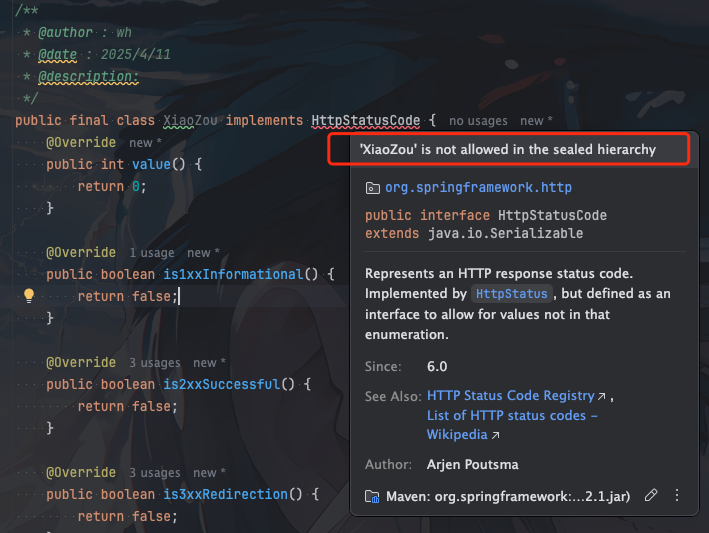

## 背景

最近在开发的时候看到`spring`中的`HttpStatusCode`出现了一个以前低版本`jdk`没用到的关键字`sealed`

所以打算来学习研究下这个新语法


## 何时引进

`sealed`关键字在`jdk15`和`jdk16`都是作为预览特性出现

直到`jdk17`才被正式引入


## 作用

`sealed`关键字主要是用于通过`permits`关键字明确指定允许继承的子类列表


我们先看看在没有`sealed`关键字我们是如何限制类的继承


### final关键字

如果一个类加上`final`关键字，则完全禁止类被继承


```java
public final class XiaoZou {}
```

### 现在类的访问权限

比如我们不将类设置为`public`，使用默认的私有权限

```java
package com.xiaozou;

class Animal {} 
```

这样仅同包才能继承`Animal`

```java
package com.xiaozou;

public class Dog extends Animal {} 

```


### 缺点

我们可以看到通过上面的几种方式都没有办法只管切灵活的限制类的子类的实现。

比如我想要某个类，仅只能我自定义的几个类去实现。

我的这几个继承类可能是夸包，用上面的方式都不灵活。


那我们看看如何使用`sealed`关键字进行实现

## sealed关键字使用

### 继承限制

比如我这里有一个父类`Car` 我想要仅`MiniCar`和`BigCar`能继承


那么如何实现这个需求呢？

使用`sealed` + `permits`关键字就很简单了

```java
public sealed class Car permits MiniCar, BigCar { }
```

```java
public final class MiniCar extends Car { } 
```

```java
public final class BigCar extends Car { } 
```


`sealed`关键字使用说明

1. 如果使用`permits`限制了`MiniCar`和`BigCar`类的继承。则`MiniCar`和`BigCar`必须继承`Car`，否则编译报错

2. `MiniCar`和`BigCar`必须声明为`final` 否则也会编译报错

### 实现的限制

不仅仅是对类的继承进行限制，也可以对接口的实现进行限制。

这里我们就不自己延时了，直接看`spring`中`HttpStatusCode`源码中的应用


## spring中HttpStatusCode permits的应用


```java
public sealed interface HttpStatusCode extends Serializable permits DefaultHttpStatusCode, HttpStatus {}
```


可以看到`HttpStatusCode`接口限制了其实现类只能是`DefaultHttpStatusCode`和`HttpStatus`

```java
final class DefaultHttpStatusCode implements HttpStatusCode, Comparable<HttpStatusCode>, Serializable {}
```

```java
public enum HttpStatus implements HttpStatusCode {}
```


`DefaultHttpStatusCode`和`HttpStatus`也确实实现了`HttpStatusCode`接口

同时`DefaultHttpStatusCode`也强制被声明成了`final`

`HttpStatus`因为是枚举所以无需声明成`final`

如果我们自定义一个类去实现`HttpStatusCode`接口就会发现编译报错




## 总结

`jdk17`引入`sealed`关键字主要有如下几个优势

1. 精确控制继承(实现)关系: 通过`permits`明确列出允许继承(实现)的子类，避免意外的类扩展

2. 增强代码可维护性: 明确的子类(实现)列表使代码结构更清晰，便于后续扩展或重构

3. 模式匹配处理更安全

像上面`Car`的例子我们可以直接使用模式匹配，安全处理所有可能的子类

```java
    public static void processCar(Car car) {
        switch (car) {
            case BigCar bigCar -> System.out.println("BigCar");
            case MiniCar miniCar -> System.out.println("MiniCar");
            case null -> System.out.println("Null car");
            default -> System.out.println("Unknown car type");
        }
    }

```

