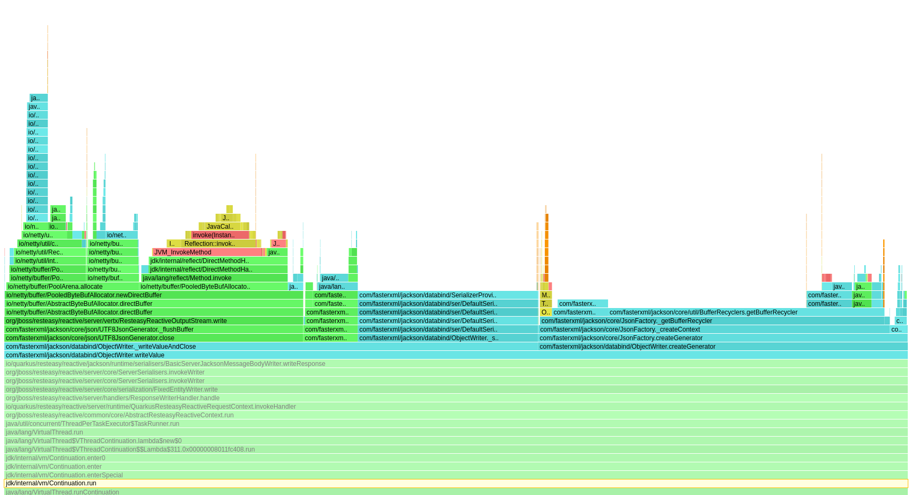

## 问题

自 Java 21 正式推出虚拟线程（Virtual Threads / Project Loom）以来

很多团队都迫不及待地将应用升级，试图通过简单的配置（如 Spring Boot 的 `spring.threads.virtual.enabled=true`来享受“免费的并发性能提升”


虚拟线程极其轻量，可以轻松创建上百万个，完美解决了传统平台线程阻塞带来的系统瓶颈。然而，现实往往骨感

部分团队在升级后不仅没有迎来性能飞跃，反而遭遇了严重的内存飙升和频繁的 GC（垃圾回收）停顿

## 原因

在[JEP 429](https://openjdk.org/jeps/429)中警告使用虚拟线程不要使用`ThreadLocal`

`Jackson`在哪里存在性能问题呢

我们观看`Jackson`序列化的火焰图，可以发现,大部分性能都浪费在`jackson-core/src/main/java/com/fasterxml/jackson/core/util/BufferRecyclers.java`

```java
 SoftReference<BufferRecycler> ref = _recyclerRef.get(); 
```





在传统的 Java 应用中，`Jackson` 进行 `JSON` 序列化和反序列化时性能极高。

为了减少大块字节数组`（byte[] / char[]）`的频繁创建和销毁

Jackson 在底层使用了一个叫做 `BufferRecycler` 的组件。

为了实现无锁的高效访问，Jackson 将 BufferRecycler 缓存在了 ThreadLocal 中

这个设计的初衷非常美好：
•	平台线程（Platform Thread） 是重量级资源，通常在线程池里，数量有限（比如 200 个），且长期存活。
•	只有 200 个线程，意味着最多只会有 200 个 `BufferRecycler` 实例常驻内存。
•	线程执行完一个任务，开始下一个任务时，可以继续复用这个绑定在自己身上的 Buffer，避免了内存分配，降低了 GC 压力


但是当`ThreadLocal`遇上虚拟线程后，一切都变了

虚拟线程的设计哲学是：轻量、海量、短命、绝不池化

每次处理一个 HTTP 请求或并发任务，系统都会直接 new 一个虚拟线程，任务执行完毕，该虚拟线程直接销毁。
此时，`Jackson` 底层原本完美的 `ThreadLocal` 逻辑变成了灾难：

1.	获取失败： 虚拟线程刚刚诞生，它的 `ThreadLocal` 必然是空的

2.	全新分配： Jackson 发现没有缓存，为这个虚拟线程创建了一套全新的、庞大的 `BufferRecycler`

3.	瞬间销毁： 毫秒级之后，请求处理完毕，虚拟线程生命走到尽头被销毁

4.	沦为垃圾： 刚刚分配的大块 Buffer 毫无悬念地变成了垃圾对象


结果就是： 针对每秒成千上万的并发请求，系统会创建成千上万个虚拟线程，进而触发成千上万次大对象分配。原本用来避免 GC 的池化设计，在虚拟线程下变成了疯狂制造 GC 的元凶


那么有什么好的解决办法呢

## 解决方式

1。 在使用虚拟线程的时候避免使用 `ThreadLocal`，使用并发安全的共享对象池（例如 ConcurrentLinkedQueue）或者更加高效的 JCTools 队列

> https://github.com/JCTools/JCTools/wiki/Getting-Started-With-JCTools#example-a-simple-object-pool


2. 使用 jdk 提供的`Per-carrier-thread cache`

但是目前这个方法在 jdk 中是私有的

```java
private static TerminatingThreadLocal<BufferCache> bufferCache = new TerminatingThreadLocal<>() {
        @Override
        protected BufferCache initialValue() {
            return new BufferCache();
        }
        @Override
        protected void threadTerminated(BufferCache cache) { // will never be null
            while (!cache.isEmpty()) {
                ByteBuffer bb = cache.removeFirst();
                free(bb);
            }
        }
    };
```

>https://github.com/openjdk/jdk/blob/861cc671e2e4904d94f50710be99a511e2f9bb68/src/java.base/share/classes/sun/nio/ch/Util.java#L56

## Jackson 中如何解决

### 方案 A：临时权宜之计（关闭 ThreadLocal）


如果你使用的是旧版本 Jackson，可以通过配置显式关闭基于 ThreadLocal 的缓存机制：

```java
ObjectMapper mapper = new ObjectMapper();
// 禁用 ThreadLocal 缓存，虽然每次都会分配内存，但避免了维护 ThreadLocal Map 的无谓开销
mapper.getFactory().disable(JsonFactory.Feature.USE_THREAD_LOCAL_FOR_BUFFER_RECYCLING);
```

### 升级并拥抱新特性

在 Jackson `2.16+` 版本中，官方进行了底层重构，引入了可插拔的 RecyclerPool 机制。

在新版本中，wom可以配置 Jackson 放弃 ThreadLocal，转而使用并发安全的共享对象池（例如 `ConcurrentLinkedQueue`）或者更加高效的 JCTools 队列来管理 Buffer

1. 原生 Jackson 配置方式

```java
import com.fasterxml.jackson.core.JsonFactory;
import com.fasterxml.jackson.core.util.JsonRecyclerPools;
import com.fasterxml.jackson.databind.ObjectMapper;
import com.fasterxml.jackson.databind.json.JsonMapper;

JsonFactory factory = JsonFactory.builder()
        // 高性能无锁双端队列
        .recyclerPool(JsonRecyclerPools.newConcurrentDequePool()) 
        .build();

ObjectMapper mapper = JsonMapper.builder(factory).build();


```

2. spring boot中配置

```java
import com.fasterxml.jackson.core.JsonFactory;
import com.fasterxml.jackson.core.util.JsonRecyclerPools;
import com.fasterxml.jackson.databind.ObjectMapper;
import com.fasterxml.jackson.databind.json.JsonMapper;
import org.springframework.context.annotation.Bean;
import org.springframework.context.annotation.Configuration;

@Configuration
public class JacksonConfig {

    @Bean
    public ObjectMapper objectMapper() {
        JsonFactory factory = JsonFactory.builder()
                // 高性能无锁双端队列
                .recyclerPool(JsonRecyclerPools.newConcurrentDequePool())
                .build();

        return JsonMapper.builder(factory)
                .findAndAddModules() 
                .build();
    }
}
```

除了使用`ConcurrentLinkedDeque`外

也可以直接关闭复用

```java
.recyclerPool(JsonRecyclerPools.nonRecyclingPool())
```

> 官方推荐使用`ConcurrentLinkedDeque`


这样无论有多少个虚拟线程，底层复用的池子都是固定的，完美解决了内存飙升问题

## 总结


## 参考

- https://github.com/FasterXML/jackson-core/issues/919
- https://github.com/FasterXML/jackson-core/pull/1064
- https://quarkus.io/guides/virtual-threads
- https://openjdk.org/jeps/429
- https://github.com/JCTools/JCTools/wiki/Getting-Started-With-JCTools#example-a-simple-object-pool
- https://github.com/open-telemetry/opentelemetry-java-instrumentation/pull/9616/changes

