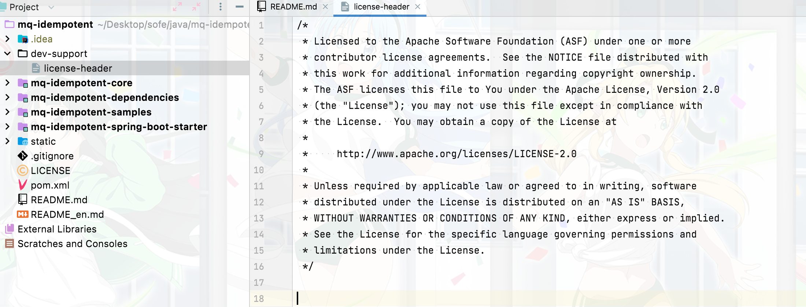
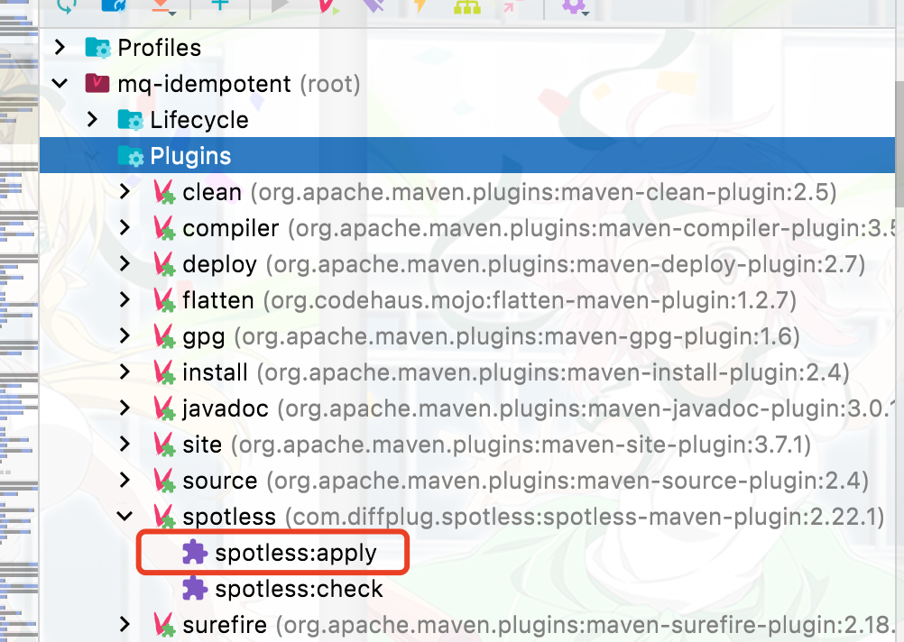
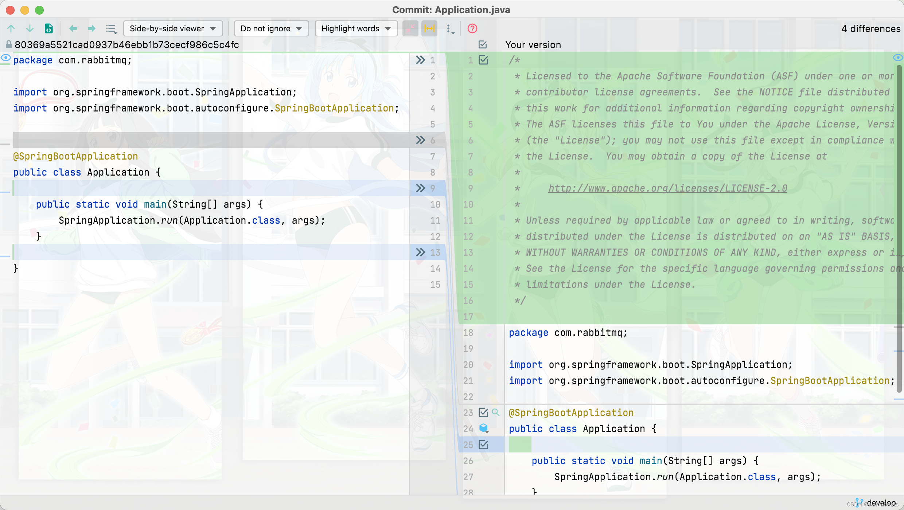

>大家好，这里是**小奏**,觉得文章不错可以关注公众号**小奏技术**

## 背景

在一些大型项目或开源项目，由于开发人员太多，导致各个代码格式不统一。会让整体项目的代码可读性变差，那么如何可以统一代码格式呢？
maven中的Spotless插件就是不错的选择

## Spotless

- [github](https://github.com/diffplug/spotless/tree/main/plugin-maven)

## Spotless 是什么

Spotless 是支持多种语言的代码格式化工具，支持 Maven 和 Gradle 以 Plugin 的形式构建。目前github已经有4000+开源项目在使用`Spotless`进行格式化代码

>我们下面使用`maven`进行演示

## Spotless 常用命令

### 检查代码格式

```xml
mvn spotless:check
```

### 自动格式化代码
```xml
mvn spotless:apply
```

## 项目实战

### 目的
自动为代码添加`licenseHeader`和格式化代码

### 添加配置文件
1. 设置自动添加请求头文件

这里我们设置自动添加`Apache-2.0 license`请求头



文件地址：

- [github](https://github.com/weihubeats/mq-idempotent/blob/develop/dev-support/license-header): https://github.com/weihubeats/mq-idempotent/blob/develop/dev-support/license-header

>注意， `license-header`最后要留有一行空格。不然`license-header`和`package`之间将没有空隙。

2. 设置代码格式配置

- spotless_mq-idempotent_formatter.xml

```xml
<?xml version="1.0" encoding="UTF-8" standalone="no"?>
<!--
/**
 * Licensed to the Apache Software Foundation (ASF) under one
 * or more contributor license agreements.  See the NOTICE file
 * distributed with this work for additional information
 * regarding copyright ownership.  The ASF licenses this file
 * to you under the Apache License, Version 2.0 (the
 * "License"); you may not use this file except in compliance
 * with the License.  You may obtain a copy of the License at
 *
 *     http://www.apache.org/licenses/LICENSE-2.0
 *
 * Unless required by applicable law or agreed to in writing, software
 * distributed under the License is distributed on an "AS IS" BASIS,
 * WITHOUT WARRANTIES OR CONDITIONS OF ANY KIND, either express or implied.
 * See the License for the specific language governing permissions and
 * limitations under the License.
 */
-->
<profiles version="13">
    <profile kind="CodeFormatterProfile" name="'ShardingSphere Apache Current'" version="13">
        <setting id="org.eclipse.jdt.core.compiler.source" value="1.8" />
        <setting id="org.eclipse.jdt.core.compiler.compliance" value="1.8" />
        <setting id="org.eclipse.jdt.core.compiler.codegen.targetPlatform" value="1.8" />
        <setting id="org.eclipse.jdt.core.formatter.indent_empty_lines" value="true" />
        <setting id="org.eclipse.jdt.core.formatter.tabulation.size" value="4" />
        <setting id="org.eclipse.jdt.core.formatter.lineSplit" value="200" />
        <setting id="org.eclipse.jdt.core.formatter.comment.line_length" value="200" />
        <setting id="org.eclipse.jdt.core.formatter.tabulation.char" value="space" />
        <setting id="org.eclipse.jdt.core.formatter.indentation.size" value="1" />
        <setting id="org.eclipse.jdt.core.formatter.blank_lines_before_first_class_body_declaration" value="1" />
        <setting id="org.eclipse.jdt.core.formatter.comment.format_javadoc_comments" value="false" />
        <setting id="org.eclipse.jdt.core.formatter.join_wrapped_lines" value="false" />
        <setting id="org.eclipse.jdt.core.formatter.insert_space_before_colon_in_conditional" value="insert" />
        <setting id="org.eclipse.jdt.core.formatter.insert_space_before_colon_in_default" value="do not insert" />
        <setting id="org.eclipse.jdt.core.formatter.alignment_for_enum_constants" value="16" />
        <setting id="org.eclipse.jdt.core.formatter.insert_space_before_colon_in_labeled_statement" value="do not insert" />
        <setting id="org.eclipse.jdt.core.formatter.insert_space_before_colon_in_case" value="do not insert" />
        <setting id="org.eclipse.jdt.core.formatter.alignment_for_conditional_expression" value="80" />
        <setting id="org.eclipse.jdt.core.formatter.alignment_for_assignment" value="16" />
        <setting id="org.eclipse.jdt.core.formatter.blank_lines_after_package" value="1" />
        <setting id="org.eclipse.jdt.core.formatter.continuation_indentation_for_array_initializer" value="2" />
        <setting id="org.eclipse.jdt.core.formatter.alignment_for_resources_in_try" value="160" />
        <setting id="org.eclipse.jdt.core.formatter.alignment_for_throws_clause_in_method_declaration" value="10" />
        <setting id="org.eclipse.jdt.core.formatter.alignment_for_parameters_in_method_declaration" value="106" />
        <setting id="org.eclipse.jdt.core.formatter.alignment_for_parameters_in_constructor_declaration" value="106" />
        <setting id="org.eclipse.jdt.core.formatter.alignment_for_throws_clause_in_constructor_declaration" value="106" />
        <setting id="org.eclipse.jdt.core.formatter.alignment_for_arguments_in_explicit_constructor_call.count_dependent" value="16|5|80" />
    </profile>
</profiles>
```

### 添加maven插件配置

我们在项目pom中添加插件及配置

```xml
<plugin>
                <groupId>com.diffplug.spotless</groupId>
                <artifactId>spotless-maven-plugin</artifactId>
                <version>${spotless-maven-plugin.version}</version>
                <configuration>
                    <java>
                        <eclipse>
                            <file>${maven.multiModuleProjectDirectory}/dev-support/spotless_mq-idempotent_formatter.xml</file>
                        </eclipse>
                        <licenseHeader>
                            <file>${maven.multiModuleProjectDirectory}/dev-support/license-header</file>
                        </licenseHeader>
                    </java>
                    <pom>
                        <sortPom>
                            <encoding>UTF-8</encoding>
                            <nrOfIndentSpace>4</nrOfIndentSpace>
                            <keepBlankLines>true</keepBlankLines>
                            <indentBlankLines>false</indentBlankLines>
                            <indentSchemaLocation>true</indentSchemaLocation>
                            <spaceBeforeCloseEmptyElement>true</spaceBeforeCloseEmptyElement>
                            <sortModules>false</sortModules>
                            <sortExecutions>false</sortExecutions>
                            <predefinedSortOrder>custom_1</predefinedSortOrder>
                            <expandEmptyElements>false</expandEmptyElements>
                            <sortProperties>false</sortProperties>
                        </sortPom>
                    </pom>
                </configuration>
                <executions>
                    <execution>
                        <goals>
                            <goal>apply</goal>
                        </goals>
                        <phase>compile</phase>
                    </execution>
                </executions>
            </plugin>
```

### 格式化代码





可以看到格式化成功了


然后我们看看代码



可以看到自动帮我们添加了文件头和格式化了代码

## 参考
- [Spotless 官方文档](https://github.com/diffplug/spotless/tree/main/plugin-maven)
- [博客](https://shardingsphere.apache.org/blog/cn/material/spotless/)