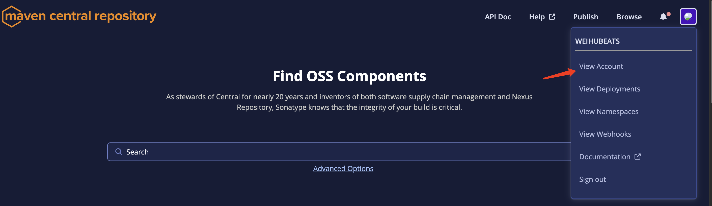
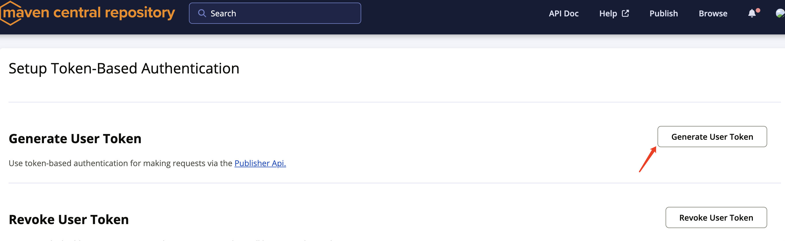
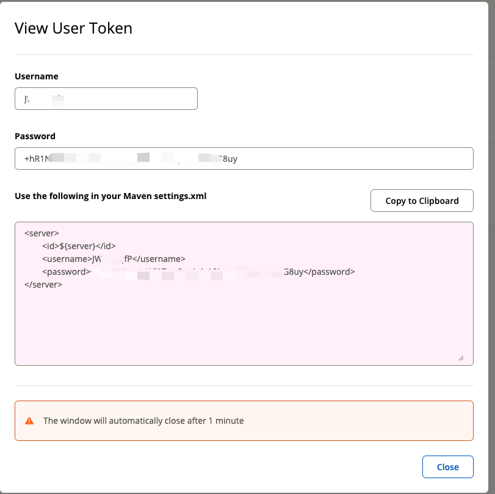
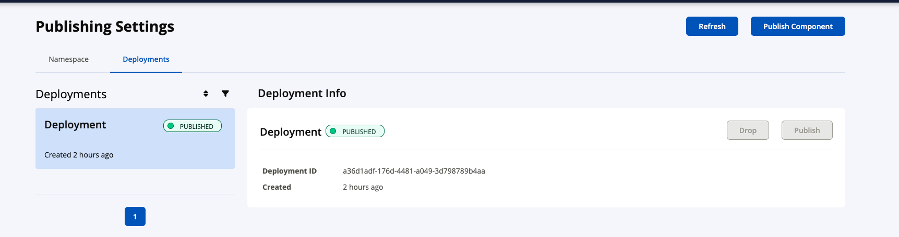

## 背景

最近在将[spring-boot-nebula](https://github.com/weihubeats/spring-boot-nebula)发布到中央仓库发现报错


```java
[ERROR] Failed to execute goal org.apache.maven.plugins:maven-deploy-plugin:3.1.2:deploy (default-deploy) on project spring-boot-nebula: Failed to deploy artifacts: Could not transfer artifact io.github.weihubeats:spring-boot-nebula:pom:0.0.6 from/to sonatype (https://s01.oss.sonatype.org/service/local/staging/deploy/maven2/): status code: 403, reason phrase: Forbidden (403) -> [Help 1]
[ERROR] 
[ERROR] To see the full stack trace of the errors, re-run Maven with the -e switch.
[ERROR] Re-run Maven using the -X switch to enable full debug logging.
[ERROR] 
[ERROR] For more information about the errors and possible solutions, please read the following articles:
[ERROR] [Help 1] http://cwiki.apache.org/confluence/display/MAVEN/MojoExecutionException
```

记得在很早的时候就提示过OSSRH 服务将于2025 年 6 月 30 日停止服务

这个提示很早就在[maven central repository](https://s01.oss.sonatype.org/#welcome)官网提示了

>The OSSRH service will reach end-of-life on June 30th, 2025. Learn more about how to transfer to the Central Publishing Portal here.


所以2025 年 6 月 30 日后就没办法直接发布到`maven central repository`了


## 迁移到新的central repository


- 新的官网地址: https://central.sonatype.com/

我们直接访问新的官网，然后使用原先`oss.sonatype`的账号密码就可以进行登入


### 生成新的token

登入后我们点击进入我们的账户



然后直接生成新的`token`






生成我们还是像之前一样将新的`username`账号信息配置到我们的`maven` `settings.xml`中


### 新增maven打包插件


新的`maven central repository`进行打包上传需要增加新的maven插件

```xml
            <plugin>
                <groupId>org.sonatype.central</groupId>
                <artifactId>central-publishing-maven-plugin</artifactId>
                <version>0.8.0</version>
                <extensions>true</extensions>
                <configuration>
                    <publishingServerId>central</publishingServerId>
                </configuration>
            </plugin>
```


插件相关的使用文档和说明可以参考[官网](https://central.sonatype.org/publish/publish-portal-maven/)

> https://central.sonatype.org/publish/publish-portal-maven/


### 打包

新增插件后我们和原先一样执行`mvn deploy`

然后回输出如下信息

```shell
$ mvn deploy
[INFO] Scanning for projects...
[INFO] Inspecting build with total of 1 modules
[INFO] Installing Central Publishing features
...
[INFO] --- central-publishing-maven-plugin:0.8.0:publish (injected-central-publishing) @ example ---
[INFO] Using Central baseUrl: https://central.sonatype.com
[INFO] Using credentials from server id central in settings.xml
[INFO] Using Usertoken auth, with namecode: XXXXXXX
[INFO] Staging 2 files
[INFO] Staging /central/tests/sonatype-central-example/pom.xml
[INFO] Installing /central/tests/sonatype-central-example/pom.xml to /central/tests/sonatype-central-example/target/central-staging/org/sonatype/central/test/example/1.0.0/example-1.0.0.pom
[INFO] Staging /central/tests/sonatype-central-example/target/example-1.0.0.pom.asc
[INFO] Installing /Users/sonatype/workspace/central/tests/sonatype-central-example/target/example-1.0.0.pom.asc to /Users/sonatype/workspace/central/tests/sonatype-central-example/target/central-staging/org/sonatype/central/test/example/1.0.0/example-1.0.0.pom.asc
[INFO] Pre Bundling - deleted /central/tests/sonatype-central-example/target/central-staging/org/sonatype/central/test/example/maven-metadata-central-staging.xml
[INFO] Generate checksums for dir: org/sonatype/central/test/example/1.0.0
[INFO] Going to create /central/tests/sonatype-central-example/target/central-publishing/central-bundle.zip by bundling content at /central/tests/sonatype-central-example/target/central-staging
[INFO] Created bundle successfully /central/tests/sonatype-central-example/target/central-staging/central-bundle.zip
[INFO] Going to upload /central/tests/sonatype-central-example/target/central-publishing/central-bundle.zip
[INFO] Uploaded bundle successfully, deployment name: Deployment, deploymentId: 9590fb21-a026-4451-9722-a7216b258f4d. Deployment will require manual publishing
[INFO] Waiting until Deployment 9590fb21-a026-4451-9722-a7216b258f4d is validated
[INFO] Deployment 9590fb21-a026-4451-9722-a7216b258f4d has been validated. To finish publishing visit https://central.sonatype.com/publishing/deployments
[INFO] ------------------------------------------------------------------------
[INFO] BUILD SUCCESS
[INFO] ------------------------------------------------------------------------
[INFO] Total time:  15.000 s
[INFO] Finished at: 2024-01-01T00:00:00-00:00
[INFO] ------------------------------------------------------------------------
```

表示打包完成

随后我们在`maven central repository`就可以看到我们新发布的jar了





和之前一样会进行校验，校验通过后我们可以点击`Publish`进行发布

如果校验没通过则无法进行`Publish`，我们可以将`deployments`队列中没通过校验的进行删除，重新上传


## 注意事项

新仓库的校验规则更严格，比如原先多模块的项目子模块没有<name>标签也是能校验通过的

新版本发现会出现校验不通过，然后新的插件的一些配置和之前的也是不一样，具体使用可以参考官网


## 参考

- https://central.sonatype.org/register/central-portal/
- https://s01.oss.sonatype.org/#welcome