## 背景

最近想做个开源项目练练手，然后在github各种操作都准备好了，想给人用发现需要将项目打成Jar发布到中央仓库别人才能引用

故此学习了一下如何将Maven项目发布到中央仓库。首先给小伙伴们看看的开源项目地址吧

[gtihub](https://github.com/weihubeats/mq-idempotent)

期间也踩了不少坑，为了让小伙伴们避免踩坑，就写了这篇文章记录下


## 1. 创建项目

项目创建这个没什么好说的，都想要看这篇文章了，肯定是有了项目想要发版。我这里给大家看看我的项目结构吧

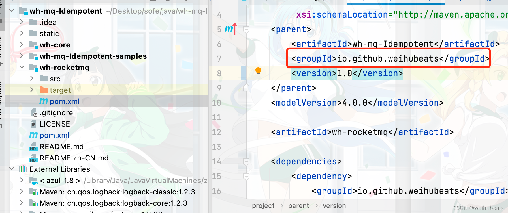

大致就长这样，其中的groupId我故意用红圈圈出来是重点，因为我们发布到中央仓库需要有个组织，也可以理解为域名之类的。

如果你没有域名就只能使用免费的githu的这个域名，github的固定前缀是`io.github.`所以其实我们看一些开源jar为什么groupId是这个前缀就能理解了


## 2. 注册JIRA账号

JIRA是一个项目管理服务，类似于国内的Teambition。Sonatype通过JIRA来管理OSSRH仓库。

[注册地址](https://issues.sonatype.org/secure/Signup!default.jspa)

记住我们的`Username`和`Password`后面的步骤需要用到

## 3. 创建issues注册groupId

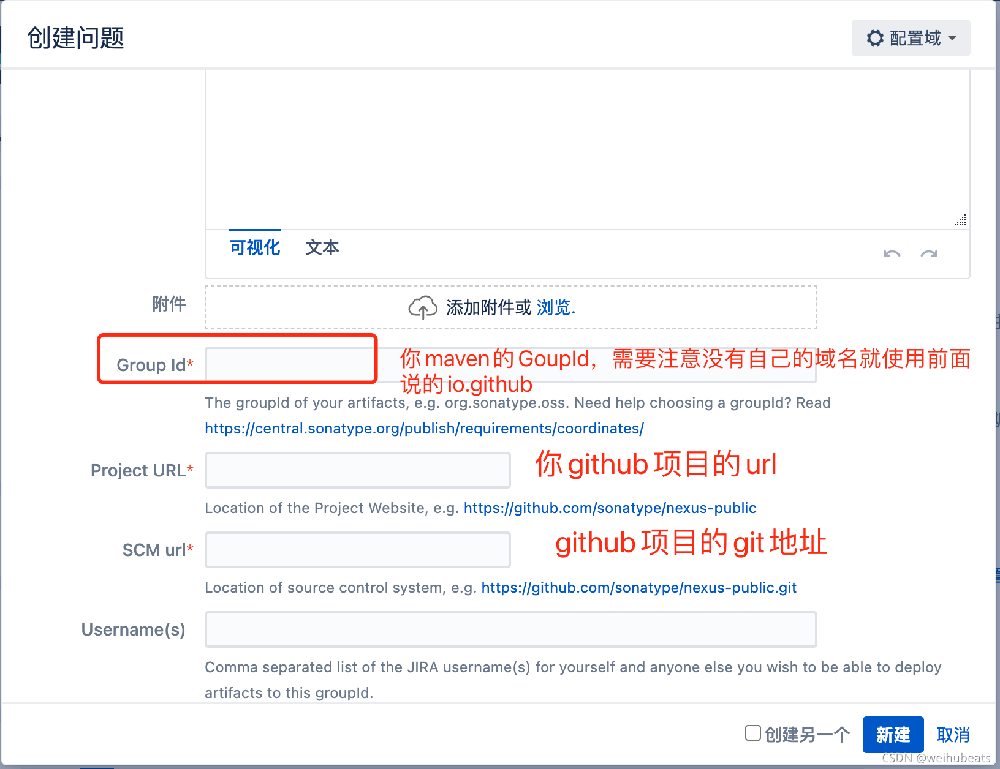

主要是几个必填的填写就行了。然后提交，等待人工处理

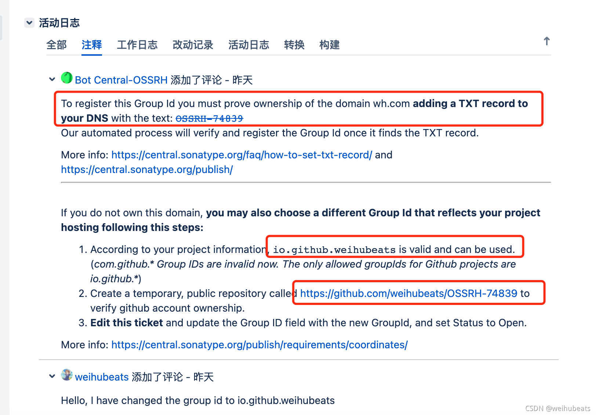

可以看到我比较蠢，开始随便用的groupId，然后人家要我验证我没有

还好心告诉我我可以使用`io.github.weihubeats`这个groupd,并且我需要在我的github建立一个临时的仓库

仓库名为`OSSRH-74839`来证明这个github是我自己的

以上步骤都做完后人工就会回复我们可以上次jar了并会关掉这个issues

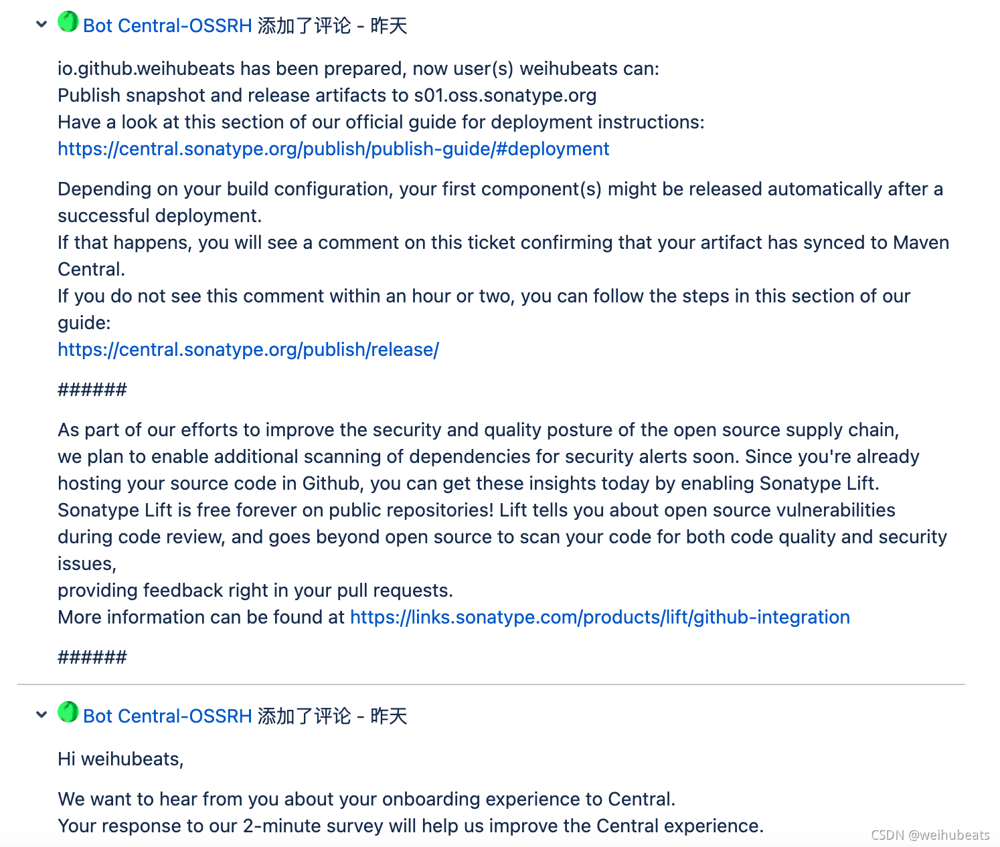

## 4. 配置maven setting.xml

```xml
  <servers>
    <server>
    <id>sonatype</id>
    <username>name</username>
    <password>password</password>
  </server>
```

上面的username和password就是你jira的账号密码，这个id随便配吧，但是后面要与项目中的配置一致，所以这里可以不用改

## 5. 项目打包配置

在pom添加如下配置

1. 开源协议
```xml
<licenses>
        <license>
            <name>The Apache Software License, Version 2.0</name>
            <url>http://www.apache.org/licenses/LICENSE-2.0.txt</url>
            <distribution>repo</distribution>
        </license>
    </licenses>
```

2. 作者信息
```java
<developers>
        <developer>
            <name>weihubeats</name>
            <email>weihubeats@163.com</email>
            <organization>https://weihubeats.blog.csdn.net/</organization>
        </developer>
    </developers>
```

3. 项目信息

```java
<scm>
        <connection>scm:git@github.com:weihubeats/wh-mq-Idempotent.git</connection>
        <developerConnection>scm:git@github.com:weihubeats/wh-mq-Idempotent.git</developerConnection>
        <url>git@github.com:weihubeats/wh-mq-Idempotent.git</url>
    </scm>
```

4. snapshotRepository地址

```xml
<distributionManagement>
        <snapshotRepository>
            <id>sonatype</id>
            <url>https://s01.oss.sonatype.org/content/repositories/snapshots/</url>
        </snapshotRepository>
        <repository>
            <id>sonatype</id>
            <url>https://s01.oss.sonatype.org/service/local/staging/deploy/maven2/</url>
        </repository>
    </distributionManagement>
```

5. 打包插件

```java
 <build>
        <plugins>
            <plugin>
                <groupId>org.apache.maven.plugins</groupId>
                <artifactId>maven-compiler-plugin</artifactId>
                <version>3.0</version>
                <configuration>
                    <encoding>UTF-8</encoding>
                    <source>${java.version}</source>
                    <target>${java.version}</target>
                </configuration>
            </plugin>
            <plugin>
                <groupId>org.apache.maven.plugins</groupId>
                <artifactId>maven-surefire-plugin</artifactId>
                <version>2.18.1</version>
                <configuration>
                    <skipTests>true</skipTests>
                </configuration>
            </plugin>
            <plugin>
                <groupId>org.apache.maven.plugins</groupId>
                <artifactId>maven-source-plugin</artifactId>
                <version>2.4</version>
                <configuration>
                    <attach>true</attach>
                </configuration>
                <executions>
                    <execution>
                        <phase>package</phase>
                        <goals>
                            <goal>jar-no-fork</goal>
                        </goals>
                    </execution>
                </executions>
            </plugin>
            <plugin>
                <groupId>org.apache.maven.plugins</groupId>
                <artifactId>maven-site-plugin</artifactId>
                <version>3.7.1</version>
            </plugin>
            <!-- Javadoc -->
            <plugin>
                <groupId>org.apache.maven.plugins</groupId>
                <artifactId>maven-javadoc-plugin</artifactId>
                <version>3.0.1</version>
                <configuration>
                    <javadocExecutable>${java.home}/bin/javadoc</javadocExecutable>
                    <additionalJOptions>
                        <additionalJOption>-Xdoclint:none</additionalJOption>
                    </additionalJOptions>
                </configuration>
                <executions>
                    <execution>
                        <phase>package</phase>
                        <goals>
                            <goal>jar</goal>
                        </goals>
                    </execution>
                </executions>
            </plugin>
            <!-- Gpg Signature -->
            <plugin>
                <groupId>org.apache.maven.plugins</groupId>
                <artifactId>maven-gpg-plugin</artifactId>
                <version>1.6</version>
                <executions>
                    <execution>
                        <id>sign-artifacts</id>
                        <phase>verify</phase>
                        <goals>
                            <goal>sign</goal>
                        </goals>
                    </execution>
                </executions>
            </plugin>
        </plugins>
    </build>
```

大致就这些内容，可以参考我前面给出的项目地址去参考我的pom文件


## 6. 安装并配置GPG
发布到Maven仓库中的所有文件都要使用GPG签名，以保障完整性。因此，我们需要在本地安装并配置GPG。

MacBook安装GPG非常简单，下载并安装[GPG Suite](https://gpgtools.org/)即可。

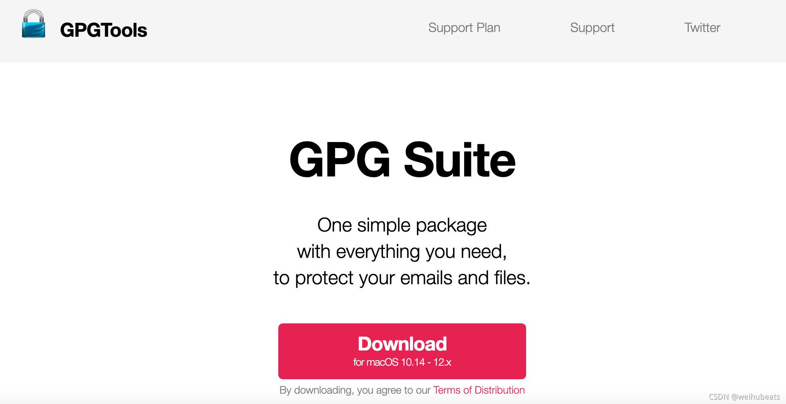

然后配置账号密码

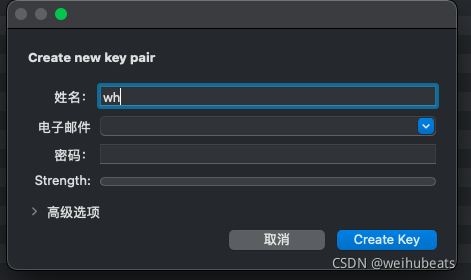

记住这里的用户密码，后面要输入的。

然后上传公钥

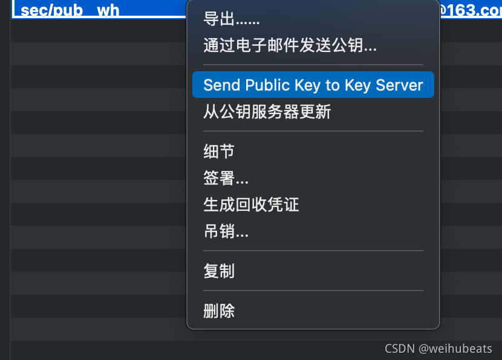

也可以使用命令行方式(上面图形化界面操作了就不用下面命令行方式操作了)

1. 生成秘钥

```shell
gpg --gen-key
```

2. 查看公钥

```shell
gpg --list-keys
```

3. 发布公钥

```shell
gpg --keyserver hkp://pool.sks-keyservers.net --send-keys C4B28DD284B45F052071359920A32885F49417BF
```

4.  验证是否发布成功

```shell
gpg --keyserver hkp://pool.sks-keyservers.net --recv-keys C4B28DD284B45F052071359920A32885F49417BF
```

## 7. 项目打包上传

需要注意的是项目打包上传的版本号不能带有`-SNAPSHOT`

> 快照包发布到快照仓库，这里是正式仓库


多模块项目直接在父pom中进行`deploy`即可

```shell
 mvn clean deploy
```


对于不需要打包的模块添加如下属性

```xml
<properties>
        <maven.deploy.skip>true</maven.deploy.skip>
    </properties>
```


打包成功后我们到[sonatype](https://s01.oss.sonatype.org/)查看我们发布的jar，登入使用jira的账号密码即可登入

然后在`staging Repositories`这里可以看到我们发布的jar

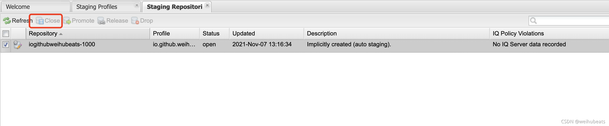

这里我们还需要把这个jar真正的发布，我们勾选这个jar，然后点击上方的`close`

close如果没啥问题，此时的`close`就会被置灰，不让点了。然后我们点击`Release`即可发布

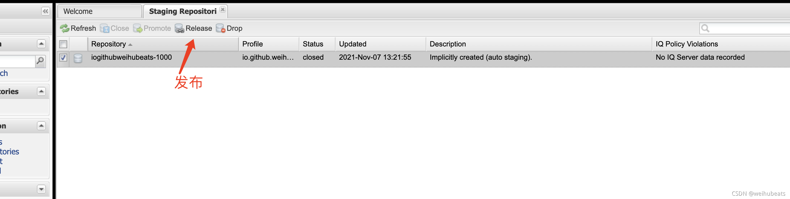

过一会我们注册`jira`的邮箱就会提示我们发布成功了

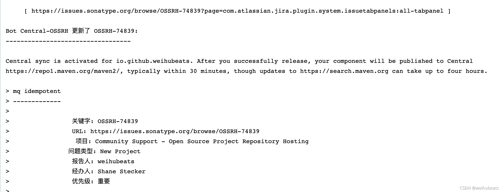

## 搜索我们的jar

需要注意的是我们只是在`https://repo1.maven.org/maven2/` 中可以搜索到，同步到中央仓库搜索可能要4个小时左右

我们去`https://repo1.maven.org/maven2/` 看看我们的jar是否发布成功

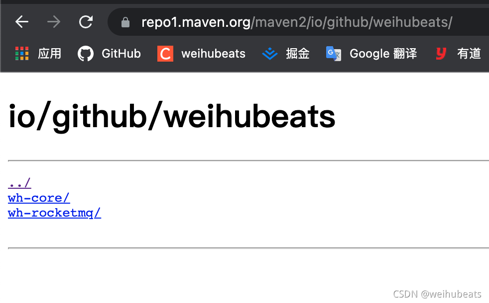

可以看到已经发布成功了，然后等几个小时再去中央仓库搜索一下吧

[中央仓库地址](https://search.maven.org/): https://search.maven.org/

