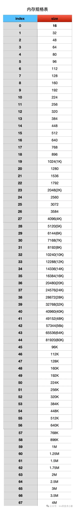

## PoolArena


内存池的核心实现方法都封装在`PoolArena`这个抽象类中


而`PoolArena`具体的实现有只有两个类

- HeapArena：负责池化堆内内存
- DirectArena：负责池化堆外内存


所以`PoolArena`实际可以说就是一个内存池

当我们需要申请`PooledByteBuf`的时候就需要去`PoolArena`中申请


申请内存本身是一个非常频繁且重要的操作，如果多线程操作一个`PoolArena`，就会有并发冲突问题，非常影响内存分配的速度，那么如何优化呢？


最简单的方式就是将多个线程与多个`PoolArena`进行绑定隔离，来减少并发冲突


PoolArena 的默认个数为 `availableProcessors * 2`(CPU核数 * 2)

因为 Netty 中的`Reactor` 线程个数默认恰好也是 `availableProcessors * 2`(CPU核数 * 2)

而内存的分配与释放在`Reactor`线程中是一个非常高频的操作，所以这里将 Reactor 线程与 PoolArena 一对一绑定起来，避免 Reactor 线程之间的相互竞争


当然我们也可以通过参数来调整`HeapArena` 和`DirectArena` 的个数

```shell
-Dio.netty.allocator.numHeapArenas
-Dio.netty.allocator.numDirectArenas
```


```java
        final int defaultMinNumArena = NettyRuntime.availableProcessors() * 2;
        final int defaultChunkSize = DEFAULT_PAGE_SIZE << DEFAULT_MAX_ORDER;
        DEFAULT_NUM_HEAP_ARENA = Math.max(0,
                SystemPropertyUtil.getInt(
                        "io.netty.allocator.numHeapArenas",
                        (int) Math.min(
                                defaultMinNumArena,
                                runtime.maxMemory() / defaultChunkSize / 2 / 3)));
        DEFAULT_NUM_DIRECT_ARENA = Math.max(0,
                SystemPropertyUtil.getInt(
                        "io.netty.allocator.numDirectArenas",
                        (int) Math.min(
                                defaultMinNumArena,
                                PlatformDependent.maxDirectMemory() / defaultChunkSize / 2 / 3)));
```


系统中的线程除了`Reactor`线程 还有如下线程

- 用户线程
- FastThreadLocalThread


不过无论什么线程，在第一次申请内存都会与一个`PoolArena`进行绑定


这样就变成了多个线程与一个`PoolArena`进行绑定，还是会有存在多线程竞争。虽然竞争的线程已经很少了

这种多线程竞争带来的影响是什么呢

Thread1 和 Thread2 ，它俩共同绑定到了同一个 PoolArena 上，Thread1 首先向 PoolArena 申请了一个内存块，并加载到运行它的 CPU1  L1 Cache 中，Thread1 使用完之后将这个内存块释放回 PoolArena


假设此时 Thread2 向 PoolArena 申请同样尺寸的内存块，而且恰好申请到了刚刚被 Thread1 释放的内存块。注意，此时这个内存块已经在 CPU1  L1 Cache 中缓存了，运行 Thread2 的 CPU2  L1 Cache 中并没有，这就涉及到了 cacheline 的核间通信（MESI 协议相关），又要耗费几十个时钟周期

为了极致的性能，我们能不能做到无锁化呢 ？近一步把 cacheline 核间通信的这部分开销省去。

这就需要引入内存池的第二个模型 —— PoolThreadCache

作为线程的 Thread Local 缓存，它用于缓存线程从 PoolArena 中申请到的内存块，线程每次申请内存的时候首先会到 PoolThreadCache 中查看是否已经缓存了相应尺寸的内存块，如果有，则直接从 PoolThreadCache 获取，如果没有，再到 PoolArena 中去申请。同理，线程每次释放内存的时候，也是先释放到 PoolThreadCache 中，而不会直接释放回 PoolArena


通过为每个线程引入 Thread Local 本地缓存 —— PoolThreadCache，实现了内存申请与释放的无锁化，同时也避免了 cacheline 在多核之间的通信开销，极大地提升了内存池的性能


但是这样又会引来一个问题，就是内存消耗太大了，系统中有那么多的线程，如果每个线程在向 PoolArena 申请内存的时候，我们都为它默认创建一个 PoolThreadCache 本地缓存的话，这一部分的内存消耗将会特别大。


因此为了近一步降低内存消耗又同时兼顾内存池的性能，在 Netty 的权衡之下，默认只会为 Reactor 线程以及  FastThreadLocalThread 类型的线程创建 PoolThreadCache，而普通的用户线程在默认情况下将不再拥有本地缓存。

同时 Netty 也为此提供了一个配置选项 -Dio.netty.allocator.useCacheForAllThreads, 默认为 false 。如果我们将其配置为 true , 那么 Netty 默认将会为系统中的所有线程分配 PoolThreadCache 。

```java
DEFAULT_USE_CACHE_FOR_ALL_THREADS = SystemPropertyUtil.getBoolean(
                "io.netty.allocator.useCacheForAllThreads", false);
```


## SizeClasses

etty 的内存池也是按照内存页 page 进行内存管理的，不过与 OS 不同的是，在 Netty 中一个 page 的大小默认为 8k，我们可以通过 -Dio.netty.allocator.pageSize 调整 page 大小，但最低只能调整到 4k，而且 pageSize 必须是 2 的次幂

```java
// 8k
int defaultPageSize = SystemPropertyUtil.getInt("io.netty.allocator.pageSize", 8192);
// 4K
private static final int MIN_PAGE_SIZE = 4096;
```

Netty 内存池最小的管理单位是 page , 而内存池单次向 OS 申请内存的单位是 Chunk，一个 Chunk 的大小默认为 4M。Netty 用一个 PoolChunk 的结构来管理这 4M 的内存空间。

我们可以通过 -Dio.netty.allocator.maxOrder 来调整 chunkSize 的大小（默认为 4M），maxOrder 的默认值为 9 ，最大值为 14。

```java
// 9
int defaultMaxOrder = SystemPropertyUtil.getInt("io.netty.allocator.maxOrder", 9);

// 8196 << 9 = 4M
final int defaultChunkSize = DEFAULT_PAGE_SIZE << DEFAULT_MAX_ORDER;

// 1G
private static final int MAX_CHUNK_SIZE = (int) (((long) Integer.MAX_VALUE + 1) / 2);
```

我们看到 ChunkSize 的大小是由 PAGE_SIZE 和 MAX_ORDER 共同决定的 —— PAGE_SIZE << MAX_ORDER，当 pageSize 为 8K 的时候，chunkSize 最大不能超过 128M，无论 pageSize 配置成哪种大小，最大的 chunkSize 不能超过 1G。


Netty 在向 OS 申请到一个 PoolChunk 的内存空间（4M）之后，会通过 SizeClasses 近一步将这 4M 的内存空间切分成 68 种规格的内存块来进行池化管理。

其中最小规格的内存块为 16 字节，最大规格的内存块为 4M 。也就是说，Netty 的内存池只提供如下 68 种内存规格来让用户申请。



除此之外，Netty 又将这 68 种内存规格分为了三类：

1. [16B , 28K] 这段范围内的规格被划分为 Small 规格。

2. [32K , 4M] 这段范围内的规格被划分为 Normal 规格。

3. 超过 4M 的内存规格被划分为 Huge 规格。


其中 Small 和 Normal 规格的内存块会被内存池（PoolArena）进行池化管理

```java
abstract class PoolArena<T> {
    enum SizeClass {
        Small,
        Normal
    }
}
```


Huge 规格的内存块不会被内存池管理

当我们向内存池申请 Huge 规格的内存块时，内存池是直接向 OS 申请内存，释放的时候也是直接释放回 OS ，内存池并不会缓存这些 Huge 规格的内存块。


## PoolChunk

在 Netty 内存池中，内存管理的基本单位是 Page , 一个 Page 的内存规格是 8K ，这个是内存管理的基础，而 Small ， Normal 这两种规格是在这个基础之上进行管理的


PoolChunk 的设计参考了 Linux 内核中的伙伴系统，在内核中，内存管理的基本单位也是 Page（4K），这些 Page 会按照伙伴的形式被内核组织在伙伴系统中


> 内核中的伙伴指的是大小相同并且在物理内存上连续的两个或者多个 page（个数必须是 2 的次幂）。


## 参考

- https://mp.weixin.qq.com/s/Vv_XV61osu9N-jCRN-Y5Kw