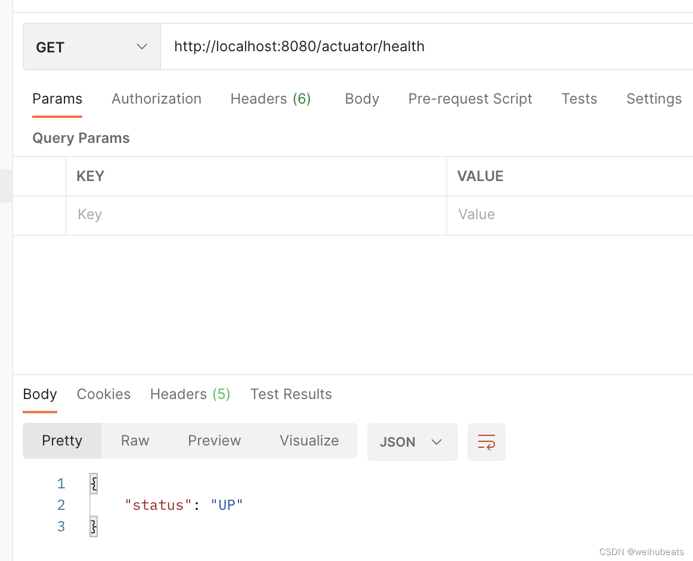
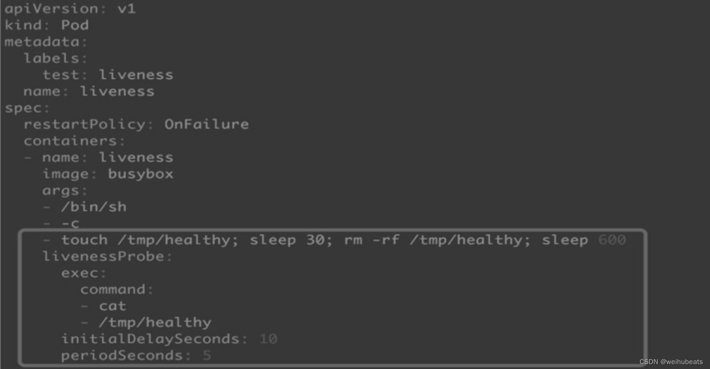
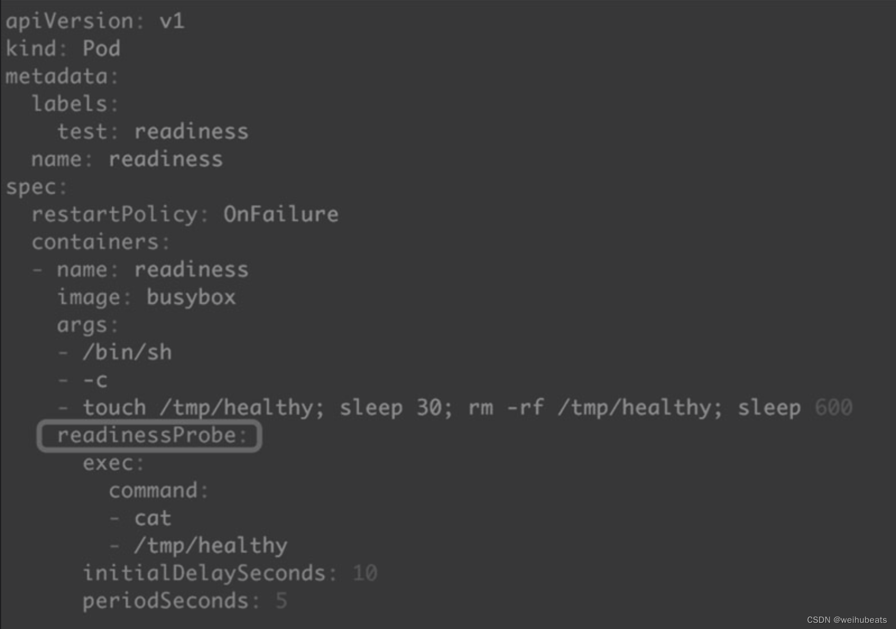
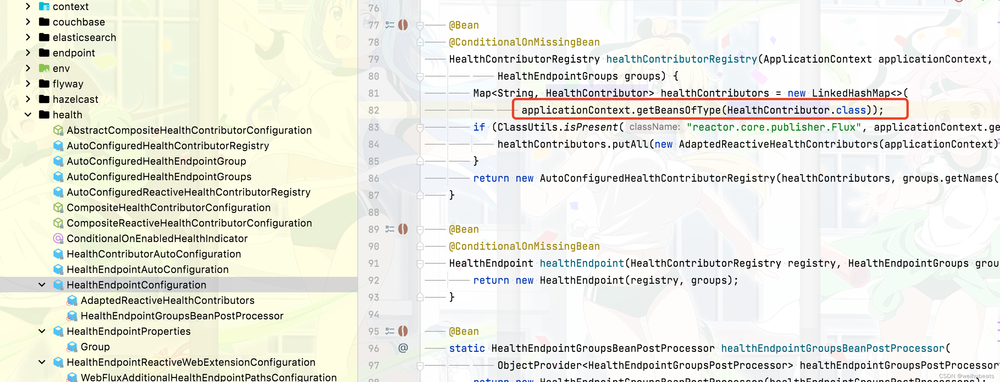
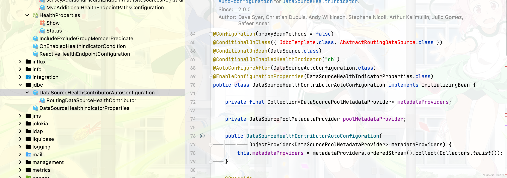
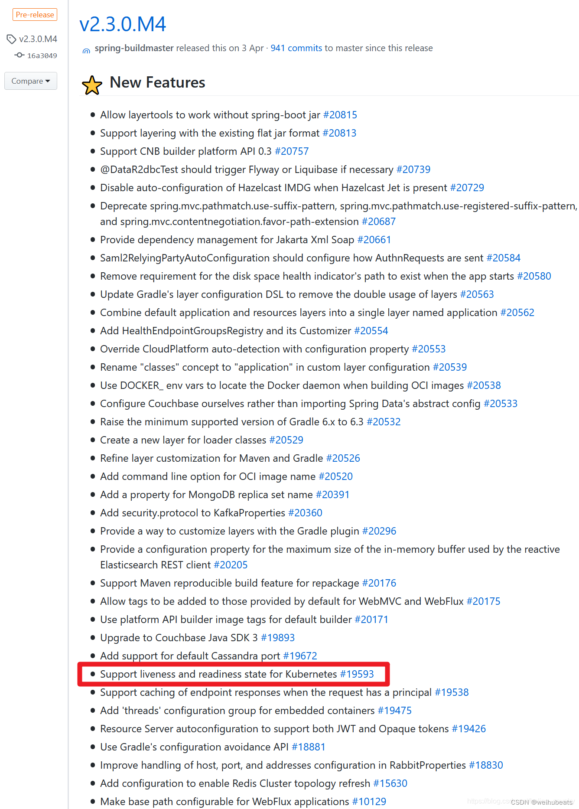
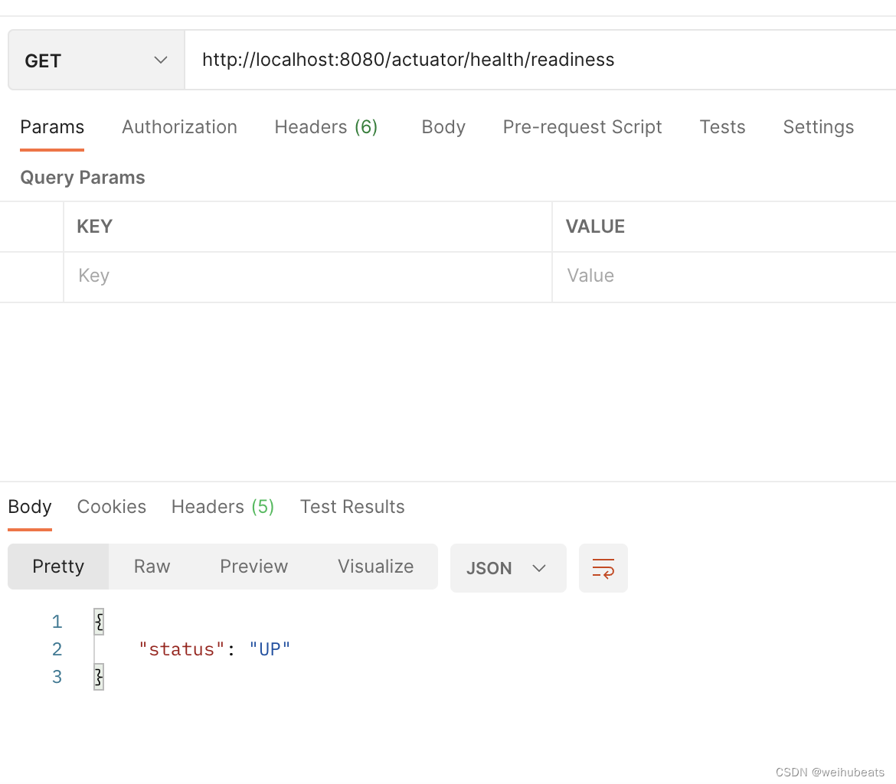

## 背景
不管什么样的场景，我们应用基本上都需要提供一个探针，判断应用是否存活，来监控应用是否存活，是否需要剔除服务，是否需要自动重启


## 健康监控

在不使用三方插件我们最简单的方式就是自己写个接口供外部调用去做类似心跳探测
```java
    @GetMapping("/health")
    public String health() {
        return ActionEnum.SUCCESS.name();
    }
```

## Spring Boot Actuator

实际上`Spring Boot Actuator`已经给我们提供了相应的组件。

### 使用

> spring boot 版本: 2.6.8

1. 引入依赖
```xml
        <dependency>
            <groupId>org.springframework.boot</groupId>
            <artifactId>spring-boot-starter-actuator</artifactId>
        </dependency>
```

2. 启动endpoint监控
我们可以使用如下配置开启所有的接口(endpoint)监控
```yaml
management:
  endpoints:
    web:
      exposure:
        include: '*'
```

也可以开启指定接口(endpoint)的监控
```yaml
management:
  endpoints:
    web:
      exposure:
        include: health,beans,trace
```

默认的接口前缀都是`/actuator`开头，如果我们要自定义可以使用如下配置
```yaml
management:
  endpoints:
    web:
      base-path: /manage
```
spring boot 为我们提供了如下可用的接口(endpoints)

|路径| 描述 |
|--|--|
| auditevents |  公开当前应用程序的审计事件信息。|
|  beans|显示应用程序中所有 Springbean 的完整列表 |
|caches  |公开可用的缓存  |
|  conditions| 显示在配置和自动配置类上计算的条件以及它们匹配或不匹配的原因 |
| configprops | 显示已排序的所有@ConfigurationProperties 列表 |
|  env|  获取全部环境属性|
|flyway  | 显示已经应用的任何 Flyway 数据库迁移。需要一个或多个 `Flyway` bean |
|health  | 显示应用程序健康信息 |
| httptrace |  显示 HTTP 跟踪信息(默认情况下是最后100次 HTTP 请求-响应)|
|info  | 显示任意的应用程序信息 |
| integrationgraph | 显示了 `Spring integrationgraph`。需要对 `Spring-Integration-core` 的依赖关系 |
| threaddump | 获取线程活动的快照 |

>更多请参考[spring boot 官方文档](https://docs.spring.io/spring-boot/docs/current/reference/html/actuator.html#actuator.enabling)


3. 访问接口

添加了`spring-boot-starter-actuator`依赖并开启接口监控后，我们可以直接访问接口，比如`health`

我们访问:
```http
http://localhost:8080/actuator/health
```




可以看到就返回了应用的健康信息,其他的接口就不一一演示了。因为这不是我们今天的重点


## kubernetes 健康检查

当应用部署到`kubernetes`，`kubernetes`提供了两种探测机制
- Liveness探测(存活探针)：Liveness探测让用户可以自定义判断容器是否健康的条件。如果探测失败，Kubernetes就会重启容器。




- Readiness探测(就绪探针)：Readiness探测则是告诉Kubernetes什么时候可以将容器加入到Service负载均衡池中，对外提供服务




在2.3.0之前我们`Liveness探测`、`Readiness探测`都可以使用`health`这个接口来处理。


## health 源码分析

health的自动装配主要实现类是`HealthEndpointAutoConfiguration`
```java
@Configuration(proxyBeanMethods = false)
@ConditionalOnAvailableEndpoint(endpoint = HealthEndpoint.class)
@EnableConfigurationProperties(HealthEndpointProperties.class)
@Import({ HealthEndpointConfiguration.class, ReactiveHealthEndpointConfiguration.class,
		HealthEndpointWebExtensionConfiguration.class, HealthEndpointReactiveWebExtensionConfiguration.class })
public class HealthEndpointAutoConfiguration {

}
```

这里面我们可以一个比较核心的类`HealthEndpointConfiguration`



这里获取的就是health要检测的一些资源


比如数据库



这里就可以看到了一个问题，实际上容器的`存活`和`就绪`探针是应该分开的。
1. 存活的探测不应该依赖于数据库这些三方中间件
2. 就绪就需要检测数据库连接池等三方中间件是否加载完成，是否可以提供服务了


## Spring boot 版本更新支持kubernetes 探针



可以看到在`spring boot` 2.3后官方支持了`kubernetes`的这两种探针

## 在spring boot 中使用kubernetes 探针

默认只有应用在`kubernetes`容器中开会开启这两个探针即
- `/actuator/health/liveness`
- `/actuator/health/readiness`

如果我们本地需要开启测试可以添加如下配置开关
```yaml
management:
  endpoint:
    health:
      probes:
        enabled: true
```

然后我们访问试试



可以看到是生效了

## 总结
我们从最初的健康探测，到`kubernetes`中的`liveness(存活)探针`、`readiness(就绪)探针`。
可见即使是最简单的健康检测也有这么多要研究的东西。
路漫漫其修远兮，吾将上下而求索啊！