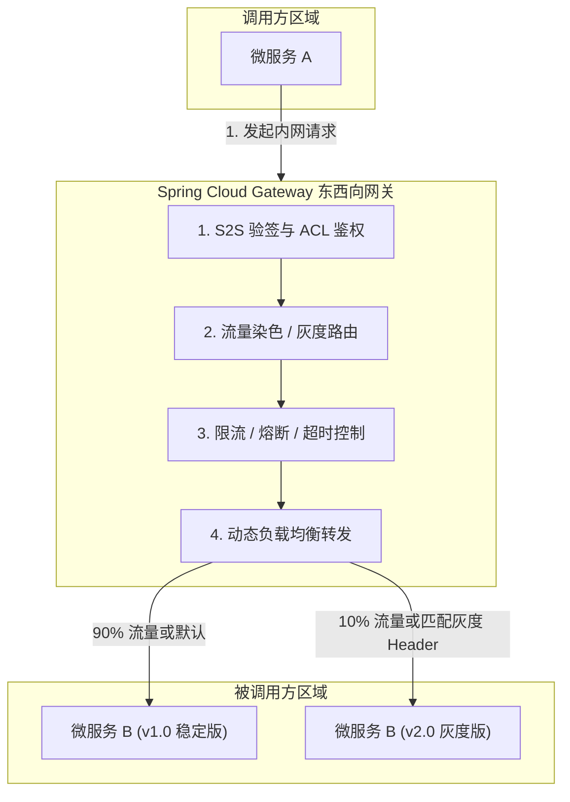

## 背景

流量主要分`东西`和`南北`向流量

本次我们聚焦`东西`向的流量治理

即 内部服务与服务之间的流量治理

## 核心架构

```mermaid
flowchart TD
    subgraph CallerZone [调用方区域]
        SA[微服务 A]
    end

    subgraph EWGateway [Spring Cloud Gateway 东西向网关]
        direction TB
        Auth[1. S2S 验签与 ACL 鉴权] --> Color[2. 流量染色 / 灰度路由]
        Color --> Resiliency[3. 限流 / 熔断 / 超时控制]
        Resiliency --> Dispatch[4. 动态负载均衡转发]
    end

    subgraph ProviderZone [被调用方区域]
        SB_v1["微服务 B (v1.0 稳定版)"]
        SB_v2["微服务 B (v2.0 灰度版)"]
    end

    SA -->|1. 发起内网请求| EWGateway
    Dispatch -->|90% 流量或默认| SB_v1
    Dispatch -->|10% 流量或匹配灰度 Header| SB_v2

```