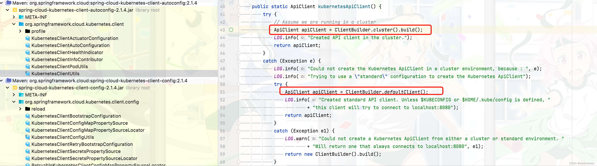
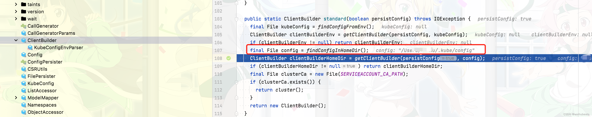
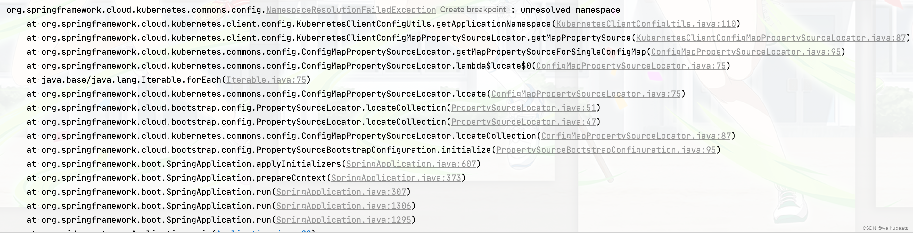
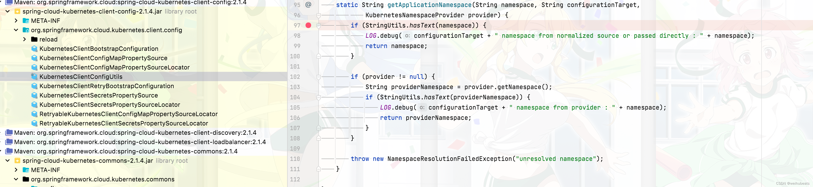

## 背景
在上文[Spring Cloud Zookeeper 升级为Spring Cloud Kubernetes](https://blog.csdn.net/qq_42651904/article/details/127725818?spm=1001.2014.3001.5501) 之后，我们使用了`Kubernetes`的服务发现，但本地开发环境不在`Kubernetes`中，所以本地项目启动会失败。只能把代码部署到`Kubernetes`中才能启动

那么就带来一个新问题，本地如何开发`debug`呢？

## 源码
本博客的源码已上传至github，需要自取
- [github](https://github.com/weihubeats/weihubeats_demos/tree/master/spring-cloud-demos/spring-cloud-kubernetes): https://github.com/weihubeats/weihubeats_demos/tree/master/spring-cloud-demos/spring-cloud-kubernetes

## 原理

要先知道本地如何搭建开发环境,就要知道`spring cloud kubernetes`是如何连接`Kubernetes`的

所以我们进行源码分析一下:

我们启动通过报错log其实可以直接定位到创建`Kubernetes` client的代码




可以看到创建`ApiClient`有两个地方

### 通过http连接
```java

public static final String ENV_SERVICE_HOST = "KUBERNETES_SERVICE_HOST";
public static final String ENV_SERVICE_PORT = "KUBERNETES_SERVICE_PORT";

public static ClientBuilder cluster() throws IOException {
    final ClientBuilder builder = new ClientBuilder();

    final String host = System.getenv(ENV_SERVICE_HOST);
    final String port = System.getenv(ENV_SERVICE_PORT);
    builder.setBasePath(host, port);

    builder.setCertificateAuthority(Files.readAllBytes(Paths.get(SERVICEACCOUNT_CA_PATH)));
    builder.setAuthentication(new TokenFileAuthentication(SERVICEACCOUNT_TOKEN_PATH));

    return builder;
  }
```

可以看到最上面的方式是通过http的方式去创建，获取的`host`和`port`都是从环境变量中获取的，如果`http`方式连接不上就被try catch 然后通过读取配置文件的方式创建`ApiClient`

### 通过config配置连接



##  本地开发环境搭建

知道原理了之后我们就知道该怎么做了，最简单的方式肯定是会用`config`去连接。我们参考之前
- [安装minikube](https://weihubeats.blog.csdn.net/article/details/126353166): https://weihubeats.blog.csdn.net/article/details/126353166

安装完并启动`minikube`
然后我们查看我们的本地配置文件，就会发现自动生成了`config`配置文件


然后就可以直接启动项目了，然后发现报错，找不到`namespace`




查看源码发现需要配置`namespace`



首先我们通过`kubectl`创建一个名为`default`的`namespace`
```
kubectl create ns default-namespace
```

我们在配置一下
- application.properties
```xml
spring.cloud.kubernetes.client.namespace = default
spring.cloud.kubernetes.enabled = true
```


> 需要注意一下这里如果引入了依赖`spring-cloud-kubernetes-client-config`该配置只能在`bootstrap`中配置才能生效

## 测试

本地随便启动一个`spring boot`项目

写一个通过`DiscoveryClient`获取服务的接口

```java
@RestController
@RequestMapping("/service/v1")
@RequiredArgsConstructor
@Slf4j
public class ServiceController {

	private final DiscoveryClient discoveryClient;

	@GetMapping("/service")
	public List<String> getServiceList(){
		return discoveryClient.getServices();
	}
}
```

调用

```http
GET http://localhost:8090/service/v1/service
```

成功返回服务列表说明成功了