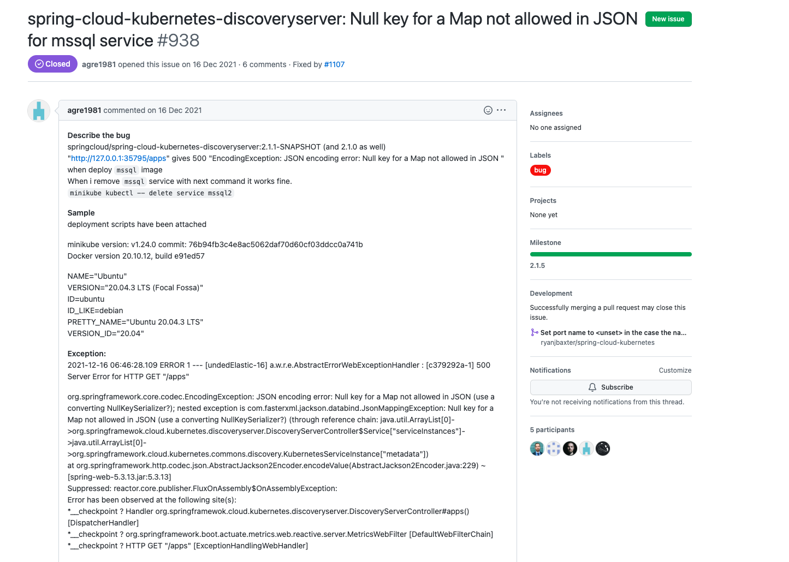
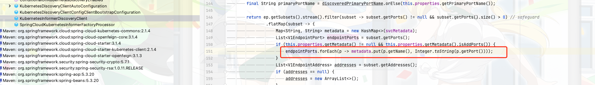
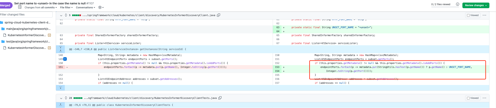

> 这里是weihubeats,觉得文章不错可以关注公众号**小奏技术**，文章首发。拒绝营销号，拒绝标题党

## 背景

最近在做`spring cloud kubernetes`改造调研，然后在获取服务元数据的时候遇到了这个错误
`Null key for a Map not allowed in JSON`


## 项目搭建还原

### 项目依赖版本

- spring cloud: `2021.0.4`
- spring cloud kubernetes:`spring-cloud-starter-kubernetes-client`: `2.1.4`
> 由上面`spring cloud` 版本管理统一管理，都是最新版本


### 代码

1. 先在`Application` 添加注解`@EnableDiscoveryClient`开启分布式客户端

```java
@SpringBootApplication
@EnableDiscoveryClient
public class Application {

    public static void main(String[] args) {
        SpringApplication.run(Application.class, args);
    }
}
```

2. 编写代码获取服务相关元数据信息

```java
@RestController
@RequestMapping("/service/v1")
@RequiredArgsConstructor
public class ServiceController {

	private final DiscoveryClient discoveryClient;

	@GetMapping("/service")
	public List<String> getServiceList(){
		return discoveryClient.getServices();
	}

	@GetMapping("/instance")
	public Object getInstance(String name){
		List<ServiceInstance> instances = discoveryClient.getInstances(name);
		return instances;
	}
	
}
```


## 测试

然后将项目部署到k8s集群中，调用上面的接口

### 1. 获取服务
调用接口
```curl
http://k8s/service/v1/service
```
> 这里天自己的k8s域名

然后回发现可以正常返回服务列表

### 2. 获取服务元数据

我们在调通接口获取服务元数据的时候就出现了上面的报错
```
http://k8s/service/v1/instance?name=test-service
```

>Null key for a Map not allowed in JSON


## 问题定位

然后在`spring-cloud-kubernetes` 中找到了类似的问题




> [issues链接](https://github.com/spring-cloud/spring-cloud-kubernetes/issues/938)


大致的意思是我们在`service.yaml`中没有定义port的名字导致报错了。
比如原先`service.yaml`的是
```yaml
apiVersion: v1
kind: Service
metadata:
  name: my-service
spec:
  selector:
    app.kubernetes.io/name: MyApp
  ports:
    - protocol: TCP
      port: 80
      targetPort: 9376
```

可以看到我们没有定义port的名字所以我们可能需要加一下port的名字
```yaml
apiVersion: v1
kind: Service
metadata:
  name: my-service
spec:
  selector:
    app.kubernetes.io/name: MyApp
  ports:
    - protocol: TCP
      port: 80
      name: default-http
      targetPort: 9376
```
> name: default-http


这样就解决了这个bug，那么我其他所有没有定义`port` `name`的项目呢，不是都会报错？
所以这里其实是一个bug

## 源码分析




可以看到这里在获取port name的时候没有默认值处理，所以`spring cloud kubernetes` 官方维护人员也说这是一个bug，并修复了他





- [pull](https://github.com/spring-cloud/spring-cloud-kubernetes/pull/1107)

代码是修复了，遗憾的好像还没有发版，中央仓库最新版本还是有这个bug


## 本地自我修复

比较好的解决方式就是在本地建立一个同包同类名的类，然后自己去修改源码


