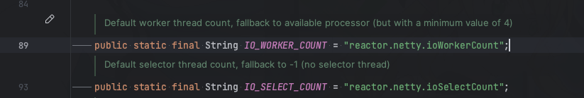
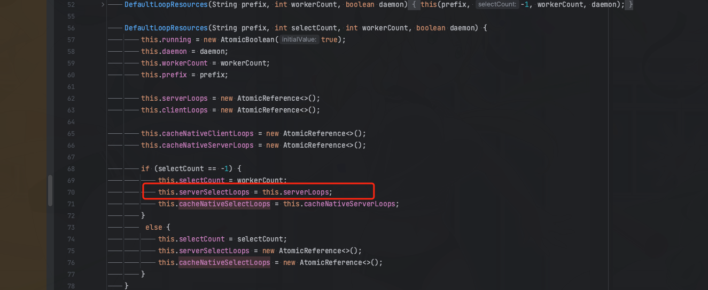

> 这里是**weihubeats**,觉得文章不错可以关注公众号**小奏技术**，文章首发。拒绝营销号，拒绝标题党


## Spring cloud gateway version

- 3.1.4

## 背景

线上的`api-gateway`网关在请求量过大的时候会偶尔出现如下报错
```java
io.netty.channel.ConnectTimeoutException: connection timed out:
```

这说明网关存在一定的性能瓶颈，需要对网关进行性能优化或者扩容pod

## Spring cloud gateway IO模型

我们通过查看`Spring cloud gateway`源码发现`Spring cloud gateway`使用的IO通信sdk主要是使用的`reactor.netty`

初始化会去构建一个`DefaultLoopResources`


在创建`DefaultLoopResources`的时候我们看看他的一些构造参数


熟悉`Netty`的IO模型我们就能知道上面最核心的两个线程配置

- IO_WORKER_COUNT
- IO_SELECT_COUNT




一个是`select`线程数，一个是`work`线程数

其中可以看到`IO_WORKER_COUNT`即`work`线程数，默认是`cpu`核数，最大值为4
`IO_SELECT_COUNT`的线程数默认是`-1`，即不设置与`IO_WORKER_COUNT`共享一个线程池




一般我们传统的Netty通信配置都是会设置一个`Boss`线程池和一个`Work`线程池

如果`Boss`和`Work`线程池公用一个会影响性能。也就是说`Spring cloud gateway` 默认是非主从`Reactor`多线程模式

大概是这样
```java
EventLoopGroup eventGroup = new NioEventLoopGroup();
ServerBootstrap serverBootstrap = new ServerBootstrap();serverBootstrap.group(eventGroup);

```

我们在开发`Netty`应用的时候一般都会使用主从`Reactor`多线程模式。
也就是如下方式
```java
EventLoopGroup bossGroup = new NioEventLoopGroup();
EventLoopGroup workGroup = new NioEventLoopGroup();
ServerBootstrap serverBootstrap = new ServerBootstrap();serverBootstrap.group(bossGroup,workGroup);
```

所以可以我们最好设置`- IO_SELECT_COUNT`线程数。

这个参数`spring cloud gateway`没有提供配置的方式。只能通过系统参数去设置

## 如何设置IO_SELECT_COUNT
```java
System.setProperty(ReactorNetty.IO_SELECT_COUNT,"1");
```

## 压测
实践是检验真理的唯一标准。这里我们通过压测添加`IO_SELECT_COUNT`和不添加`IO_SELECT_COUNT`配置进行压测看看`spring cloud gateway`的性能表现如何

### 压测环境
- 机器配置：Apple M1 hw.physicalcpu: 8 
- os版本: 13.4 (22F66)

### jmeter设置


3000个线程，循环两次。1秒执行

> 这里如果不会`Jmeter`可以参考我之前的使用教程:
>https://blog.csdn.net/qq_42651904/article/details/118860462

注意新版本的`Jmeter`默认返回的请求结果只有200个，如果需要观察全部可以修改配置`jmeter.properties`
```properties
#view.results.tree.max_results=0
```
把这个注释的#去掉


### 测试路由服务接口

```java
@GetMapping("/test")
public  List<StudentVO> test(String name) throws Exception{
    TimeUnit.MILLISECONDS.sleep(500);
    return mockSelectSql();
}
```

请求的接口故意休眠500毫秒,模拟存在一定耗时

### 压测结果


- 无任何配置

序号|average|Max|error%|
:--:|:--:|:--:|:--:|
| 1 | 5330 | 7776 | 0.35% |
| 2 | 4436 | 9301 | 8.03% |
| 3 | 3629 | 8977 | 18.55% |
| 4 | 3164 | 8074 | 26.02% |
| 5 | 5156 | 7815 | 1.37% |
| 6 | 3907 | 9002 | 13.63% |
| 7 | 3871 | 9759 | 15% |
| 8 | 3557 | 8527 | 19.97% |

- 新增IO_SELECT_COUNT = 1

序号|average|Max|error%|
:--:|:--:|:--:|:--:|
| 1 | 5151 | 8051 | 5.45% |
| 2 | 5260 | 8081 | 2.88% |
| 3 | 5371 | 7732 | 0.33% |
| 4 | 5785 | 8078 | 0.00% |
| 5 | 5613 | 8190 | 2.48% |
| 6 | 5397 | 8036 | 0.37% |
| 7 | 1275 | 2773 | 0.00% |
| 8 | 5664 | 8241 | 0.12% |
| 9 | 5746 | 8589 | 0.00% |


## 总结
可以看到增加`IO_SELECT_COUNT`线程数配置 可以明显减少`error`错误，即减少`connection timed`。目前是在mac测试数据，预计至少有`20%`左右的QPS提升

其次还有一个可配置参数`DEFAULT_IO_WORKER_COUNT`，默认为cpu核数，最大为4
如果cpu核数够多也可以增加该线程数，由于本机线程数有限，增加该线程数性能提升不明显