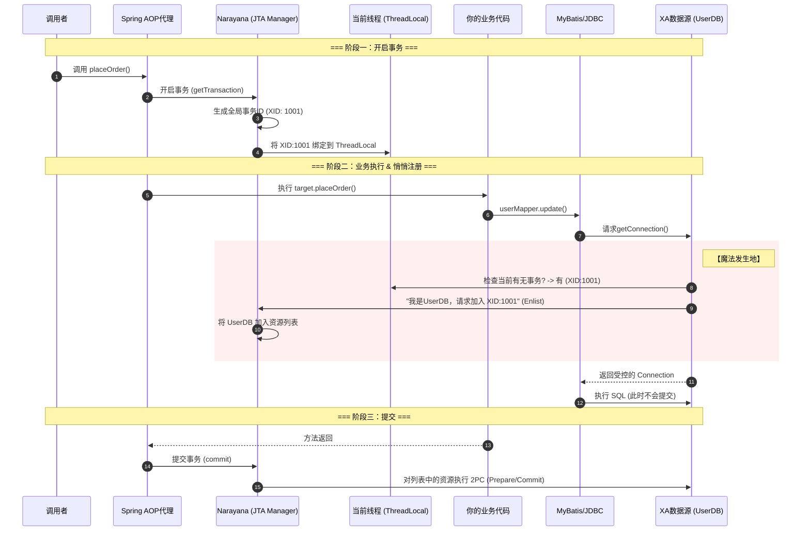

## Narayana 是什么

Narayana 是一个老牌且著名的分布式事务管理器（JTA Transaction Manager），主要由 Red Hat（红帽）和 JBoss 社区维护

- 作用：确保在复杂的软件系统中，涉及多个数据库（如 MySQL + Oracle）或消息队列（如 Kafka/JMS）的操作能保持数据一致性

- 核心功能:它支持 JTA（Java Transaction API）、JTS、Web Service 事务等标准

## 使用


1. 引入依赖

```xml
<dependencies>
    <dependency>
        <groupId>org.springframework.boot</groupId>
        <artifactId>spring-boot-starter-web</artifactId>
    </dependency>

    <dependency>
        <groupId>me.snowdrop</groupId>
        <artifactId>narayana-spring-boot-starter</artifactId>
        <version>2.6.5</version>
    </dependency>

    <dependency>
        <groupId>com.baomidou</groupId>
        <artifactId>mybatis-plus-boot-starter</artifactId>
        <version>3.5.3.1</version>
    </dependency>

    <dependency>
        <groupId>com.h2database</groupId>
        <artifactId>h2</artifactId>
        <scope>runtime</scope>
    </dependency>
    
    <dependency>
        <groupId>org.projectlombok</groupId>
        <artifactId>lombok</artifactId>
    </dependency>
</dependencies>
```

2. 项目结构

```
src/main/java/com/example
├── config
│   ├── UserDbConfig.java   (配置 DB_A)
│   └── OrderDbConfig.java  (配置 DB_B)
├── entity
│   ├── User.java
│   └── Order.java
├── mapper
│   ├── user                (存放 UserMapper)
│   │   └── UserMapper.java
│   └── order               (存放 OrderMapper)
│       └── OrderMapper.java
└── service...
```


2. 实体类定义

```java
// User.java
@Data
@TableName("account")
public class User {
    private String username;
    private Integer balance;
}

// Order.java
@Data
@TableName("orders")
public class Order {
    private String id;
    private Integer amount;
}

```

4. mapper定义

```java
// package com.example.mapper.user;
public interface UserMapper extends BaseMapper<User> {}

// package com.example.mapper.order;
public interface OrderMapper extends BaseMapper<Order> {}

```

5. 多数据源配置

- user库

```java
package com.example.config;

import com.baomidou.mybatisplus.extension.spring.MybatisSqlSessionFactoryBean;
import org.apache.ibatis.session.SqlSessionFactory;
import org.h2.jdbcx.JdbcDataSource;
import org.mybatis.spring.annotation.MapperScan;
import org.springframework.context.annotation.Bean;
import org.springframework.context.annotation.Configuration;
import org.springframework.context.annotation.Primary;
import javax.sql.DataSource;

@Configuration
@MapperScan(basePackages = "com.example.mapper.user", sqlSessionFactoryRef = "userSqlSessionFactory")
public class UserDbConfig {

    // 1. 创建 XA 数据源
    @Bean
    @Primary
    public DataSource userDataSource() {
        JdbcDataSource h2XaDataSource = new JdbcDataSource();
        h2XaDataSource.setUrl("jdbc:h2:mem:userDb;DB_CLOSE_DELAY=-1");
        h2XaDataSource.setUser("sa");
        h2XaDataSource.setPassword("");
        return h2XaDataSource;
    }

    // 2. 创建 MyBatis Plus 的 SqlSessionFactory
    // 注意：这里使用的是 MybatisSqlSessionFactoryBean，不是原生的 SqlSessionFactoryBean
    @Bean
    @Primary
    public SqlSessionFactory userSqlSessionFactory(DataSource userDataSource) throws Exception {
        MybatisSqlSessionFactoryBean bean = new MybatisSqlSessionFactoryBean();
        bean.setDataSource(userDataSource);
        // 如果有 xml 文件，这里设置：bean.setMapperLocations(...)
        return bean.getObject();
    }
}
```

- 订单库

```java
package com.example.config;

import com.baomidou.mybatisplus.extension.spring.MybatisSqlSessionFactoryBean;
import org.apache.ibatis.session.SqlSessionFactory;
import org.h2.jdbcx.JdbcDataSource;
import org.mybatis.spring.annotation.MapperScan;
import org.springframework.context.annotation.Bean;
import org.springframework.context.annotation.Configuration;
import javax.sql.DataSource;

@Configuration
// 【关键】：扫描 com.example.mapper.order 下的接口，并绑定到 orderSqlSessionFactory
@MapperScan(basePackages = "com.example.mapper.order", sqlSessionFactoryRef = "orderSqlSessionFactory")
public class OrderDbConfig {

    @Bean
    public DataSource orderDataSource() {
        JdbcDataSource h2XaDataSource = new JdbcDataSource();
        h2XaDataSource.setUrl("jdbc:h2:mem:orderDb;DB_CLOSE_DELAY=-1");
        h2XaDataSource.setUser("sa");
        h2XaDataSource.setPassword("");
        return h2XaDataSource;
    }

    @Bean
    public SqlSessionFactory orderSqlSessionFactory(DataSource orderDataSource) throws Exception {
        MybatisSqlSessionFactoryBean bean = new MybatisSqlSessionFactoryBean();
        bean.setDataSource(orderDataSource);
        return bean.getObject();
    }
}
```


6. 业务层 (Service)

现在你可以像平时一样注入 Mapper，Narayana 会自动处理跨库事务。

```java
@Service
public class OrderService {

    @Autowired
    private UserMapper userMapper;   // 自动指向 DB_A
    @Autowired
    private OrderMapper orderMapper; // 自动指向 DB_B

    // 初始化表 (H2内存库需要)
    @Transactional
    public void init() {
        // 使用 MyBatis Plus 没什么好办法直接建表，这里临时用原生 SQL 模拟一下初始化
        // 实际生产中表是存在的，不需要这步
        // (为了演示简洁，这里略去建表代码，假设表已通过 application.yml 或 schema.sql 建立)
        // 你可以在配置 DataSource 时指定 init-script
    }

    @Transactional(rollbackFor = Exception.class)
    public void placeOrder(boolean simulateError) {
        System.out.println(">>> 事务开始 (MyBatis Plus) <<<");

        // 1. 扣减余额 (DB_A)
        // 这里演示 MP 的 Wrapper 用法
        UpdateWrapper<User> updateWrapper = new UpdateWrapper<>();
        updateWrapper.setSql("balance = balance - 10").eq("username", "zhangsan");
        userMapper.update(null, updateWrapper);
        System.out.println(">>> 余额已扣减 <<<");

        // 2. 插入订单 (DB_B)
        Order order = new Order();
        order.setId("ORDER_MP_001");
        order.setAmount(10);
        orderMapper.insert(order);
        System.out.println(">>> 订单已插入 <<<");

        // 3. 模拟异常
        if (simulateError) {
            throw new RuntimeException("MyBatis Plus 遇到异常，全部回滚！");
        }
    }
}
```

## 数据初始化

```java
// 在 UserDbConfig 中添加
@Bean
public DataSourceInitializer userDbInit(DataSource userDataSource) {
    ResourceDatabasePopulator populator = new ResourceDatabasePopulator();
    populator.addScript(new ByteArrayResource("CREATE TABLE IF NOT EXISTS account (username VARCHAR(50), balance INT); INSERT INTO account VALUES ('zhangsan', 100);".getBytes()));
    DataSourceInitializer initializer = new DataSourceInitializer();
    initializer.setDataSource(userDataSource);
    initializer.setDatabasePopulator(populator);
    return initializer;
}

// 在 OrderDbConfig 中添加
@Bean
public DataSourceInitializer orderDbInit(DataSource orderDataSource) {
    ResourceDatabasePopulator populator = new ResourceDatabasePopulator();
    populator.addScript(new ByteArrayResource("CREATE TABLE IF NOT EXISTS orders (id VARCHAR(50), amount INT);".getBytes()));
    DataSourceInitializer initializer = new DataSourceInitializer();
    initializer.setDataSource(orderDataSource);
    initializer.setDatabasePopulator(populator);
    return initializer;
}
```

## 核心原理

