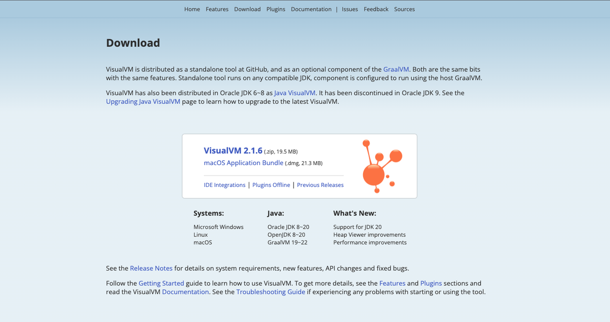
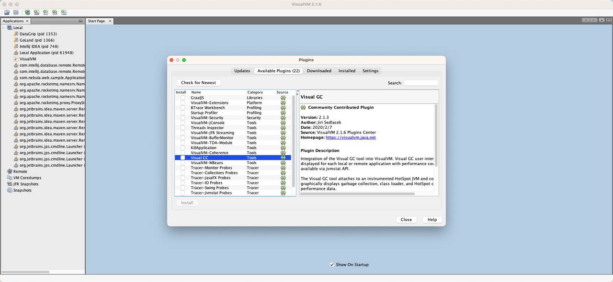
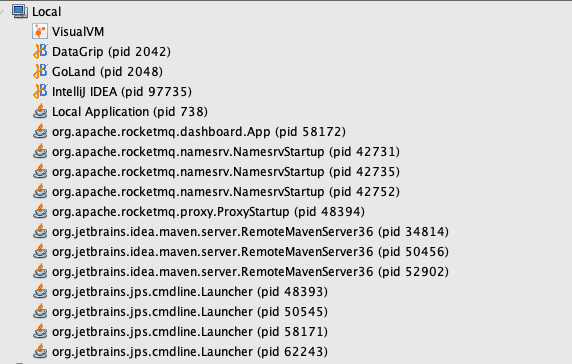
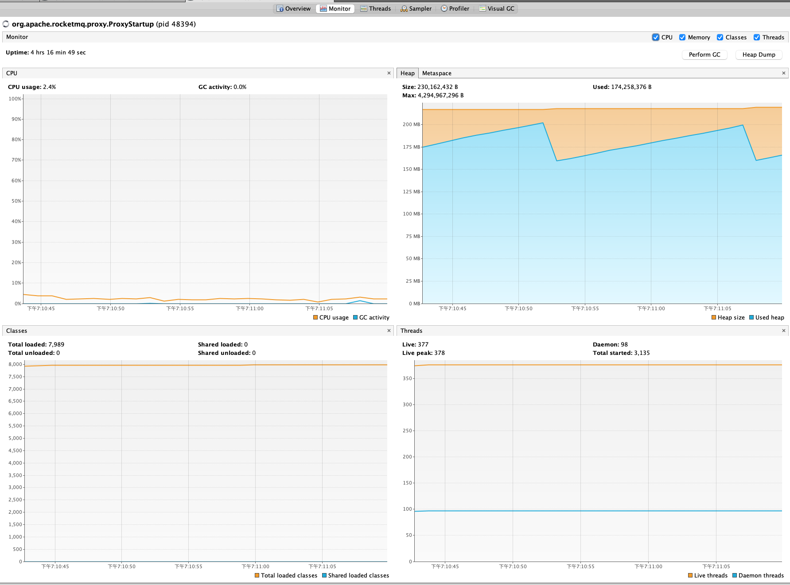
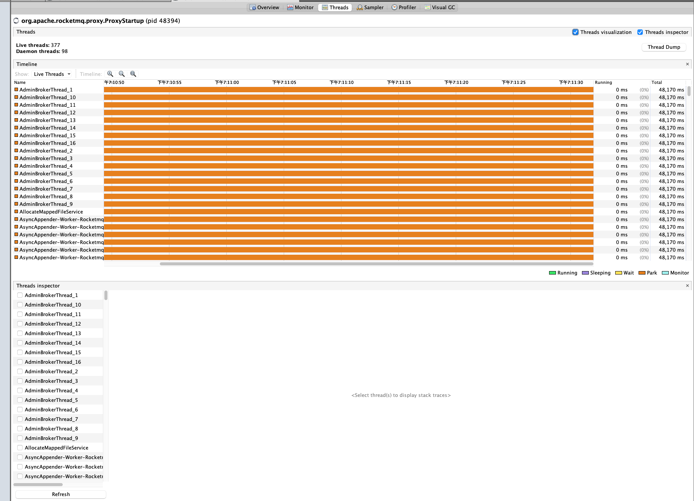
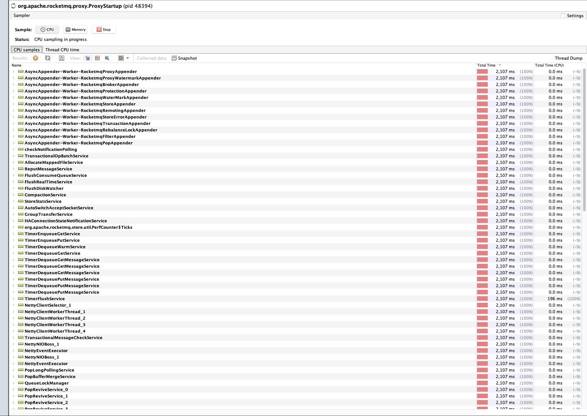
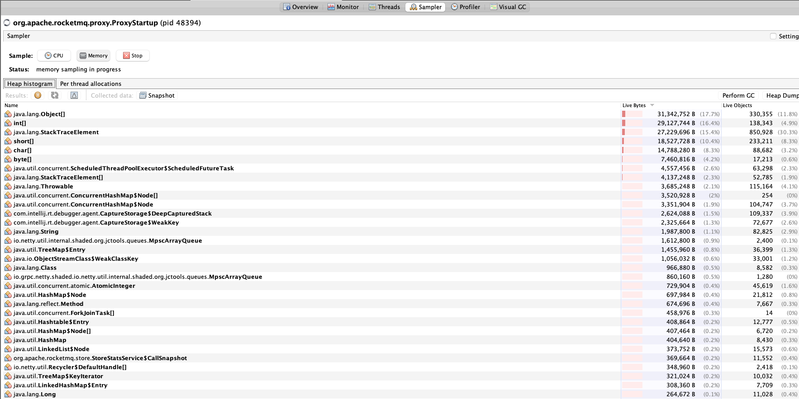
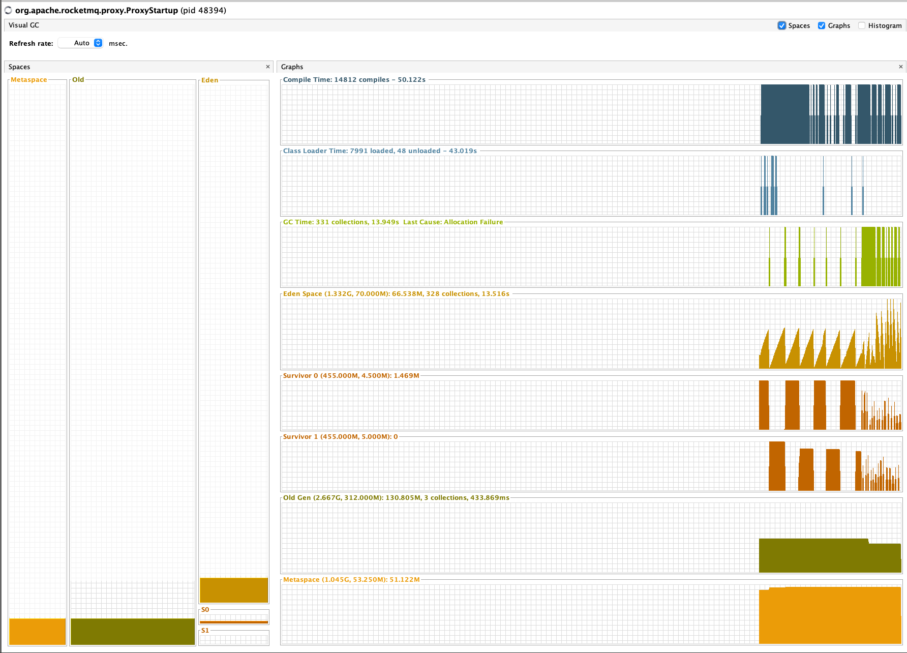
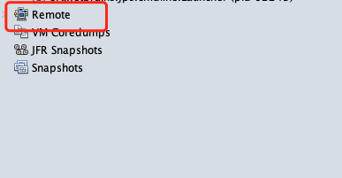
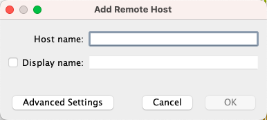

> 这里是**weihubeats**,觉得文章不错可以关注公众号**小奏技术**，文章首发。拒绝营销号，拒绝标题党

## 背景

在有时候我们需要分析java应用的一些内存、gc等情况进行性能分析。我们往往需要一些性能分析利器，而`VisualVM`算是其中一个，今天我们来学习他的使用以及如何性能分析java应用


## VisualVM是什么

VisualVM 是一款集成了 JDK 命令行工具和轻量级剖析功能的可视化工具。
设计用于开发和生产。

## 官网

[官网](https://visualvm.github.io/):https://visualvm.github.io/

## 下载

https://visualvm.github.io/download.html




## 安装gc插件

为了我们方便我们观察gc的一些监控指标，我们安装一个gc插件




## 监控本地java项目

我们安装完启动就可以监控本地的java项目



我们看看有哪些监控指标




### Threads



### Sampler


#### cpu



#### Memory



## Visual GC





## 远程java应用监控

大多时候我们需要监控的是线上的java应用，进行排查问题。所以了远程接入点





远程接入方式有两种
### JMX

这种方式的必须在应用启动的时候添加启动参数提供远程连接
```
-Dcom.sun.management.jmxremote
-Dcom.sun.management.jmxremote.port=8777
-Dcom.sun.management.jmxremote.rmi.port=8777
-Dcom.sun.management.jmxremote.authenticate=false
-Dcom.sun.management.jmxremote.ssl=false
```

这样就可以通过远程ip+8777端口进行连接了

由于我这里的应用是已经启动了，所以只能使用第二种方式连接监控

### jstatd

1. 找到java安装home路径
```shell
echo $JAVA_HOME
```
如果输出为空,如果输出为空,运行以下命令来查找`java`可执行文件的位置：
```
which java
```
这将输出 java 可执行文件的路径，例如：
```
/usr/bin/java
```

使用`ls -l`命令查看该路径的符号链接或软链接的目标，例如：
```
ls -l /usr/bin/java
```

这将显示符号链接的目标路径，类似于：
```
lrwxrwxrwx 1 root root 22 Sep 10  2021 /usr/bin/java -> /etc/alternatives/java

```

继续查看符号链接的目标路径，例如：
```
ls -l /etc/alternatives/java
```
这将显示符号链接的目标路径，类似于：
```
lrwxrwxrwx 1 root root 46 Sep 10  2021 /etc/alternatives/java -> /usr/lib/jvm/java-11-openjdk-amd64/bin/java
```

这样就可以确定jdk的安装路径`/usr/lib/jvm/java-11-openjdk-amd64`

2.      在服务器`{JAVA_HOME}/bin`目录建立文件：`jstatd.all.policy`（名字随便，符合*.policy即可）， 文件内容为：

`vim jstatd.all.policy`

```
grant codebase "file:/usr/lib/jvm/java-8-openjdk-amd64/lib/tools.jar" {
    permission java.security.AllPermission;
};
```

> tools.jar换成自己jdk的路径地址

如果jdk版本大于1.8，文件内容为
```
grant codebase "jrt:/jdk.jstatd" {
   permission java.security.AllPermission;
};

grant codebase "jrt:/jdk.internal.jvmstat" {
   permission java.security.AllPermission;
};

```

3. 启动jstatd
```
nohup /usr/lib/jvm/java-8-openjdk-amd64/bin/jstatd -J-Djava.security.policy=/usr/lib/jvm/java-8-openjdk-amd64/bin/jstatd.all.policy &
```

4.  查看jstatd端口
```
netstat -luntp|grep jstatd
```

这里会出现两个端口，一个默认的`1099`，还有一个随机端口。
如果是机器有限制，需要向运维身申请开通这两个端口的权限

5. 连接




之后就可以正常查看相关的统计数据了
不过相比本地的指标来说会少很多


## 总结

总的来说`VisualVM`可以为我们统计到一些内存、jvm gc信息。远程接入的方式有两种
- jmx
- jstatd

jmx需要项目启动的时候添加启动参数，而jstatd不用，但是启动的时候有一个端口是随机的，这样每次可能需要运维帮忙配置打开不同的端口有点麻烦

实际线上的环境往往更复杂，`VisualVM`并不一定能查看到我们排查问题的所有指标