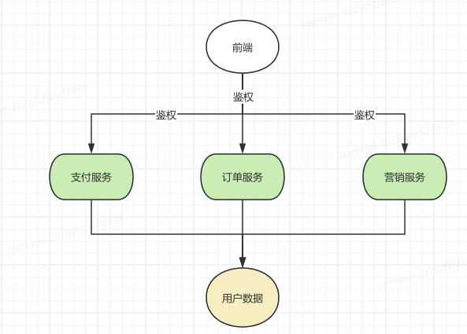

## 背景

早期由于业务需要快速发展，以及开发人员水平原因

没有统一的用户中台

所有的用户鉴权都是共用一套代码

每个系统需要鉴权的时候就是copy这份代码，然后基于这套代码进行鉴权

也就是没有网关，每个系统都要拥有自己的鉴权。

大致架构如下




## 问题

为什么需要重构呢

1. 鉴权代码在每个服务有一套，维护起来非常不方便，需要修改多个服务。稍有不慎，某个服务的代码修改遗漏了，就会出事故
2. 新服务鉴权困难，新服务如果需要鉴权，又需要一个比较熟悉这套鉴权逻辑的人把这部分代码迁移过去
3. 每个服务都去鉴权，影响性能。包括请求的性能和项目编译的性能


## 好处

独立出来一个用户中台后，有如下好处

1. 所有代码统一维护，提升开发效率，系统稳定性
2. 减少业务系统代码量，提升编译启动速度
3. 新服务无需关注鉴权，只需要关注业务即可


## 重构后的架构


重构后主要是网关调用用户中台进行鉴权

鉴权通过则可放行请求到对应的后端服务中

## 目标

1. 用户系统拆分成一个独立系统
2. 多端相同功能的接口需要统一成一个
3. 多端不同`token`需要统一使用相同的`token`
4. 多端相同功能的`Filter`需要统一成一个
5. 不要影响线上业务系统的正常登入
6. 一期只做登入校验


## 整体改造方法

对于一个不熟悉的用户系统，重构成用户中台。我们需要指定详细的规划与技术方案


大致分如下几个过程

1. 熟悉整个用户相关代码、流程
2. 整理所有需要迁移的接口、拦截器
3. 指定迁移计划

## 改造需要解决的问题

> 整体鉴权基于`Sa-token`框架设计


1. 多个系统代码大致相同，但是有细微差异，比如不同系统的鉴权`token`不一致，大致有如下几种`token`
    - X-Token
    - X-MToken
    - X-SToken
    - X-WToken

重构需要将`token`统一

2. 用户信息使用`redis`默认的序列化方式，需要通报同类名，才能序列化成功，想要兼容旧数据，就必须保持一致

3. 用户请求`API`鉴权使用`request.getRequestURI()`获取API路径

如果新服务新增请求`context`，就会多出一个服务前缀比如`user-service`报错

需要将所有`request.getRequestURI()`替换成`getServletPath`

4. web端使用`cookie`，但是其他端不用

5. 不同系统端比如`app`端和`web`端同个功能是两个接口，接口之前部分有细微逻辑差异，需要将多端接口合并成一个，提高代码内聚，提高代码可维护性

6. 用户服务依赖一些基础服务，之前是内部java调用，拆分出去后需要考虑如何处理
7. 用户服务之前发送过`Spring`事件，拆分出去后JVM不在共享，`spring`事件需要改造
8. 部分接口耦合用户和其他服务的业务逻辑，需要拆分改造，并不影响现有业务系统


## 详细迁移方案


1. 新建`user-service`服务
2. 改造`Sa-token`源码实现多端登入验证
    - 由于多端`token`名字不同，sa token仅支持单个名字前缀token校验，所以需要对`sa token`源码进行改造 支持动态获取`token`前缀来进行`tokan`校验

    修改方式如下 修改`SaTokenConfig`源码

    提供一个`private final ThreadLocal<String> TOKEN_NAME_HOLDER = new ThreadLocal<>();`

    动态替换`token`名字，解决多端token name不一致

    `token name`的设值通过拦截器实现

```java
@RequiredArgsConstructor
public class RequestSourceInterceptor implements HandlerInterceptor {

    private static final String API_PREFIX = "/api/";

    private static final String WEB_API_PREFIX = "/wapi/";

    private final SaTokenConfig saTokenConfig;

    @Override
    public boolean preHandle(HttpServletRequest request, HttpServletResponse response, Object handler) {

        String uri = request.getServletPath();

        for (SaTokenEnum value : SaTokenEnum.values()) {
            boolean source = source(request, value);
            if (source) {
                return true;
            }
        }

        // 未登入
        if (uri.startsWith(API_PREFIX)) {
            ApiOriginUtil.set(SaTokenEnum.API);
            return true;
        }
        if (uri.startsWith(WEB_API_PREFIX)) {
            ApiOriginUtil.set(SaTokenEnum.WEB_API);
            return true;
        }

        return true;
    }

    @Override
    public void afterCompletion(HttpServletRequest request, HttpServletResponse response, Object handler,
        Exception ex) {
        ApiOriginUtil.clear();
        saTokenConfig.removeTokenName();
    }

    /**
     * todo 未登入场景通过域名区分
     * @param request
     * @param saTokenEnum
     * @return
     */
    public boolean source(HttpServletRequest request, SaTokenEnum saTokenEnum) {
        String tokenName = request.getHeader(saTokenEnum.getTokenName());
        if (StrUtil.isNotBlank(tokenName)) {
            ApiOriginUtil.set(saTokenEnum);
            saTokenConfig.tokenName(tokenName);
            return true;
        }
        return false;
    }

}

 ```

 识别`token name`规则如下

 1. 不同端通过不同域名过来，可以基于请求域名区分
 2. 不同端有不同的接口前缀，可以基于接口前缀区分
 3. 登入用户会传入`token name`到请求头


 sa token主要修改方法`getTokenName`，其他方法会调用该方法

 ```java
    public String getTokenName() {
        String currentTokenName = TOKEN_NAME_HOLDER.get();
        return StrUtil.isNotEmpty(currentTokenName) ? currentTokenName : tokenName;
    }

 ```