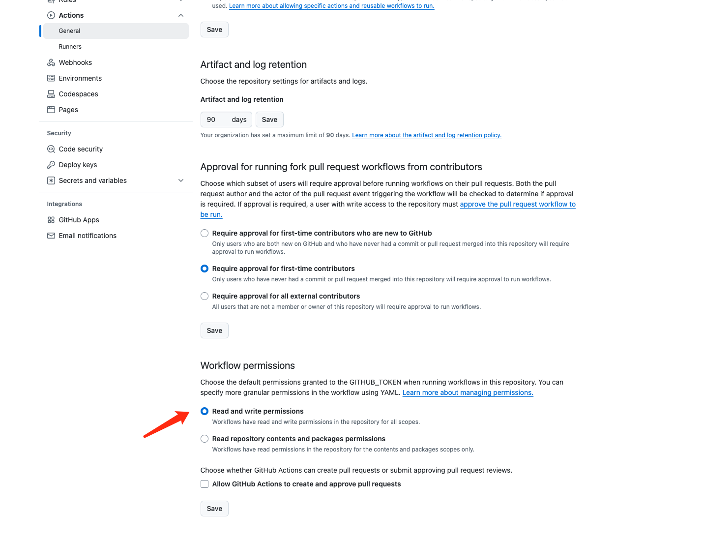

## 快读构建

```shell
# my-website是项目名称
npx create-docusaurus@latest my-website classic
```

## 运行

```shell
cd my-website
npm run start

```
如果不进行额外配置，浏览器会默认打开 localhost:3000

## 构建

Docusaurus 是一款现代化的静态网页生成器。因此，我们需要将网站生成为静态内容，并上传到网络服务器，才能被其他人访问。 要构建站点，请使用以下命令：

```shell
npm run build
```

## 配置文件设置

配置文件主要是`docusaurus.config.js`

- url: 'https://weihubeats.github.io',    // 当前页面的URL
- baseUrl: '/',   路径访问前缀 一般不用配置
- organizationName: weihubeats //你的github名字
- projectName weihubeats.github.io //github项目名字


## action权限

