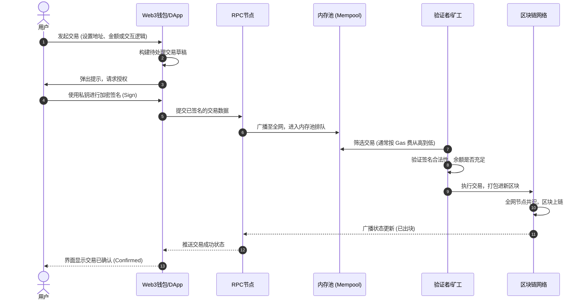

## 整体支付流程

## 支付回调

支付回调可以拆分为两个

- 渠道通知（Channel Webhook/API Callback）

- 扫链通知（On-chain Node Scanning）

| 对比维度 | 渠道通知 (Channel Webhook / API Callback) | 扫链通知 (On-chain Node Scanning) |
| :--- | :--- | :--- |
| **核心机制** | 依赖第三方支付平台或节点服务商主动推送的 HTTP 回调。 | 系统后台主动通过 RPC 节点，轮询并解析区块链的最新区块数据。 |
| **优势 (优点)** | **1. 极速响应**：通常在交易刚广播时就推送，便于给用户即时反馈。 **2. 接入成本低**：只需暴露一个 Web 接口，与传统 Web2 支付对接无异。 **3. 覆盖链下场景**：能处理中心化交易所的内部转账（如 Binance Pay）。 | **1. 绝对真实**：直接读取底层公链数据，彻底杜绝伪造回调通知的欺诈。 **2. 高度可控**：可灵活自定义区块确认数（如大额等待 12 个区块，小额 1 个）。 **3. 极致稳定性**：不依赖第三方服务器，只要区块链运行正常，就不会漏单。 |
| **劣势 (缺点)** | **1. 信任风险**：必须完全信任渠道方；若其私钥泄露或有漏洞，极易被伪造。 **2. 丢单风险**：极易受网络波动、宕机或防火墙策略影响导致通知丢失。 **3. 缺乏确定性**：收到初步通知时，链上交易仍有被丢弃或回滚的可能。 | **1. 运维成本极高**：需自建或租用高质量 RPC 节点，并处理复杂的分叉回滚逻辑。 **2. 体验延迟**：必须等待足够的区块确认，用户体感上“到账较慢”。 **3. 存在盲区**：完全无法感知且无法处理未上链的中心化内部账本划转。 |
| **系统资源消耗** | **轻量级 (IO 密集型)**：被动接收请求，占用服务器 CPU 和内存极少。 | **重量级 (计算密集型)**：需持续拉取、过滤、比对海量区块数据，资源消耗大。 |
| **系统核心定位** | 充当\*\*“前锋”**：用于前端页面的状态快速更新、用户安抚及处理内部转账。 | 充当**“守门员”\*\*：作为订单最终入账、资产释放（放币/发货）的安全底线。 |

渠道通知的弱点：第三方支付渠道（如 Binance Pay、Coinbase Commerce 或其他承兑商）的回调通常是通过 HTTP Webhook 发送的。虽然有签名校验机制（Signature Validation），但如果渠道方的私钥泄露，或者您的网关存在逻辑漏洞，黑客可以伪造一条“支付成功”的回调通知，骗取系统发货或入账

扫链的兜底：通过自己的 RPC 节点或专门的索引服务（Indexer）去扫描区块链（扫链），是为了去链上直接验证这笔交易。即使渠道方发来了“支付成功”的通知，系统也必须核对扫链服务获取到的链上真实数据（金额、目标地址、Token 智能合约地址）。只有链上确实存在这笔转账，才算真正安全

•	渠道回调丢失：第三方渠道可能会因为网络波动、短暂宕机、或者由于您自己服务器的防火墙拦截，导致 Webhook 通知发送失败。如果只依赖渠道通知，这笔订单就会成为死单（用户付了钱，但系统没反应）。
•	扫链延迟或分叉：如果是自己维护的全节点，有时可能会因为同步延迟（Sync Lag）或者遇到链的分叉（Reorg）而未能及时抓取到交易。
•	双轨并行：这两者互为备份。如果渠道回调没收到，扫链服务扫到了，依然可以推进订单状态；如果扫链服务卡顿了，渠道方的通知也能作为一个参考信号（比如先给用户展示“支付确认中”）