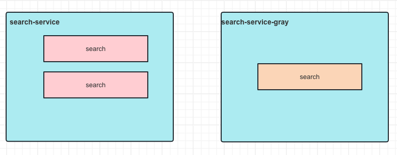

> 这里是**小奏**,觉得文章不错可以关注公众号**小奏技术**


## 背景

想要实现`http`流量灰度的核心还是看你用什么网关，才能决定你用什么技术方案。

如果我们想用`spring cloud gateway`那一套，那么我们就需要自己去开发一些路由规则。

本次我们讨论的是云原生网关`apisix`的一种灰度发布实现方式

## 基于k8s的单service pod替换

实际最简单的方案就是我们可以基于`kubernetes`的服务发现来做
比如我们有一个`search`服务，有3个pod


我们可以发版只发布修改一个pod实现最简单的灰度


但是这样有一个最明显的弊端，我们无法精准控制灰度流量比例。在apisix那边对应只有一个`upstream`(上游服务)


## 基于k8s的多service+apisix traffic-split插件


### traffic-split插件

`traffic-split` 插件可以通过配置`match` 和 `weighted_upstreams` 属性，从而动态地将部分流量引导至各种上游服务。该插件可应用于灰度发布和蓝绿发布的场景

- [官方文档](https://apisix.apache.org/zh/docs/apisix/plugins/traffic-split/):https://apisix.apache.org/zh/docs/apisix/plugins/traffic-split/

### 举个🌰

比如现在`search`需要进行蓝绿发布。那么我们需要首先创建两个上游服务
- `search`
- `search-gray`


对应的也是两个`kubernetes`的 `service`

- search-service

- search-service-gray





然后我们配置`traffic-split`插件

```json
{
  "plugins": {
    "traffic-split": {
      "rules": [
        {
          "match": [
            {
              "vars": [
                ["http_release_version", "==", "小奏技术"]
              ]
            }
          ],
          "weighted_upstreams": [
            {
              "upstream_id": "search_gray_upstream_id",
              "weight": 10
            }
          ]
        },
        {
          "match": [
            {
              "vars": []
            }
          ],
          "weighted_upstreams": [
            {
              "upstream_id": "search_upstream_id",
              "weight": 90
            },
            {
              "upstream_id": "search_gray_upstream_id",
              "weight": 10
            }
          ]
        }
      ]
    }
  }
}
```

注意这里我们配置了两条规则
1. 第一条规则是针对带有特定 HTTP 头 `http_release_version` 等于 `小奏技术` 的请求。这些请求将被100%路由到新版本的 `search_gray` 服务。
2. 第二条规则是默认规则，适用于所有其他请求。在这个例子中，我们将90%的流量路由到旧版本的 `search` 服务，将10%的流量路由到灰度的 `search` 服务

> 注意原生的`traffic-split`插件比较简陋，不支持`uid`这种自定义参数,需要自己开发,自定义请求头参数仅支持`http_`开头的，比如`http_x_user_id`


## 总结

总的来说基于`apisix`实现灰度发布还是比较简单的，实现方式有多种，区别主要还是`kubernetes`中是多个`service`还是单个`service`

相对来说多`service`是`apisix`更推荐的做法，也能更精准控制流量。

但是相对于java传统的比如`spring cloud`和`dubbo`这些服务发现框架来说都是单`service`的元数据管理不太一样

所以后续要实现全链路灰度可能会有比较大的不同