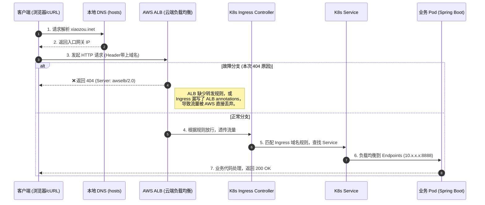

## 现象

新服务部署到 k8s，需要在本地访问新服务

1. 已在 aws构建流水线
2. 已部署到k8s 集群中
3. 已创建 service
4. 已配置 Ingress Controller

本地访问域名返回 404

## 排查

遇到网络不通或 404 时，切忌无头苍蝇般盲目改代码或配置。本次排障采用了“自底向上 + 节点截断”的策略，快速排除了干扰项，精准锁定了云原生组件层

### 应用进程与内部路由是否健康

首先确认是应用问题还是网络问题

在`kuboard`中进入 pod

绕过所有外部网关，直接在集群内部 curl Pod_IP:8888，以及通过 NodePort / ClusterIP 访问 Service

- 结果：✅ 返回 200 OK

- 结论：应用代码没问题、端口监听没问题、K8s Service 标签选择器配置正确。 彻底排除研发代码层面（如 Spring Boot 上下文路径错误、过滤器拦截等）的嫌疑。

### 验证网络连通性

- 操作：在本地执行 `nc -vz xiaozoutest.com 80`

- 结果：✅ 显示 succeeded!

- 结论：网络链路是通的。 本地 hosts 域名解析正确，且中间没有被防火墙拦截 TCP 建联。

### 抓取请求头（到底是谁抛出了 404？）

- 操作：在本地执行 `curl -I http://paymentv2test.redotpay.inet/health-check/health/liveness`

- 结果：❌ 返回 HTTP/1.1 404 Not Found，且关键响应头为 Server: awselb/2.0

- 结论：真相大白。 404 并非来自 Nginx 或 Java 应用，而是 AWS ALB 抛出的。流量根本没有进入 Kubernetes 集群内部

## 整体链路

🎯 组件职责说明：

- 本地 hosts/DNS：负责将内网测试域名指向 AWS ALB 的入口 IP。

- AWS ALB (Application Load Balancer)：云厂商级别的七层负载均衡器，是集群流量的第一道大门。如果它的侦听器规则里没有对应域名，会直接返回 404（此时响应头带有 Server: awselb/2.0）

- K8s Ingress：Kubernetes 内部的路由规则声明。需要配合 annotations 才能让外部的 ALB 认领这些规则

- K8s Service：负责服务发现和内部负载均衡，将请求转发给存活的 Pod (Endpoints)

- 业务 Pod：实际运行 Java/Spring Boot 代码的容器