> 这里是weihubeats,觉得文章不错可以关注公众号**小奏技术**，文章首发。拒绝营销号，拒绝标题党
## 源码
本项目博文的源码已上传github，有需要自取
- [github](https://github.com/weihubeats/weihubeats_demos/tree/master/spring-boot-demos/spring-boot-docker): https://github.com/weihubeats/weihubeats_demos/tree/master/spring-boot-demos/spring-boot-docker

## 1. 安装minikube
参考之前的教程
- [Kubernetes学习(一)安装minikube](https://weihubeats.blog.csdn.net/article/details/126353166): https://weihubeats.blog.csdn.net/article/details/126353166

## 2. 使 Kubernetes 与本地 Docker 一起工作
```shell
eval $(minikube docker-env)
```
## 3. 项目打包jar
我们先需要将项目打包，执行`mvn install`或者直接点击idea的`install`

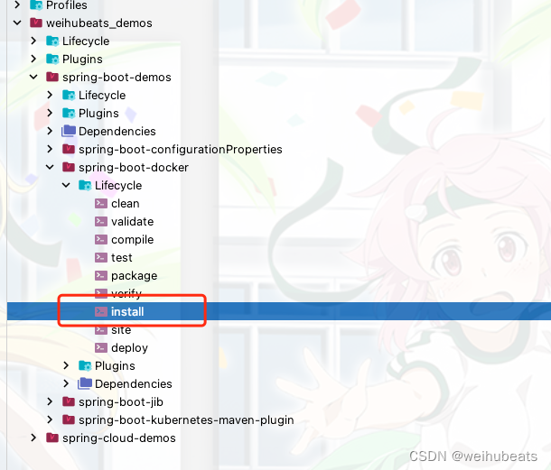

install完成后会发现我们项目目录多出了一个target的目录

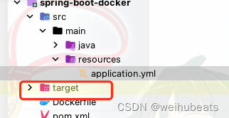


## 4. 打包spring boot 项目为docker镜像
- 项目目录结构

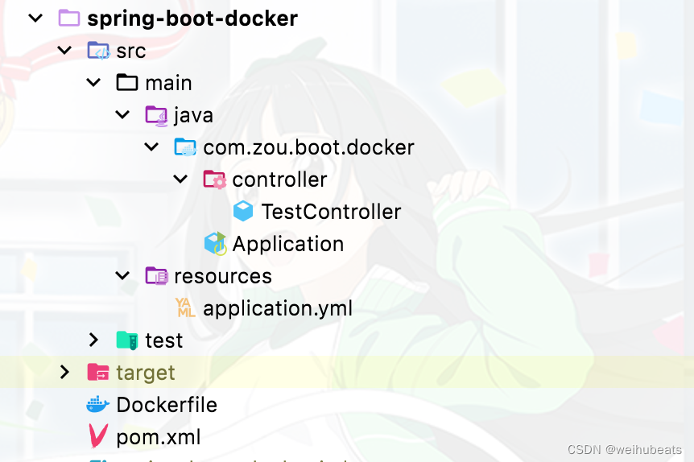

简单的`spring boot` 项目，和普通项目没有任何不同，唯一的是多了一个`Dockerfile`文件

- Dockerfile
```shell
FROM openjdk:8-jre
ADD target/spring-boot-docker-1.0-SNAPSHOT.jar app.jar
ENTRYPOINT ["java","-jar","/app.jar"]
```
首先进入到项目`Dockerfile`的同级目录

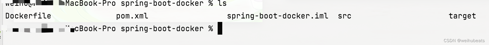


然后执行docker 打包镜像命令
```
docker build -t springboot-kubernetes:1.0 .
```
>后面的一个点代表同级目录

这里就显示我们创建镜像成功了

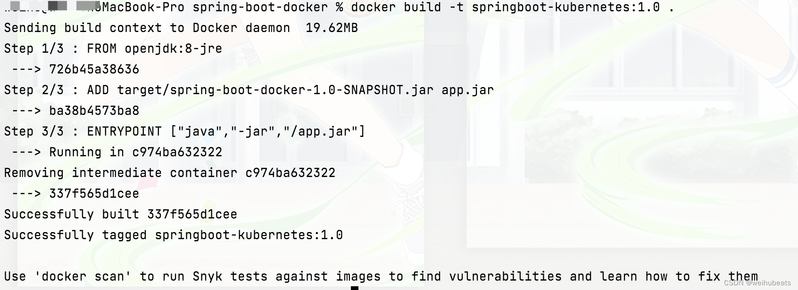

## 5. 创建 Deployment
执行如下命令
```shell
kubectl create deployment springboot-kubernetes --image=springboot-kubernetes:1.0 --port=9004
```

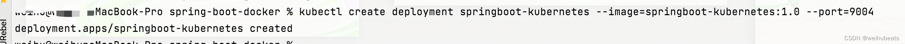

然后我们可以通过命令
```shell
kubectl get pods
```
查看我们的pod是否已经启动成功

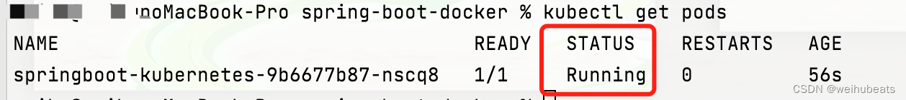

我们可以通过`kubectl logs <pod_name>`去查看详细log

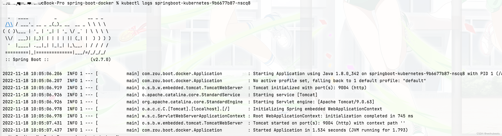

可以看到启动的非常顺利

## 6. 创建Service

`Kubernetes`外部访问服务需要通过`Service`去访问，所以我们创建一个`Service`

```
kubectl create service nodeport  springboot-kubernetes --tcp=9004:9004
```


## 7. 获取访问url

`minikube service springboot-kubernetes`

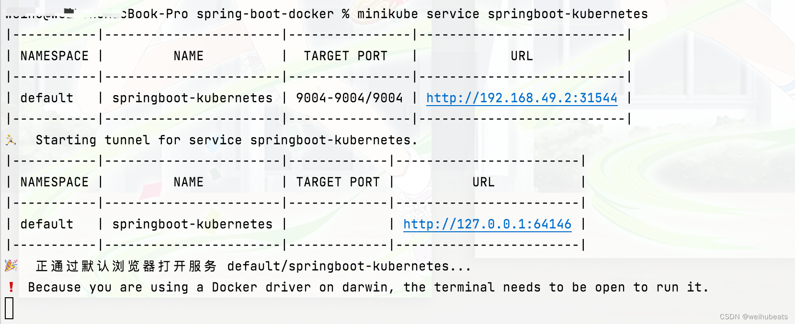

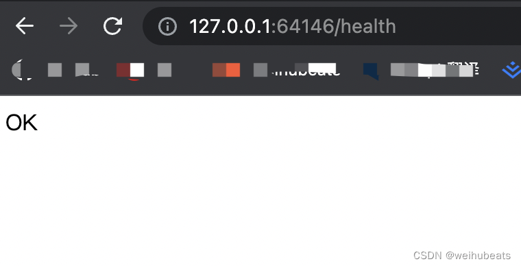

可以看到是可以正常访问的

## Dashboard

如果我们安装了`Dashboard`，我们可以通过`Dashboard`去看看

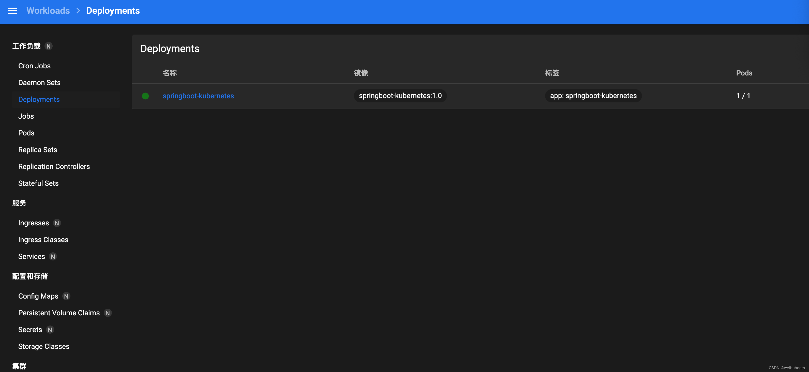


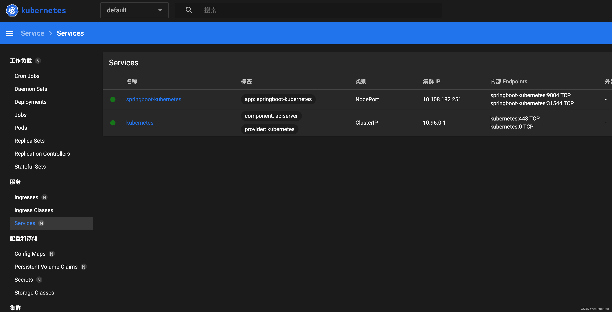

## 参考

- [博客](https://www.kindsonthegenius.com/setup-kubernetes-locally-deploy-springboot-application-step-by-step-tutorial/)