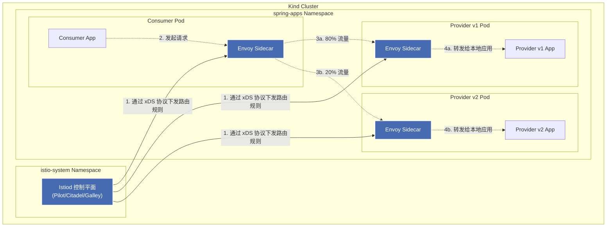

## 安装

```
brew install kind kubectl istioctl
```

### 创建本地 Kubernetes 集群

```
kind create cluster --name istio-demo
```

安装完成后验证

```
kubectl get nodes
```


###  安装 Istio 网格

```
istioctl install --set profile=demo -y
```

安装完成

```
        |\          
        | \         
        |  \        
        |   \       
      /||    \      
     / ||     \     
    /  ||      \    
   /   ||       \   
  /    ||        \  
 /     ||         \ 
/______||__________\
____________________
  \__       _____/  
     \_____/        

✔ Istio core installed ⛵️                                                                                        
✔ Istiod installed 🧠                                                                                            
✔ Ingress gateways installed 🛬                                                                                  
✔ Egress gateways installed 🛫                                                                                   
✔ Installation complete   
```

验证  执行

```
kubectl get pods -n istio-system
```

正常输出

```
NAME                                    READY   STATUS    RESTARTS   AGE
istio-egressgateway-64958445fc-ppjqj    1/1     Running   0          3m6s
istio-ingressgateway-8576cc8b87-zt7h2   1/1     Running   0          3m6s
istiod-769f54d46b-pzvjb                 1/1     Running   0          5m20s
```

## 📦 第三步：构建与部署 Spring Boot 服务

部署脚本

```

```

执行脚本

```
chmod +x build_and_deploy.sh
./build_and_deploy.sh
```

2. 验证：Pod 状态与 Sidecar 注入

```
kubectl get pods -n spring-apps -w

```

正常应该输出如下

```
NAME                           READY   STATUS    RESTARTS   AGE
consumer-cbdc8dfc8-8vmcw       2/2     Running   0          23s
provider-v1-5d5ddc6dfc-xzjsd   2/2     Running   0          23s
provider-v2-5bc46958dc-7zvvz   2/2     Running   0          23s
```

## 🔍 第四步：进行默认东西向通信测试


在不配置任何 Istio 路由规则的情况下，K8s 默认会做轮询负载均衡（50% 流量给 v1，50% 给 v2）。我们进入 Consumer 容器内部触发调用测试。
1. 进入 Consumer 容器发送请求

```
# 获取 Consumer Pod 名字
CONSUMER_POD=$(kubectl get pod -n spring-apps -l app=consumer -o jsonpath='{.items[0].metadata.name}')

# 触发 10 次服务间调用 (Consumer 调 Provider)
kubectl exec -it $CONSUMER_POD -n spring-apps -c consumer -- sh -c 'for i in $(seq 1 10); do curl -s http://localhost:8080/invoke; echo ""; done'
```

```
【Provider 服务响应】版本: v1, 处理节点: provider-v1-5d5ddc6dfc-xzjsd
【Provider 服务响应】版本: v2, 处理节点: provider-v2-5bc46958dc-7zvvz
【Provider 服务响应】版本: v1, 处理节点: provider-v1-5d5ddc6dfc-xzjsd
【Provider 服务响应】版本: v1, 处理节点: provider-v1-5d5ddc6dfc-xzjsd
【Provider 服务响应】版本: v1, 处理节点: provider-v1-5d5ddc6dfc-xzjsd
【Provider 服务响应】版本: v2, 处理节点: provider-v2-5bc46958dc-7zvvz
【Provider 服务响应】版本: v1, 处理节点: provider-v1-5d5ddc6dfc-xzjsd
【Provider 服务响应】版本: v2, 处理节点: provider-v2-5bc46958dc-7zvvz
【Provider 服务响应】版本: v2, 处理节点: provider-v2-5bc46958dc-7zvvz
【Provider 服务响应】版本: v1, 处理节点: provider-v1-5d5ddc6dfc-xzjsd
```

验证输出】：你会看到消费者成功拿到了返回结果，并且 v1 和 v2 出现的概率大约是 5:5。
(示例输出：【Provider 服务响应】版本: v1, 处理节点: provider-v1-xxx)

## 🔀 第五步：落地 Istio 东西向流量治理 (80/20 灰度发布)


现在我们要落地服务网格的价值：不修改 Spring Boot 代码，利用 Istio 实现按权重的金丝雀发布。

1. 应用 Istio 路由规则

我们执行项目中的 4-istio-routing.yaml，该文件定义了将 80% 流量切向 v1，20% 切向 v2：

```
kubectl apply -f k8s/4-istio-routing.yaml
```

2. 验证路由规则是否生效

```
kubectl get virtualservice,destinationrule -n spring-apps
```

```
NAME                                             GATEWAYS   HOSTS                  AGE
virtualservice.networking.istio.io/provider-vs              ["provider-service"]   8s

NAME                                              HOST               AGE
destinationrule.networking.istio.io/provider-dr   provider-service   8s
```

3. 最终验证：东西向金丝雀流量测试

再次进入 Consumer 容器，执行同样的服务间调用测试：

```
kubectl exec -it $CONSUMER_POD -n spring-apps -c consumer -- sh -c 'for i in $(seq 1 10); do curl -s http://localhost:8080/invoke; echo ""; done'
```

```
【Provider 服务响应】版本: v1, 处理节点: provider-v1-5d5ddc6dfc-xzjsd
【Provider 服务响应】版本: v1, 处理节点: provider-v1-5d5ddc6dfc-xzjsd
【Provider 服务响应】版本: v1, 处理节点: provider-v1-5d5ddc6dfc-xzjsd
【Provider 服务响应】版本: v1, 处理节点: provider-v1-5d5ddc6dfc-xzjsd
【Provider 服务响应】版本: v2, 处理节点: provider-v2-5bc46958dc-7zvvz
【Provider 服务响应】版本: v1, 处理节点: provider-v1-5d5ddc6dfc-xzjsd
【Provider 服务响应】版本: v1, 处理节点: provider-v1-5d5ddc6dfc-xzjsd
【Provider 服务响应】版本: v2, 处理节点: provider-v2-5bc46958dc-7zvvz
【Provider 服务响应】版本: v1, 处理节点: provider-v1-5d5ddc6dfc-xzjsd
【Provider 服务响应】版本: v1, 处理节点: provider-v1-5d5ddc6dfc-xzjsd
```

在 10 次请求中，大约有 8 次返回 版本: v1，只有约 2 次返回 版本: v2