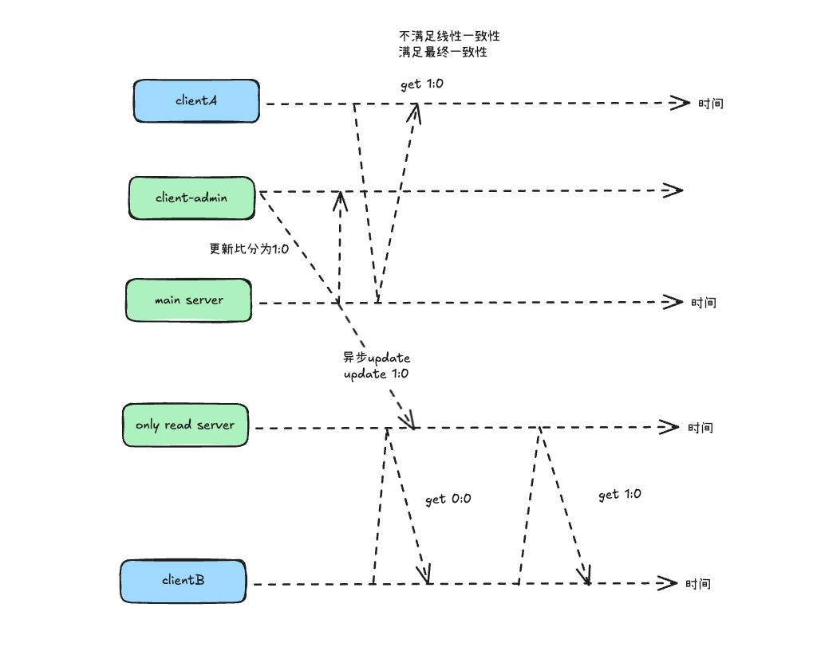
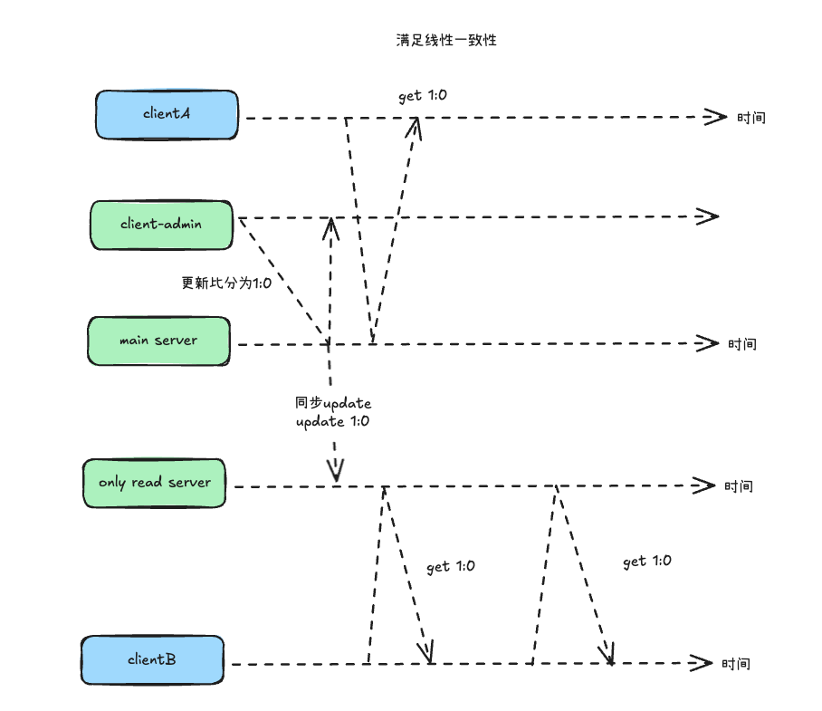
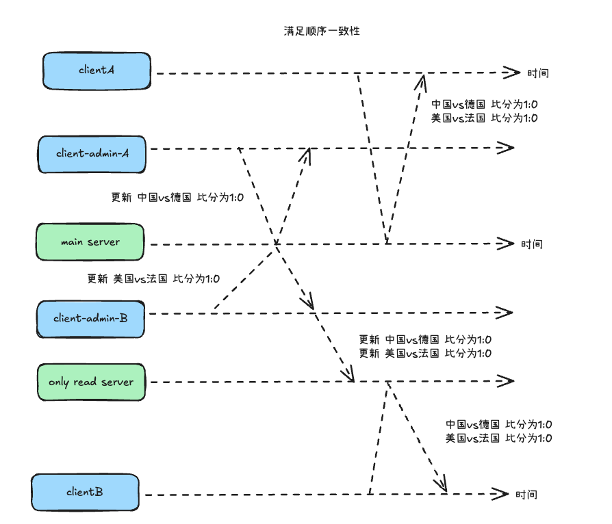
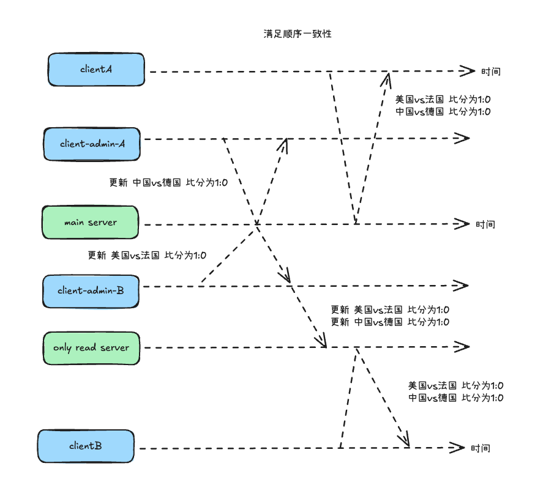
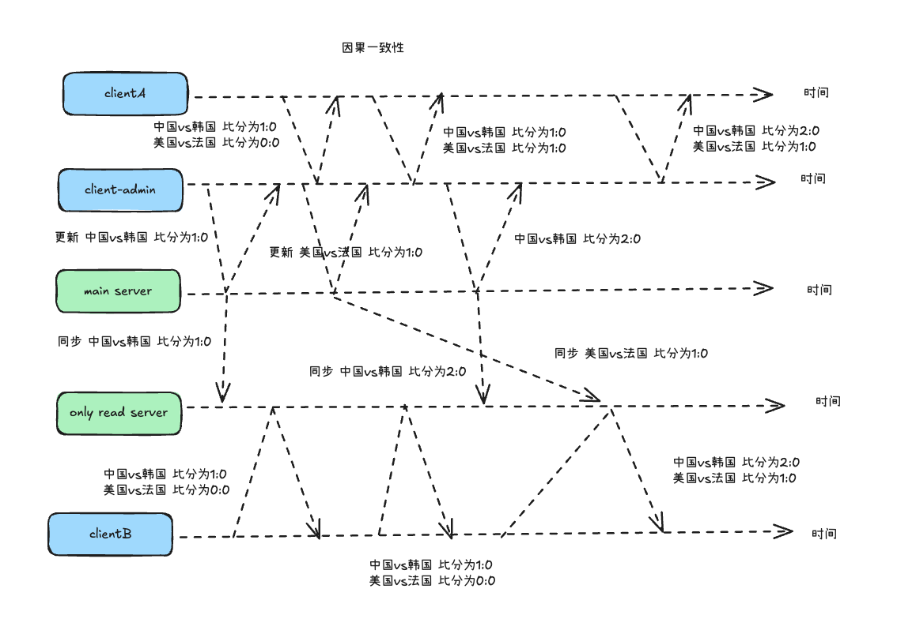
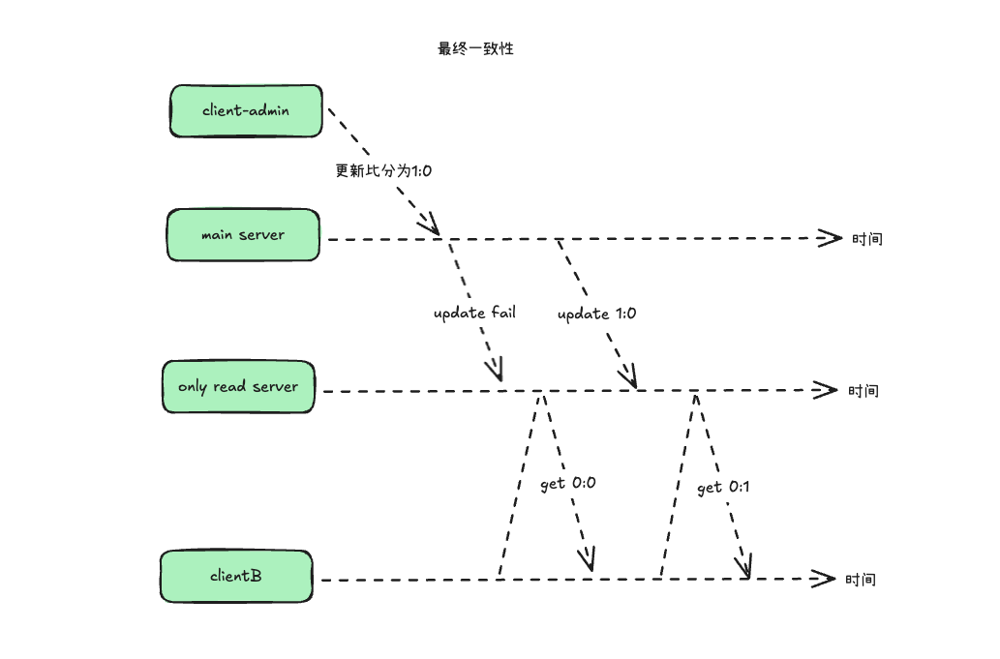

一致性模型有很多，我们来分析一下

## 单体架构

我们先看看单体架构存在一致性问题吗？

这里说的单体是针对`server`的

我们后面的所有案例都以足球比赛为例

这里我们有多个`client`，但是只有一个`server`

这里有一个细节，我故意将`clientA`的请求放在`ClientB`前面。

`clientB`明明请求时间晚于`clientA`，但获取到的结果比`clientA`旧。

这合理吗？

这合理，并且不违法任何一致性，因为`clientA`请求到达`server`的时间要晚于`ClientB`

## 分布式架构

现在系统大多是分布式架构，肯定不会只有一个`server`

大多是一主多从，多主多从其实也能简化为一主多从。

## 强一致性

### 线性一致性(Linearizability)

线性一致性和之前的单体架构类似，线性一致性（Linearizability）要求所有操作（读/写）看起来像是原子性执行且按全局实时顺序生效。

即，一旦写操作完成，所有后续读操作必须返回该值或更新的值，核心特征如下

- 全局实时顺序：所有操作按全局时间顺序生效，仿佛在一个中心化系统中执行。

CAP理论中的C就指定的线性一致性

我们先看看不满足线性一致性(Linearizability)的场景

首先`client-admin`对比分进行了更新，更新为`1:0`

此时`main server`比分进行了更新，因为是异步`update`到`read server`，有延迟

此时同一时间`clientA`和`clientA`同时请求一个请求到`main server`，一个请求到`read server`

这时候得到的结果就不一样

`clientA`获取到的结果为 `1:0`

`clientB`获取到的结果为 `0:0`

虽然最终`clientB`能获取到结果为`1:0`

这只满足最终一致性，不满足线性一致性

要满足线性一致性也很简单。我们看如下图

首先`client-admin`对比分进行了更新，更新为`1:0`

此时`main server`比分进行了更新，然后同步`update`到`read server`，同步成功才返回给`client-admin`返回成功

这样`clientA`和`clientB`获取到的结果为都为`1:0`

- 应用场景

线性一致性主要用于像分布式锁这种强一致的系统，以牺牲性能为代价，换取强一致性

像`Raft`协议就是线性一致性，所以一些使用`Raft`协议开发的分布式系统都是线性一致性的应用场景

### 顺序一致性(Sequential Consistency)

顺序一致性要求所有的事件，在所有的`client`看来发生顺序一致，属于强一致性

核心特征:

- 局部顺序保留：每个节点的操作顺序必须一致，但允许不同节点的操作在时间上重叠

- 不依赖真实时间：只需逻辑顺序一致，无需全局时钟同步

线性一致性要求操作按真实时间顺序生效，顺序一致性只需逻辑顺序一致

我们还是用如下的图来说明

这里我们看有两个`client-admin`对`main server`同时进行数据更新

`client-admin-A` 更新 中国vs德国 比分为1:0
`client-admin-B` 更新 美国vs法国 比分为1:0

此时所有客户端看到的信息都是

先看到 中国vs德国 比分为1:0
再看到 美国vs法国 比分为1:0

是满足顺序一致性的

如果是像如下图

所有客户端都看到的信息是

先看到 美国vs法国 比分为1:0

再看到 中国vs德国 比分为1:0

也是满足顺序一致性的

顺序一致性不需要按真实的时间顺序进行排序

系统可以自主选择全局逻辑顺序（如 中国vs德国 -> 美国vs法国 或者 美国vs法国 -> 中国vs德国），只要所有节点统一即可，无需与实际时间一致。

- 应用场景

像`ZooKeeper`就是顺序一致性

## 弱一致性

### 因果一致性(Causal consistency)

核心特征

- 因果关系保留：如果操作 A 因果依赖于操作 B（例如 B 写入后 A 读取），则所有节点必须按 B→A 的顺序生效
- 无关操作可乱序：无因果关系的并发操作可以以任意顺序生效

比顺序一致性更宽松，性能更高，但能保证逻辑正确性

我们来看一个满足因果一致性的例子

这里我们可以看到有2场比赛

- 中国 vs 韩国
- 美国 vs 法国

正常是物理时间顺序是

中国 vs 韩国 更新比分为 1:0

美国 vs 法国 更新比分为 1:0

中国 vs 韩国 更新比分为 2:0

首先看到 中国 vs 韩国 更新比分为 1:0，随后美国 vs 法国比分更新后

`clientB`看到的结果还是

中国vs韩国 比分为1:0

美国vs法国 比分为0:0

实际这时候`clientA`看到的比分为

中国vs韩国 比分为1:0

美国vs法国 比分为1:0

但是这里是满足因果一致性的，因为美国vs法国和中国vs韩国没有因果关系

不能先看到 中国 vs 韩国 更新比分为 2:0，因为只有看到了  中国 vs 韩国 更新比分为 1:0，才能看到中国 vs 韩国 更新比分为 2:0

中国 vs 韩国他们之前的比分是有因果关系的，要先有1:0，然后再有2:0

但是美国vs法国和中国 vs 韩国没有因果关系，所以不管是在中国 vs 韩国 1:0的时候看到 美国vs法国 比分为1:0

还是 中国 vs 韩国 比分为 2:0 的时候看到  美国vs法国 比分为1:0 都无所谓

所以美国vs法国的 1:0 比分无论是在中国 vs 韩国任意时间看到，都无所谓

- 应用场景

因果一致性的应用场景主要是像微信的朋友圈的帖子。

只要保证帖子和帖子的评论的严格一致性就可以了，不要出现用户看到了A的朋友圈的评论，但是没有看到A这条朋友圈。确保评论在原帖之后显示

### 最终一致性(Eventual consistency)

最终一致性主要是如下特点

- 如果没有新的更新操作，那么经过一段时间后，所有副本最终将达到一致状态
- 系统不保证在任何给定时间点所有副本数据相同
- 不保证读操作能立即看到最新写入的数据
- 数据的不一致状态只是暂时的，系统会自行收敛至一致状态

也有人觉得最终一致性没什么一致性可言，因为没有数据保持一致的时间保证，你永远不知道什么时候的数据是一致的(最终的)

## 参考

- [MIT6.824](https://mit-public-courses-cn-translatio.gitbook.io/mit6-824/lecture-01-introduction/1.6-yi-zhi-xing-consistency):https://mit-public-courses-cn-translatio.gitbook.io/mit6-824/lecture-01-introduction/1.6-yi-zhi-xing-consistency

- [共识、线性一致性与顺序一致性](https://segmentfault.com/a/1190000022248118#item-4-8):https://segmentfault.com/a/1190000022248118#item-4-8