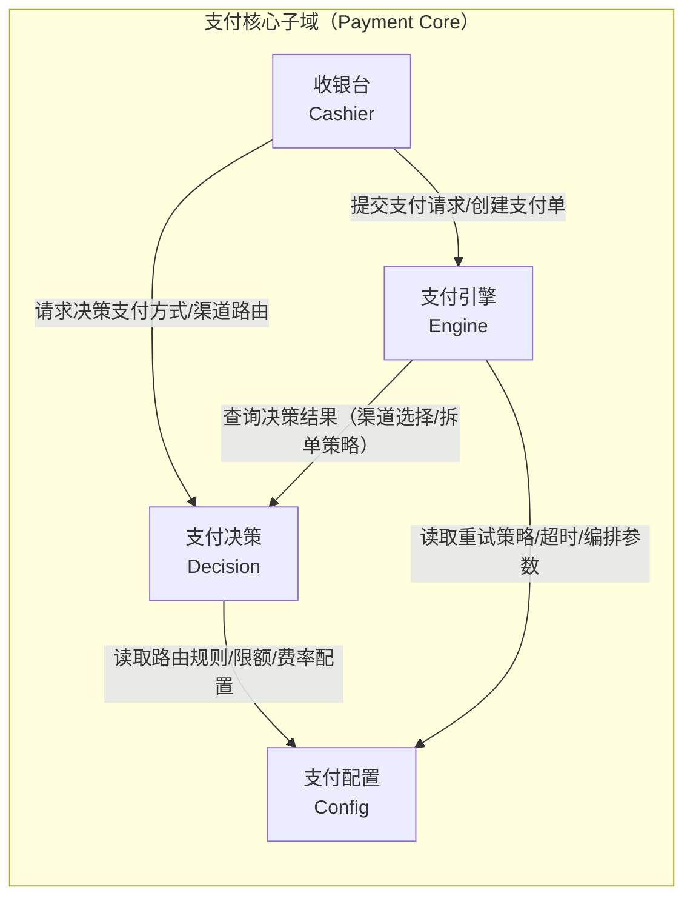
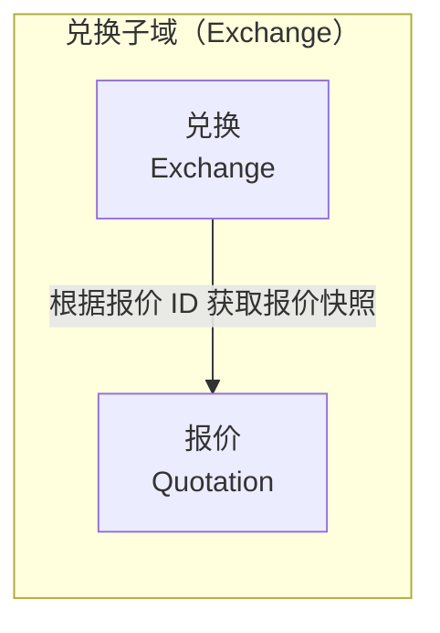
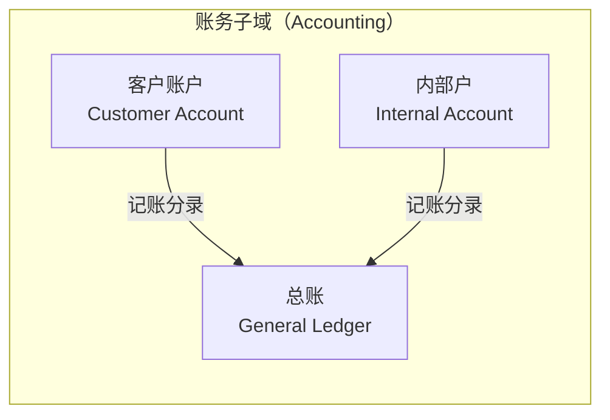
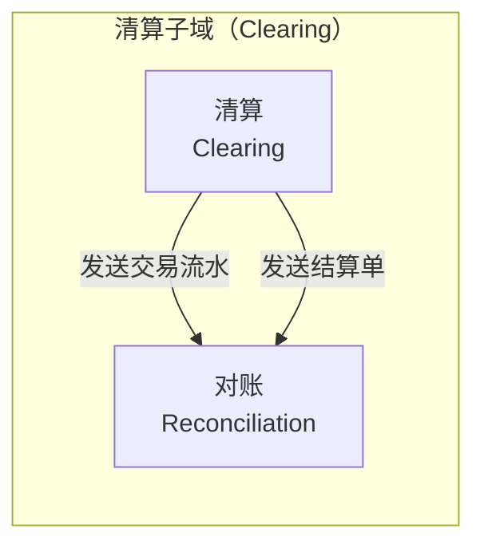
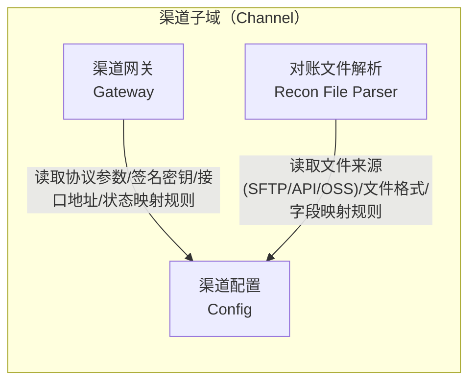
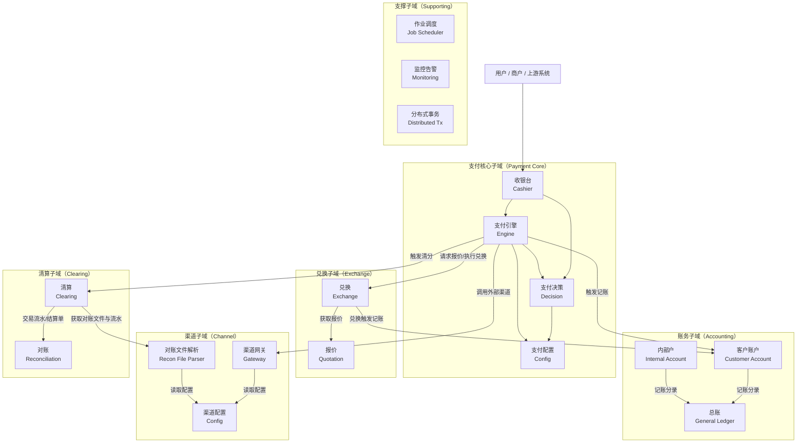
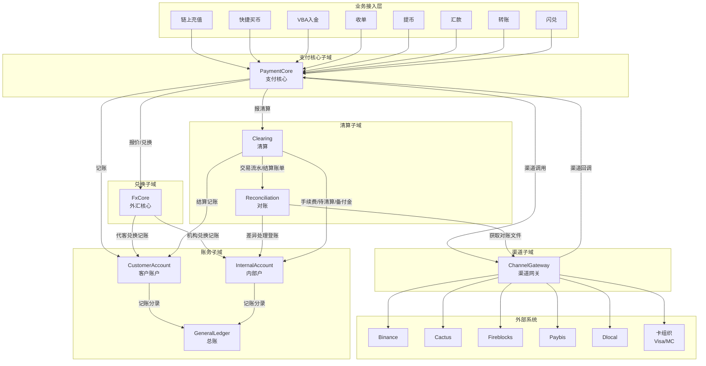

# 支付领域划分

本文档基于 DDD（领域驱动设计）思想，将支付平台划分为多个子域，明确各子域的职责边界、核心能力和协作关系。

---

## 1. 支付核心子域（Payment Core）

支付平台的业务中枢，负责交易的受理、决策、编排和推进。

| 限界上下文 | 职责 | 核心能力 |
| --- | --- | --- |
| **收银台（Cashier）** | 支付入口，面向用户展示可用支付方式 | 支付方式可用性判断、支付预览、下单入口、支付方式推荐排序 |
| **支付决策（Payment Decision）** | 支付链路的决策中心 | 支付方式决策（余额/信用/第三方）、渠道路由决策、兑换路径决策、组合支付拆单策略 |
| **支付引擎（Payment Engine）** | 支付流程的执行和推进 | 支付单创建与生命周期管理、状态机驱动流程推进、重试与补偿调度、异步回调处理与结果收敛 |
| **支付配置（Payment Config）** | 支付能力的配置管理 | 支付产品开关、支付方式配置、限额规则、手续费规则、用户支付偏好设置 |

**子域内限界上下文协作关系：**



| 调用方 | → 被调用方 | 交互内容 |
| --- | --- | --- |
| 收银台 | → 支付引擎 | 提交支付请求，创建支付单并驱动流程执行 |
| 收银台 | → 支付决策 | 用户下单后，请求决策支付方式、渠道路由 |
| 支付引擎 | → 支付决策 | 执行过程中查询决策结果（渠道选择、拆单策略） |
| 支付决策 | → 支付配置 | 读取支付方式配置、渠道路由规则、限额规则、手续费费率 |
| 支付引擎 | → 支付配置 | 读取重试策略、超时配置、流程编排参数 |

**与其他子域的协作关系：**

- → 兑换子域：需要兑换时请求报价和执行兑换
- → 账务子域：在支付不同阶段触发相应的记账
- → 渠道子域：通过渠道网关调用外部渠道
- → 清算子域：支付完成后进入清算流程

---

## 2. 兑换子域（Exchange）

负责不同币种（加密货币、法币）之间的资产兑换，为收单、汇款、闪对等场景提供汇率服务。

| 限界上下文 | 职责 | 核心能力 |
| --- | --- | --- |
| **报价（Quotation）** | 提供实时汇率和对客报价 | 行情源聚合与管理、买卖价计算（含点差）、对客报价生成与有效期管理、汇率锁定与报价快照 |
| **兑换（Exchange）** | 执行币种之间的资产兑换 | 兑换单创建与执行、报价验证与滑点控制、兑换记账触发、兑换撤销与冲正 |

**子域内限界上下文协作关系：**



| 调用方 | → 被调用方 | 交互内容 |
| --- | --- | --- |
| 兑换 | → 报价 | 执行兑换前根据报价 ID 获取报价快照，验证报价有效期与滑点 |

**与其他子域的协作关系：**

- → 账务子域：在平台进行兑换平盘时，进行记账

---

## 3. 账务子域（Accounting）

负责平台所有资金变动的记录、核算和审计，是资金准确性的最终保障。

| 限界上下文 | 职责 | 核心能力 |
| --- | --- | --- |
| **客户账户（Customer Account）** | 记录客户维度的资产变动 | 客户账户余额管理（可用、冻结、在途）、账户资金变动流水、多币种余额管理、冻结/解冻/扣减/入账操作 |
| **内部户账户（Internal Account）** | 记录平台内部账户的资金变动 | 头寸账户管理、收入/费用/备付金等内部户管理、渠道备付金管理、内部资金调拨记录 |
| **总账（General Ledger）** | 基于分户账明细生成会计科目记账 | 分录到科目的映射规则、复式记账（借贷平衡）、科目余额表与试算平衡、期末结转与报表输出 |

**账户体系（示意）：**

```
├── 客户账户
│   ├── 用户钱包账户（按币种）
│   └── 商户结算账户（按币种）
├── 内部户
    ├── 平台手续费收入户
    ├── 平台备付金户
    ├── 渠道待清算户
    ├── 兑换损益户
    ├── 渡户
        ├── 在途资金户
        └── 挂账户
```

**子域内限界上下文协作关系：**



| 调用方 | → 被调用方 | 交互内容 |
| --- | --- | --- |
| 客户账户 | → 总账 | 客户账户发生资金变动后，生成记账分录推送至总账 |
| 内部户 | → 总账 | 内部户资金变动后，生成记账分录推送至总账 |

---

## 4. 清算子域（Clearing）

负责交易完成后的资金清分、结算和对账，确保"账实一致"。

| 限界上下文 | 职责 | 核心能力 |
| --- | --- | --- |
| **清算（Clearing）** | 计算应收应付并完成资金清分 | 交易手续费计算（按费率规则）、商户/合作方结算金额计算、分润计算、结算单生成、结算单审核与执行 |
| **对账（Reconciliation）** | 核对内外部数据一致性 | 渠道对账：平台流水 vs 渠道流水、内部对账：交易流水 vs 账务流水、余额对账：账务余额 vs 渠道余额、差异识别与分类（长款/短款/金额不一致/状态不一致）、差异处理闭环（自动修复/人工处理） |

**子域内限界上下文协作关系：**



| 调用方 | → 被调用方 | 交互内容 |
| --- | --- | --- |
| 清算 | → 对账 | 发送交易流水，供对账与渠道流水进行一致性核对 |
| 清算 | → 对账 | 清分完成后将结算单提供给对账进行一致性核对 |

**与其他子域的协作关系：**

- → 渠道子域：通过渠道配置获取渠道对账文件，解析对账文件生产机构对账流水
- → 账务子域：待清算金额、渠道费用，交易手续费登账，对账不平时进行挂账

---

## 5. 渠道子域（Channel）

负责统一管理和对接外部支付渠道，屏蔽渠道差异，为支付核心提供标准化的渠道调用能力。

| 限界上下文 | 职责 | 核心能力 |
| --- | --- | --- |
| **渠道网关（Channel Gateway）** | 标准化协议转换与渠道调用 | 定义统一渠道协议（下单/查询/退款/回调）、协议适配与字段映射、请求签名与验签、渠道状态标准化映射、错误码统一归类、异步回调接收与解析 |
| **渠道配置（Channel Config）** | 渠道元数据与能力管理 | 渠道基础信息维护、支持的支付产品/币种/国家/支付方式、限额/费率/结算周期配置、渠道启停与灰度范围、渠道对账文件配置 |
| **对账文件解析（Reconciliation File Parser）** | 渠道对账文件获取与标准化解析 | 对账文件自动拉取（SFTP/API/OSS）、多格式文件解析（CSV/Excel/XML/固定宽度）、渠道差异化字段映射与标准化、解析结果生成机构对账流水、文件解析异常告警与重试 |

**子域内限界上下文协作关系：**



| 调用方 | → 被调用方 | 交互内容 |
| --- | --- | --- |
| 渠道网关 | → 渠道配置 | 读取渠道协议参数、签名密钥、接口地址、状态映射规则 |
| 对账文件解析 | → 渠道配置 | 读取对账文件来源（SFTP/API/OSS）、文件格式、字段映射规则 |

---

## 6. 支撑子域（Supporting）

提供平台公共基础能力，不直接处理业务逻辑，但为所有业务子域提供必要的技术支撑。

| 限界上下文 | 职责 | 核心能力 |
| --- | --- | --- |
| **作业调度（Job Scheduler）** | 定时与异步任务管理 | 对账任务调度、结算批次触发、超时订单关单、补偿任务重试 |
| **监控告警（Monitoring）** | 系统与业务监控 | 交易成功率监控、渠道可用性监控、异常交易告警、资金异动告警 |
| **分布式事务（Distributed Transaction）** | 跨服务数据一致性保障 | TCC 预留/确认/撤销（资金冻结与扣减场景）、本地消息/事务消息（异步最终一致性）、幂等控制与防重机制、事务状态追踪与异常恢复 |

---

## 7. 子域关系全景图



**依赖关系汇总：**

| 依赖方 | → 被依赖方 | 依赖说明 |
| --- | --- | --- |
| 收银台 | → 支付决策 | 用户下单后请求决策支付方式、渠道路由 |
| 收银台 | → 支付引擎 | 提交支付请求，创建支付单并驱动执行 |
| 支付引擎 | → 支付决策 | 执行过程中查询渠道选择、拆单策略 |
| 支付决策 | → 支付配置 | 读取支付方式、路由规则、限额、费率等配置 |
| 支付引擎 | → 支付配置 | 读取重试策略、超时配置、流程编排参数 |
| 兑换 | → 报价 | 根据报价 ID 获取报价快照，验证有效期与滑点 |
| 客户账户 | → 总账 | 客户资金变动后生成记账分录推送至总账 |
| 内部户 | → 总账 | 内部户资金变动后生成记账分录推送至总账 |
| 渠道网关 | → 渠道配置 | 读取渠道协议参数、签名密钥、接口地址、状态映射规则 |
| 对账文件解析 | → 渠道配置 | 读取对账文件来源（SFTP/API/OSS）、文件格式、字段映射规则 |
| 清算 | → 对账 | 发送交易流水和结算单，供对账进行一致性核对 |
| 支付核心 | → 兑换子域 | 需要兑换时请求报价和执行兑换 |
| 支付核心 | → 账务子域 | 在支付不同阶段触发相应的记账 |
| 支付核心 | → 渠道子域 | 通过渠道网关调用外部渠道 |
| 支付核心 | → 清算子域 | 支付完成后触发清分与对账 |
| 兑换子域 | → 账务子域 | 兑换完成后触发记账 |
| 清算子域 | → 渠道子域 | 获取渠道对账文件与流水 |


---

## 8. 应用架构

### 应用架构全景图



### 核心接口定义

### 8.1 支付核心子域

#### PaymentCore 支付核心

| 接口 | 方法 | 说明 |
| --- | --- | --- |
| 支付下单 | `createPayment(bizType, bizOrderId, userId, amount, currency, ...)` | 创建支付订单，关联业务单号，返回支付单号 |
| 收银咨询 | `cashierConsult(userId, payOrderId)` | 返回用户可用支付方式列表及组合支付拆分预览 |
| 支付确认 | `confirmPayment(paymentId, payMethod, payAssets[])` | 用户选择支付方式后确认支付，触发收款阶段资产处理 |
| 支付取消 | `cancelPayment(paymentId, reason)` | 取消支付订单，已处理资产执行冲正 |
| 支付查询 | `queryPayment(paymentId)` | 查询支付订单状态及明细 |
| 退款申请 | `createRefund(paymentId, refundAmount, reason)` | 对已成功支付发起退款 |
| 退款查询 | `queryRefund(refundId)` | 查询退款单状态及明细 |
| 渠道回执处理 | `handleChannelCallback(channelCode, callbackData)` | 接收并处理渠道异步回调，推进支付状态 |

**事件消息：**

| 事件 | 触发时机 | 消费方 |
| --- | --- | --- |
| `PaymentCreated` | 支付订单创建成功 | 业务方、风控 |
| `PaymentSuccess` | 支付最终成功 | 业务方、风控 |
| `PaymentFailed` | 支付最终失败 | 业务方、风控 |
| `RefundSuccess` | 退款成功 | 业务方、风控 |

---

### 8.2 兑换子域

#### FxCore 外汇核心

| 接口 | 方法 | 说明 |
| --- | --- | --- |
| 报价咨询 | `getQuotation(sellCurrency, buyCurrency)` | 获取实时报价（含点差），返回报价 ID、汇率、有效期、报价路径 |
| 锁定报价 | `lockQuotation(quotationId)` | 锁定报价汇率，返回锁定快照 |
| 执行对客兑换 | `executeExchange(quotationId, amount)` | 根据锁定的报价执行对客兑换，验证滑点，触发记账 |
| 兑换查询 | `queryExchange(exchangeId)` | 查询兑换单状态及明细 |
| 兑换撤销 | `cancelExchange(exchangeId, reason)` | 撤销兑换，触发冲正记账 |
| 执行平盘 | `executeHedging(currencyPair, direction, amount)` | 批量发送至机构执行平盘兑换，对冲平台头寸敞口 |

---

### 8.3 账务子域

#### CustomerAccount 客户账户

| 接口 | 方法 | 说明 |
| --- | --- | --- |
| 开户 | `createAccount(userId, currency, accountType)` | 为用户创建指定币种的客户账户 |
| 记账 | `postTransaction(accountId, txType, amount, currency, bizOrderId)` | 执行账户资金变动（入账/扣减/冻结/解冻） |
| 冲正 | `reverseTransaction(originalTxId, reason)` | 对原始交易进行冲正，恢复账户余额 |
| 余额查询 | `queryBalance(accountId)` | 查询账户余额（可用、冻结） |
| 流水查询 | `queryTransactions(accountId, startTime, endTime, pageNo, pageSize)` | 分页查询账户资金变动流水 |

#### InternalAccount 内部户账户

| 接口 | 方法 | 说明 |
| --- | --- | --- |
| 开户 | `createInternalAccount(accountNo, currency, accountType)` | 创建内部户（手续费收入户/备付金户/过渡户等） |
| 记账 | `postTransaction(accountNo, txType, amount, currency, bizOrderId)` | 执行内部户资金变动 |
| 冲正 | `reverseTransaction(originalTxId, reason)` | 对原始交易进行冲正 |
| 余额查询 | `queryBalance(accountNo)` | 查询内部户余额 |
| 日终余额查询 | `queryDailyBalance(accountNo, date)` | 查询指定日期的日终余额快照 |
| 流水查询 | `queryTransactions(accountNo, startTime, endTime, pageNo, pageSize)` | 分页查询内部户资金变动流水 |

#### GeneralLedger 总账

| 接口 | 方法 | 说明 |
| --- | --- | --- |
| 会计分录登记 | `postEntry(debitAccount, creditAccount, amount, currency, bizOrderId)` | 登记会计分录（借贷平衡校验） |
| 会计分录冲正 | `reverseEntry(originalEntryId, reason)` | 冲正已登记的会计分录 |
| 会计分录查询 | `queryEntry(entryId)` | 查询单条会计分录明细 |
| 日记账查询 | `queryJournal(subjectCode, startTime, endTime, pageNo, pageSize)` | 按科目查询日记账 |
| 总账查询 | `queryLedger(subjectCode, period)` | 查询指定科目在指定会计期间的余额和发生额 |

---

### 8.4 清算子域

#### Clearing 清算

| 接口 | 方法 | 说明 |
| --- | --- | --- |
| 登记清分流水 | `registerClearingMessage(clearingMessage)` | 对已完成需要清算的支付交易进行登记 |
| 触发清分 | `executeClearing(clearingBatchId)` | 对已完成支付需要清算的交易进行清分，计算手续费、结算金额 |
| 清算结果查询 | `queryClearingResult(clearingId)` | 查询清分结果，包含借方发生额、贷方发生额、净额 |
| 结算单生成 | `generateSettlement(merchantId, settlePeriod)` | 按商户和结算周期生成结算单 |
| 结算单审核 | `approveSettlement(settlementId, operator)` | 审核结算单 |
| 结算单执行 | `executeSettlement(settlementId)` | 执行结算，触发账务记账和资金划转 |
| 结算单查询 | `querySettlement(settlementId)` | 查询结算单状态及明细 |
| 结算单下载 | `downloadSettlement(settlementId, format)` | 下载结算账单（支持 CSV/PDF 格式） |

#### Reconciliation 对账

| 接口     | 方法                                                                         | 说明                               |
|--------|----------------------------------------------------------------------------|----------------------------------|
| 登记交易流水 | `registerTradeRecord(paymentId, channelCode, amount, currency, tradeTime)` | 接收清算发过来的交易流水，入库交易流水              |
| 机构流水解析 | `parseInstitutionRecords(channelCode, reconDate)`                          | 从渠道配置获取渠道文件位置，拉取对账文件并解析，入库机构对账流水 |
| 触发对账   | `executeReconciliation(channelCode, reconDate)`                            | 对指定渠道和日期发起对账任务                   |
| 差异查询   | `queryDifference(reconTaskId, type, pageNo, pageSize)`                     | 查询对账差异明细（长款/短款/金额不一致）            |
| 差异处理   | `handleDifference(differenceId, instruction, operator)`                    | 处理对账差异（自动修复/人工调账/挂账）             |
| 对账报告查询 | `queryReconReport(reconTaskId)`                                            | 查询对账任务的汇总报告                      |

---

### 8.5 渠道子域

#### ChannelGateway 渠道网关

| 接口 | 方法 | 说明 |
| --- | --- | --- |
| 渠道下单 | `channelRequest(channelCode, channelRequest)` | 向指定渠道发起请求（泛型调用，统一协议适配） |
| 回调接收 | `receiveCallback(channelCode, callbackRequest)` | 接收渠道异步回调，解析并标准化后转发给支付核心 |
| 渠道可用性查询 | `queryChannels(bizType)` | 查询业务可用渠道列表 |
| 拉取对账文件 | `queryReconFile(channelCode, reconDate)` | 查询渠道标准化对账文件 |
| 解析对账文件 | `parseReconFile(channelCode, fileId)` | 解析渠道对账文件，生成标准化的机构对账流水 |