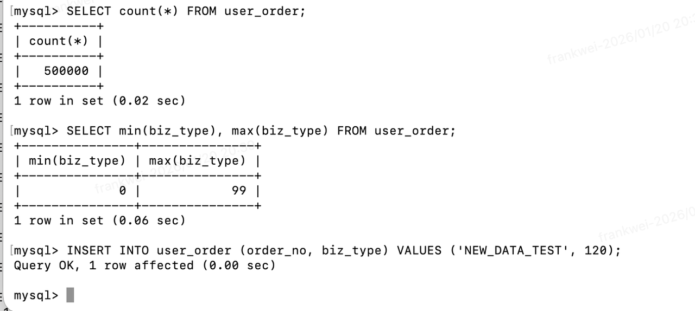
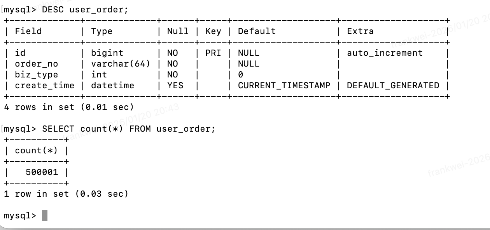

## 背景

线上千万大表需要变更表字段,数据量在8000w左右


## 环境

- 数据库： MySQL8
- 数据量: 8000w
- 表名:user_order

## 注意事项

迁移过程需要注意`DTS`同步到下游数据库的兼容性问题

比如`SelectDB`或者`ADB`是否会同步变更表结构，DTS是否会断连

目前验证是`SelectDB`和`ADB`需要手动变更表字段
DTS如果是`TINNIT`修改为`INT` DTS不会中断


## 模拟操作

### Docker安装MySQL

```bash
# 停止并删除旧容器（如果有）
docker stop mysql-lab && docker rm mysql-lab

# 启动新容器（适配 M1 芯片）
docker run --name mysql-lab \
  -e MYSQL_ROOT_PASSWORD=root \
  -p 3306:3306 \
  -d mysql:8.0 \
  --server-id=100 \
  --log-bin=mysql-bin \
  --binlog-format=ROW \
  --default-authentication-plugin=mysql_native_password
```

安装完成后可以使用`docker`自带工具进行连接数据库，确认数据库安装正确

```bash
# 使用 Docker 内置客户端连接
docker exec -it mysql-lab mysql -uroot -proot
```

## 安装gh-ost

1. 安装
```bash
brew install gh-ost
```

2. 验证

```bash
gh-ost --version
```

## 构建测试数据

1. 建表

```sql
CREATE DATABASE IF NOT EXISTS gh_test;
USE gh_test;

-- 原始表结构
CREATE TABLE user_order (
    id BIGINT AUTO_INCREMENT PRIMARY KEY,
    order_no VARCHAR(64) NOT NULL,
    biz_type TINYINT NOT NULL COMMENT '业务类型', -- 这里是我们主要修改的字段
    create_time DATETIME DEFAULT CURRENT_TIMESTAMP
) ENGINE=InnoDB;
```

2. 生成测试数据

```sql
DELIMITER //
CREATE PROCEDURE generate_data()
BEGIN
  DECLARE i INT DEFAULT 0;
  -- 循环插入 500,000 条数据
  WHILE i < 500000 DO
    INSERT INTO user_order (order_no, biz_type) 
    VALUES (UUID(), FLOOR(RAND() * 100)); -- biz_type 随机生成 0-99
    SET i = i + 1;
  END WHILE;
END;
//
DELIMITER ;

-- 执行存储过程（可能需要 30秒 - 1分钟）
CALL generate_data();
```

如果存储过程被禁用，也可以使用如下方式早数据库

```sql
-- 种子数据插入
INSERT INTO user_order (order_no, biz_type) VALUES  (UUID(), 10), (UUID(), 20), (UUID(), 30), (UUID(), 40), (UUID(), 50);

-- 笛卡尔积插入50w数据
INSERT INTO user_order (order_no, biz_type) SELECT      UUID(),FLOOR(RAND() * 100)    FROM     (SELECT 0 AS n UNION ALL SELECT 1 UNION ALL SELECT 2 UNION ALL SELECT 3 UNION ALL SELECT 4 UNION ALL SELECT 5 UNION ALL SELECT 6 UNION ALL SELECT 7 UNION ALL SELECT 8 UNION ALL SELECT 9) t1,     (SELECT 0 AS n UNION ALL SELECT 1 UNION ALL SELECT 2 UNION ALL SELECT 3 UNION ALL SELECT 4 UNION ALL SELECT 5 UNION ALL SELECT 6 UNION ALL SELECT 7 UNION ALL SELECT 8 UNION ALL SELECT 9) t2,     (SELECT 0 AS n UNION ALL SELECT 1 UNION ALL SELECT 2 UNION ALL SELECT 3 UNION ALL SELECT 4 UNION ALL SELECT 5 UNION ALL SELECT 6 UNION ALL SELECT 7 UNION ALL SELECT 8 UNION ALL SELECT 9) t3,     (SELECT 0 AS n UNION ALL SELECT 1 UNION ALL SELECT 2 UNION ALL SELECT 3 UNION ALL SELECT 4 UNION ALL SELECT 5 UNION ALL SELECT 6 UNION ALL SELECT 7 UNION ALL SELECT 8 UNION ALL SELECT 9) t4,     (SELECT 0 AS n UNION ALL SELECT 1 UNION ALL SELECT 2 UNION ALL SELECT 3 UNION ALL SELECT 4 UNION ALL SELECT 5 UNION ALL SELECT 6 UNION ALL SELECT 7 UNION ALL SELECT 8 UNION ALL SELECT 9) t5,     (SELECT 0 AS n UNION ALL SELECT 1 UNION ALL SELECT 2 UNION ALL SELECT 3 UNION ALL SELECT 4 UNION ALL SELECT 5 UNION ALL SELECT 6 UNION ALL SELECT 7 UNION ALL SELECT 8 UNION ALL SELECT 9) t6 LIMIT 500000;
```


3. 测试数据验证

```sql
-- 确认输出 500000
SELECT count(*) FROM user_order; 
-- 确认数据在 tinyint 范围内
SELECT min(biz_type), max(biz_type) FROM user_order; 
```

## 执行迁移

1. 创建控制文件

```bash
touch /tmp/ghost.postpone.flag
```

2. 执行gh-ost命令

```bash
gh-ost \
--max-load=Threads_running=25 \
--critical-load=Threads_running=50 \
--chunk-size=3000 \
--max-lag-millis=1500 \
--host=127.0.0.1 \
--port=3306 \
--user="root" \
--password="root" \
--database="gh_test" \
--table="user_order" \
--alter="MODIFY COLUMN biz_type INT NOT NULL DEFAULT 0 COMMENT '业务类型'" \
--allow-on-master \
--concurrent-rowcount \
--cut-over=default \
--exact-rowcount \
--panic-flag-file=/tmp/ghost.panic.flag \
--postpone-cut-over-flag-file=/tmp/ghost.postpone.flag \
--execute
```

终端显示进度
- Copy: 250000/500000 50.0% ...
- 如果想暂停，打开另一个终端：echo throttle | nc -U /tmp/gh-ost.gh_test.user_order.sock
- 最后它会停在：Copy: 500000/500000 100.0% 并且状态显示 Postponing cut-over。

此时，数据已经同步到了影子表（隐形的新表），且正在实时同步增量数据

3. 模拟生产环境的“增量写入” 

```sql
-- 在另一个终端连接 MySQL
INSERT INTO user_order (order_no, biz_type) VALUES ('NEW_DATA_TEST', 120);
```



4. 执行切换 (Cut-over)

```bash
# 在另一个终端执行
rm /tmp/ghost.postpone.flag
```

回到运行 `gh-ost` 的终端，发现输出 `Done` 并退出


5. 数据验证

- 字段验证

```sql
DESC user_order;
```


- 数据量验证




## 环境清理(可选)

验证完成后如果我们想要清理环境

```bash
docker stop mysql-lab
docker rm mysql-lab
rm /tmp/gh-ost.*.sock
```

## 迁移速度太慢

如果线上资源文档，表数据同步太慢，可以动态调整迁移批次

- 增大 chunk-size (每次拷贝的行数)

```shell
# 将批次大小从 1000 调整为 2000
echo chunk-size=2000 | nc -U /tmp/gh-ost.gh_test.user_order.sock
```

- 放宽 max-lag-millis (延迟容忍度)

```shell
# 将最大允许延迟调整为 3000毫秒 (3秒)
echo max-lag-millis=3000 | nc -U /tmp/gh-ost.gh_test.user_order.sock
```


## 异常情况处理

一般启动会打印出`gh-ost`运行时创建的`socket`文件

```shell
# Serving on unix socket: /tmp/gh-ost.gh_test.user_order.sock
```

这里可以看到目录在`/tmp/gh-ost.gh_test.user_order.sock`

### 主从延迟过大，从库报警:gh-ost 在主库写入太快，单线程复制的从库追不上

gh-ost 默认会自动检测从库延迟（--max-lag-millis），如果它没生效，手动通过 Socket 调大检测灵敏度，或者暂停一下

```bash
echo throttle | nc -U /tmp/gh-ost.gh_test.user_order.sock
```

待数据库稳定后恢复同步

```bash
echo no-throttle | nc -U /tmp/gh-ost.gh_test.user_order.sock
```

### 磁盘空间报警： 迁移跑到 80%，运维报警磁盘空间不足（Disk Usage > 90%）。 原因： Binlog 增长太快，或者新旧两张大表并存（8000万行 x 2）占满了空间

## Cut-over 阶段切换超时/失败

- 现象： 数据同步到了 100%，你删除了 postpone 文件开始切换，但 gh-ost 报错超时，或者一直在重试。 错误日志可能包含：Error: ... lock wait timeout exceeded ...

- 原因： 切换表名需要获取原表（user_order）的元数据锁 (Metadata Lock)。如果此时有一个长事务（比如有人在跑报表 SQL）占用了原表的读锁，gh-ost 就抢不到锁，无法重命名

查看正在运行的长事务

```sql
SHOW PROCESSLIST;
```

找那些 Command 是 Query 且 Time 很大的连接，且正在操作 user_order 表。

解决方案：
1. （推荐）：等待该 SQL 执行完。gh-ost 会不断重试
2. （暴力，不推荐）：杀掉那个阻塞的业务 SQL 连接

### 彻底放弃迁移（如何清理垃圾）

迁移了一半，发现字段加错了，或者不想迁了。如何把环境恢复原状

1. 终止进程: 在运行 gh-ost 的终端按 Ctrl+C，或者使用 `kill` 命令杀掉进程。 或者使用 Panic 文件：`touch /tmp/ghost.panic.flag`

2. 清理残留表:`gh-ost`没迁移完成主要是有一张影子表:`_user_order_gho`（影子表）

```sql
DROP TABLE IF EXISTS _user_order_gho;
```

